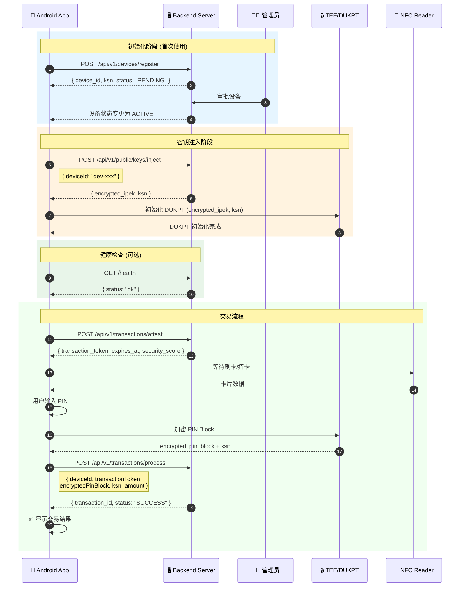
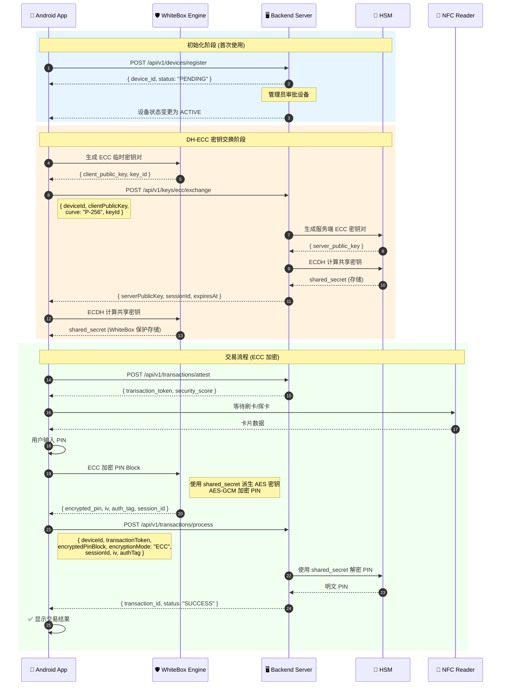
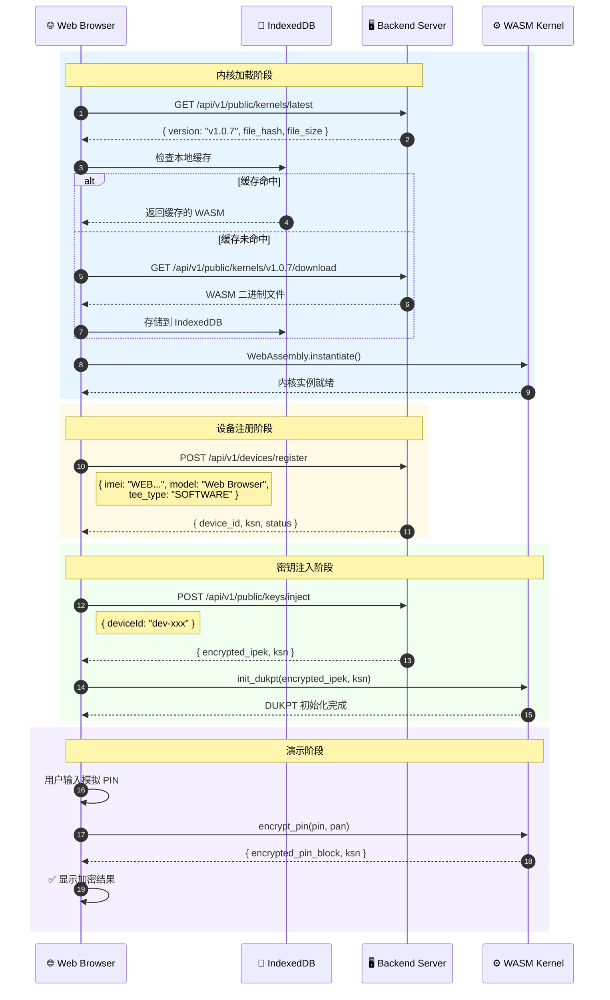

# SUNBAY SoftPOS 客户端 API 使用指南

**版本**: v2.1  
**更新日期**: 2024-12-29  
**适用客户端**: Android App / WebKernel Demo

---

## 概述

本文档整理了 `sunbay-softpos-android` 和 `sunbay-webkernel-demo` 两个客户端项目中实际使用的后端 API 接口，并提供详细的调用说明和示例代码。

### 文档目标

1. 明确客户端实际使用的 API 端点
2. 提供请求/响应的数据结构定义
3. 说明认证要求和调用流程
4. 提供 Android (Kotlin) 和 Web (TypeScript) 的代码示例

---

## 基础信息

### 服务器地址

| 环境 | 地址 |
|------|------|
| 开发环境 | `http://localhost:8080` |
| 生产环境 | `http://softpos.sunbay.dev` |

### API 版本

- **当前版本**: v1
- **Base Path**: `/api/v1`
- **完整 Base URL**: `http://softpos.sunbay.dev/api/v1`

### 认证方式

| 端点类型 | 认证要求 |
|---------|---------|
| 公开端点 (Public) | 无需认证 |
| 受保护端点 (Protected) | JWT Bearer Token |

---

## 目录

- [第一部分：Android App API](#第一部分android-app-api)
- [第二部分：WebKernel Demo API](#第二部分webkernel-demo-api)
- [通用：错误处理](#通用错误处理)
- [通用：字段命名约定](#通用字段命名约定)

---

# 第一部分：Android App API

## API 概览

| API | 端点 | 认证 | 用途 |
|-----|------|------|------|
| 健康检查 | `GET /health` | ❌ | 检查后端服务状态 |
| 设备注册 | `POST /api/v1/devices/register` | ❌ | 注册新设备 |
| 密钥注入 (DUKPT) | `POST /api/v1/public/keys/inject` | ❌ | 注入 DUKPT 密钥 |
| ECC 公钥交换 | `POST /api/v1/keys/ecc/exchange` | ❌ | DH-ECC 密钥交换 |
| 威胁上报 | `POST /api/v1/threats/report` | ❌ | 上报安全威胁 |
| 交易鉴证 | `POST /api/v1/transactions/attest` | ❌ | 获取交易令牌 |
| 交易处理 | `POST /api/v1/transactions/process` | ❌ | 处理支付交易 |

## PIN 加密方案对比

| 方案 | 安全级别 | 适用场景 | 密钥管理 |
|------|---------|---------|---------|
| **DUKPT** | 高 | 标准 POS 交易 | 每笔交易派生唯一密钥 |
| **WhiteBox DH-ECC** | 极高 | 高安全要求场景 | 动态密钥协商，抗白盒攻击 |

## 完整交易流程 (DUKPT 模式)



## 完整交易流程 (WhiteBox DH-ECC 模式)



---

## 1.1 健康检查 API

### GET /health

检查后端服务是否正常运行。

**使用场景**:
| 场景 | 说明 |
|------|------|
| 🚀 应用启动 | App 启动时检查后端是否可用，决定是否显示离线模式 |
| 🔄 网络恢复 | 网络断开重连后，验证后端服务状态 |
| ⏱️ 定时心跳 | 定期检测后端健康状态，及时发现服务异常 |
| 🔧 故障诊断 | 用户报告问题时，首先检查后端连通性 |

**请求**:
```http
GET /health
```

**响应**:
```json
{
  "status": "ok",
  "timestamp": "2024-12-29T10:00:00Z"
}
```

**Kotlin 代码示例**:
```kotlin
interface BackendApi {
    @GET("/health")
    suspend fun healthCheck(): Response<HealthCheckResponse>
}

data class HealthCheckResponse(
    val status: String,
    val timestamp: String
)

// 使用示例
class DeviceManager(private val api: BackendApi) {
    suspend fun checkBackendHealth(): Boolean {
        return try {
            val response = api.healthCheck()
            response.isSuccessful && response.body()?.status == "ok"
        } catch (e: Exception) {
            false
        }
    }
}
```

---

## 1.2 设备注册 API

### POST /api/v1/devices/register

注册新设备到后端系统。设备注册后状态为 `PENDING`，需要管理员审批后才能使用。

**使用场景**:
| 场景 | 说明 |
|------|------|
| 📱 首次安装 | App 首次安装启动时，自动注册设备到后端 |
| 🔄 设备重置 | 设备恢复出厂设置后，需要重新注册 |
| 🔑 获取 KSN | 注册成功后获取设备专属的 KSN，用于后续密钥派生 |
| 📋 设备入网 | 新 POS 终端部署时的入网注册流程 |

**请求**:
```http
POST /api/v1/devices/register
Content-Type: application/json

{
  "imei": "123456789012345",
  "model": "SUNMI P2",
  "os_version": "Android 11",
  "tee_type": "QTEE",
  "public_key": "-----BEGIN PUBLIC KEY-----\n...",
  "device_mode": "FULL_POS",
  "nfc_present": true
}
```

**请求字段说明**:

| 字段 | 类型 | 必填 | 说明 |
|------|------|------|------|
| `imei` | string | ✅ | 设备 IMEI，15位数字 |
| `model` | string | ✅ | 设备型号 |
| `os_version` | string | ✅ | 操作系统版本 |
| `tee_type` | string | ✅ | TEE 类型: `QTEE`, `TRUSTZONE`, `SOFTWARE` |
| `public_key` | string | ✅ | 设备公钥 (PEM 格式) |
| `device_mode` | string | ❌ | 设备模式: `FULL_POS`, `PINPAD` (默认: `FULL_POS`) |
| `nfc_present` | boolean | ❌ | 是否支持 NFC (默认: `false`) |

**响应**:
```json
{
  "code": 201,
  "message": "Device registered successfully",
  "data": {
    "device_id": "dev-550e8400-e29b-41d4-a716-446655440000",
    "ksn": "FFFF9876543210E00000",
    "status": "PENDING",
    "message": "Device registered successfully. Awaiting approval."
  }
}
```

**Kotlin 代码示例**:
```kotlin
data class DeviceRegistrationRequest(
    val imei: String,
    val model: String,
    val os_version: String,
    val tee_type: String,
    val public_key: String,
    val device_mode: String = "FULL_POS",
    val nfc_present: Boolean = false
)

data class DeviceRegistrationResponse(
    val code: Int,
    val message: String,
    val data: DeviceData
)

data class DeviceData(
    val device_id: String,
    val ksn: String,
    val status: String,
    val message: String
)

interface BackendApi {
    @POST("/api/v1/devices/register")
    suspend fun registerDevice(
        @Body request: DeviceRegistrationRequest
    ): Response<DeviceRegistrationResponse>
}
```

---

## 1.3 密钥注入 API

### POST /api/v1/public/keys/inject

为设备注入 DUKPT 密钥。设备审批通过后需要调用此接口获取加密密钥。

**使用场景**:
| 场景 | 说明 |
|------|------|
| 🔑 初始密钥注入 | 设备注册审批通过后，注入初始 IPEK |
| 🔄 密钥更新 | 定期更换设备密钥，增强安全性 |
| 🔐 DUKPT 初始化 | 获取加密的 IPEK 和初始 KSN，初始化 TEE 中的 DUKPT |
| 📋 密钥审计 | 后端记录密钥注入时间，用于安全审计 |

**请求**:
```http
POST /api/v1/public/keys/inject
Content-Type: application/json

{
  "deviceId": "dev-550e8400-e29b-41d4-a716-446655440000"
}
```

**请求字段说明**:

| 字段 | 类型 | 必填 | 说明 |
|------|------|------|------|
| `deviceId` | string | ✅ | 设备 ID (注意: 使用 camelCase) |

**响应**:
```json
{
  "code": 200,
  "data": {
    "device_id": "dev-550e8400-e29b-41d4-a716-446655440000",
    "encrypted_ipek": "base64_encoded_encrypted_ipek",
    "ksn": "FFFF9876543210E00000",
    "injected_at": "2024-12-29T10:00:00Z",
    "message": "Key injected successfully"
  },
  "message": "Success"
}
```

**响应字段说明**:

| 字段 | 类型 | 说明 |
|------|------|------|
| `device_id` | string | 设备 ID |
| `encrypted_ipek` | string | 加密的初始 PIN 加密密钥 (Base64) |
| `ksn` | string | 密钥序列号 (20 位十六进制) |
| `injected_at` | string | 注入时间 (ISO 8601) |

**Kotlin 代码示例**:
```kotlin
data class KeyInjectionRequest(
    val deviceId: String
)

data class KeyInjectionResponse(
    val code: Int,
    val message: String,
    val data: KeyInjectionData
)

data class KeyInjectionData(
    val device_id: String,
    val encrypted_ipek: String,
    val ksn: String,
    val injected_at: String,
    val message: String
)

interface BackendApi {
    @POST("/api/v1/public/keys/inject")
    suspend fun injectKey(
        @Body request: KeyInjectionRequest
    ): Response<KeyInjectionResponse>
}

// 使用示例 - 密钥管理器
class KeyManager(private val api: BackendApi, private val teeManager: TeeManager) {
    suspend fun injectAndInitialize(deviceId: String): Boolean {
        return try {
            val response = api.injectKey(KeyInjectionRequest(deviceId))
            if (response.isSuccessful) {
                val data = response.body()!!.data
                // 将加密的 IPEK 传入 TEE 进行解密和初始化
                teeManager.initDukpt(data.encrypted_ipek, data.ksn)
                true
            } else {
                false
            }
        } catch (e: Exception) {
            false
        }
    }
}
```

---

## 1.4 ECC 公钥交换 API (WhiteBox DH-ECC)

### POST /api/v1/keys/ecc/exchange

基于 Diffie-Hellman 椭圆曲线密码学 (DH-ECC) 的密钥交换接口。用于建立 WhiteBox 加密的会话密钥。

**使用场景**:
| 场景 | 说明 |
|------|------|
| 🔐 高安全交易 | 对安全性要求极高的大额交易场景 |
| 🛡️ 抗白盒攻击 | 即使攻击者获取内存数据也无法提取密钥 |
| 🔄 动态密钥 | 每次会话使用不同的临时密钥对 |
| ⏱️ 会话管理 | 会话密钥有时效性，过期需重新协商 |
| 🏦 合规要求 | 满足 PCI-DSS 等安全合规要求 |

**密钥交换原理**:

```
┌─────────────────────────────────────────────────────────────────┐
│                    DH-ECC 密钥交换流程                           │
├─────────────────────────────────────────────────────────────────┤
│  Client (WhiteBox)              Server (HSM)                    │
│  ─────────────────              ────────────                    │
│  1. 生成临时密钥对               1. 生成临时密钥对                │
│     (client_priv, client_pub)      (server_priv, server_pub)   │
│                                                                 │
│  2. 发送 client_pub ──────────────────────────────────────────► │
│                                                                 │
│  3. ◄────────────────────────────────────── 返回 server_pub    │
│                                                                 │
│  4. ECDH: shared = client_priv × server_pub                    │
│                      = server_priv × client_pub (相同结果)      │
│                                                                 │
│  5. KDF: aes_key = HKDF(shared, "PIN_ENCRYPTION")              │
└─────────────────────────────────────────────────────────────────┘
```

**请求**:
```http
POST /api/v1/keys/ecc/exchange
Content-Type: application/json

{
  "deviceId": "dev-550e8400-e29b-41d4-a716-446655440000",
  "clientPublicKey": "BFxyz...base64_encoded_point...",
  "curve": "P-256",
  "keyId": "wb-key-20241229-001",
  "timestamp": "2024-12-29T10:00:00Z",
  "signature": "base64_encoded_signature"
}
```

**请求字段说明**:

| 字段 | 类型 | 必填 | 说明 |
|------|------|------|------|
| `deviceId` | string | ✅ | 设备 ID |
| `clientPublicKey` | string | ✅ | 客户端 ECC 公钥 (Base64 编码的压缩点) |
| `curve` | string | ✅ | 椭圆曲线: `P-256`, `P-384`, `P-521` |
| `keyId` | string | ✅ | 客户端密钥标识 (用于会话关联) |
| `timestamp` | string | ✅ | 请求时间戳 (防重放) |
| `signature` | string | ❌ | 请求签名 (使用设备私钥签名) |

**响应**:
```json
{
  "code": 200,
  "data": {
    "serverPublicKey": "BGabc...base64_encoded_point...",
    "sessionId": "sess-20241229-abc123",
    "expiresAt": "2024-12-29T10:30:00Z",
    "curve": "P-256",
    "kdfParams": {
      "algorithm": "HKDF-SHA256",
      "info": "PIN_ENCRYPTION_V1",
      "keyLength": 256
    }
  },
  "message": "Key exchange successful"
}
```

**响应字段说明**:

| 字段 | 类型 | 说明 |
|------|------|------|
| `serverPublicKey` | string | 服务端 ECC 公钥 (Base64) |
| `sessionId` | string | 会话 ID，后续交易需携带 |
| `expiresAt` | string | 会话过期时间 |
| `curve` | string | 使用的椭圆曲线 |
| `kdfParams` | object | 密钥派生参数 |

**Kotlin 代码示例**:
```kotlin
data class EccKeyExchangeRequest(
    val deviceId: String,
    val clientPublicKey: String,
    val curve: String = "P-256",
    val keyId: String,
    val timestamp: String,
    val signature: String? = null
)

data class KdfParams(
    val algorithm: String,
    val info: String,
    val keyLength: Int
)

data class EccKeyExchangeData(
    val serverPublicKey: String,
    val sessionId: String,
    val expiresAt: String,
    val curve: String,
    val kdfParams: KdfParams
)

interface BackendApi {
    @POST("/api/v1/keys/ecc/exchange")
    suspend fun exchangeEccKey(
        @Body request: EccKeyExchangeRequest
    ): Response<ApiResponse<EccKeyExchangeData>>
}

// WhiteBox ECC 密钥管理器
class WhiteBoxKeyManager(
    private val api: BackendApi,
    private val whiteBoxEngine: WhiteBoxEngine
) {
    private var currentSession: EccSession? = null
    
    data class EccSession(
        val sessionId: String,
        val sharedSecret: ByteArray,  // WhiteBox 保护存储
        val expiresAt: Long
    )
    
    suspend fun establishSession(deviceId: String): EccSession? {
        // 1. 生成 WhiteBox 保护的临时密钥对
        val keyPair = whiteBoxEngine.generateEccKeyPair("P-256")
        val keyId = "wb-key-${System.currentTimeMillis()}"
        
        // 2. 发送公钥到服务端
        val request = EccKeyExchangeRequest(
            deviceId = deviceId,
            clientPublicKey = keyPair.publicKeyBase64,
            curve = "P-256",
            keyId = keyId,
            timestamp = Instant.now().toString()
        )
        
        val response = api.exchangeEccKey(request)
        if (!response.isSuccessful) return null
        
        val data = response.body()!!.data
        
        // 3. 使用 WhiteBox 引擎计算共享密钥
        val sharedSecret = whiteBoxEngine.computeEcdh(
            privateKeyId = keyId,
            serverPublicKey = data.serverPublicKey,
            kdfInfo = data.kdfParams.info
        )
        
        // 4. 创建会话
        currentSession = EccSession(
            sessionId = data.sessionId,
            sharedSecret = sharedSecret,
            expiresAt = parseIsoTime(data.expiresAt)
        )
        
        return currentSession
    }
    
    fun encryptPin(pin: String, pan: String): EncryptedPinBlock? {
        val session = currentSession ?: return null
        if (System.currentTimeMillis() > session.expiresAt) {
            currentSession = null
            return null
        }
        
        // 使用 WhiteBox 引擎加密 PIN
        return whiteBoxEngine.encryptPinWithEcc(
            pin = pin,
            pan = pan,
            sessionId = session.sessionId,
            sharedSecret = session.sharedSecret
        )
    }
}

data class EncryptedPinBlock(
    val encryptedData: String,  // Base64
    val iv: String,             // Base64
    val authTag: String,        // Base64 (GCM 认证标签)
    val sessionId: String
)
```

**交易处理请求 (ECC 模式)**:

当使用 WhiteBox DH-ECC 加密时，交易处理请求需要额外字段：

```http
POST /api/v1/transactions/process
Content-Type: application/json

{
  "deviceId": "dev-550e8400-e29b-41d4-a716-446655440000",
  "transactionType": "PAYMENT",
  "amount": 10000,
  "currency": "CNY",
  "encryptedPinBlock": "base64_aes_gcm_ciphertext",
  "encryptionMode": "ECC",
  "sessionId": "sess-20241229-abc123",
  "iv": "base64_initialization_vector",
  "authTag": "base64_gcm_auth_tag",
  "cardNumberMasked": "6222****7890",
  "transactionToken": "eyJhbGciOiJIUzI1NiIs..."
}
```

**ECC 模式额外字段**:

| 字段 | 类型 | 必填 | 说明 |
|------|------|------|------|
| `encryptionMode` | string | ✅ | 加密模式: `DUKPT` 或 `ECC` |
| `sessionId` | string | ✅ | ECC 会话 ID |
| `iv` | string | ✅ | AES-GCM 初始化向量 (Base64) |
| `authTag` | string | ✅ | AES-GCM 认证标签 (Base64) |

**安全特性**:

| 特性 | 说明 |
|------|------|
| 🔒 前向安全 | 每次会话使用临时密钥，历史会话无法被破解 |
| 🛡️ 白盒保护 | 密钥在 WhiteBox 引擎中受保护，抗内存提取攻击 |
| ✅ 认证加密 | AES-GCM 提供加密和完整性保护 |
| ⏱️ 时效控制 | 会话有过期时间，降低密钥泄露风险 |
| 🔐 HSM 集成 | 服务端密钥操作在 HSM 中完成 |

---

## 1.5 威胁上报 API

### POST /api/v1/threats/report

设备端检测到安全威胁时上报到后端。

**使用场景**:
| 场景 | 说明 |
|------|------|
| 🔓 Root 检测 | 检测到设备被 Root，立即上报并阻止交易 |
| 🖥️ 模拟器检测 | 发现运行在模拟器环境，上报安全风险 |
| 🐛 调试器检测 | 检测到调试器附加，可能存在逆向攻击 |
| 🪝 Hook 检测 | 发现 Xposed/Frida 等 Hook 框架 |
| 📦 应用篡改 | 签名校验失败，应用可能被二次打包 |
| 🦠 恶意软件 | 检测到已知恶意软件特征 |
| 📊 安全审计 | 后端记录威胁事件，用于安全分析和合规审计 |

**请求**:
```http
POST /api/v1/threats/report
Content-Type: application/json

{
  "deviceId": "dev-550e8400-e29b-41d4-a716-446655440000",
  "threatType": "ROOT_DETECTED",
  "severity": "HIGH",
  "description": "Root access detected on device"
}
```

**请求字段说明**:

| 字段 | 类型 | 必填 | 说明 |
|------|------|------|------|
| `deviceId` | string | ✅ | 设备 ID |
| `threatType` | string | ✅ | 威胁类型 (见下表) |
| `severity` | string | ✅ | 严重程度: `LOW`, `MEDIUM`, `HIGH`, `CRITICAL` |
| `description` | string | ✅ | 威胁描述 |

**威胁类型**:

| 类型 | 说明 |
|------|------|
| `ROOT_DETECTED` | 检测到 Root 权限 |
| `EMULATOR_DETECTED` | 检测到模拟器 |
| `DEBUGGER_DETECTED` | 检测到调试器 |
| `HOOK_DETECTED` | 检测到 Hook 框架 |
| `TAMPERING_DETECTED` | 检测到应用篡改 |
| `MALWARE_DETECTED` | 检测到恶意软件 |

**响应**:
```json
{
  "code": 201,
  "message": "Threat reported successfully",
  "data": {
    "id": "threat-123",
    "deviceId": "dev-550e8400-e29b-41d4-a716-446655440000",
    "threatType": "ROOT_DETECTED",
    "severity": "HIGH",
    "status": "ACTIVE",
    "description": "Root access detected on device",
    "detectedAt": "2024-12-29T10:00:00Z"
  }
}
```

**Kotlin 代码示例**:
```kotlin
data class ThreatReportRequest(
    val deviceId: String,
    val threatType: String,
    val severity: String,
    val description: String
)

interface BackendApi {
    @POST("/api/v1/threats/report")
    suspend fun reportThreat(
        @Body request: ThreatReportRequest
    ): Response<ThreatReportResponse>
}

// 使用示例 - 安全检测服务
class SecurityChecker(private val api: BackendApi, private val deviceId: String) {
    suspend fun checkAndReportThreats() {
        if (isRooted()) {
            api.reportThreat(ThreatReportRequest(
                deviceId = deviceId,
                threatType = "ROOT_DETECTED",
                severity = "HIGH",
                description = "Root access detected via su binary check"
            ))
        }
    }
    
    private fun isRooted(): Boolean {
        // Root 检测逻辑
        return false
    }
}
```

---

## 1.6 交易鉴证 API

### POST /api/v1/transactions/attest

在执行交易前获取交易令牌。令牌有效期为 5 分钟。

**使用场景**:
| 场景 | 说明 |
|------|------|
| 💳 交易前验证 | 用户点击"收款"按钮后，先获取交易令牌 |
| 🔒 设备状态检查 | 后端验证设备是否处于 ACTIVE 状态，是否有未处理的威胁 |
| 📊 安全评分获取 | 获取设备当前安全评分，低于阈值可拒绝交易 |
| ⏱️ 交易时效控制 | 令牌 5 分钟有效，防止重放攻击 |
| 🛡️ 防欺诈 | 结合设备位置、交易金额等进行风控评估 |

**请求**:
```http
POST /api/v1/transactions/attest
Content-Type: application/json

{
  "deviceId": "dev-550e8400-e29b-41d4-a716-446655440000",
  "amount": 10000,
  "currency": "CNY"
}
```

**请求字段说明**:

| 字段 | 类型 | 必填 | 说明 |
|------|------|------|------|
| `deviceId` | string | ✅ | 设备 ID |
| `amount` | number | ✅ | 交易金额 (分) |
| `currency` | string | ✅ | 货币代码 (如 `CNY`) |

**响应**:
```json
{
  "transaction_token": "eyJhbGciOiJIUzI1NiIs...",
  "expires_at": "2024-12-29T10:05:00Z",
  "device_status": "ACTIVE",
  "security_score": 95
}
```

**响应字段说明**:

| 字段 | 类型 | 说明 |
|------|------|------|
| `transaction_token` | string | 交易令牌，用于后续交易处理 |
| `expires_at` | string | 令牌过期时间 (ISO 8601) |
| `device_status` | string | 设备当前状态 |
| `security_score` | number | 设备安全评分 (0-100) |

**Kotlin 代码示例**:
```kotlin
data class TransactionAttestRequest(
    @SerializedName("deviceId")
    val deviceId: String,
    val amount: Long,
    val currency: String
)

data class TransactionAttestResponse(
    val transaction_token: String,
    val expires_at: String,
    val device_status: String,
    val security_score: Int
)

interface BackendApi {
    @POST("/api/v1/transactions/attest")
    suspend fun attestTransaction(
        @Body request: TransactionAttestRequest
    ): Response<TransactionAttestResponse>
}

// 使用示例 - 交易令牌管理器
class TransactionTokenManager(private val api: BackendApi) {
    private var currentToken: String? = null
    private var tokenExpiresAt: Long = 0
    
    suspend fun getToken(deviceId: String, amount: Long): String? {
        // 检查令牌是否过期
        if (currentToken != null && System.currentTimeMillis() < tokenExpiresAt) {
            return currentToken
        }
        
        // 获取新令牌
        val response = api.attestTransaction(
            TransactionAttestRequest(deviceId, amount, "CNY")
        )
        
        if (response.isSuccessful) {
            val data = response.body()!!
            currentToken = data.transaction_token
            // 提前 30 秒过期，留出处理时间
            tokenExpiresAt = parseIsoTime(data.expires_at) - 30_000
            return currentToken
        }
        return null
    }
}
```

---

## 1.7 交易处理 API

### POST /api/v1/transactions/process

使用交易令牌处理支付交易。

**使用场景**:
| 场景 | 说明 |
|------|------|
| 💰 消费交易 | 用户刷卡/挥卡后，提交加密 PIN 进行支付 |
| 🔙 退款交易 | 商户发起退款，需要原交易信息 |
| ❌ 撤销交易 | 当日交易撤销，资金原路返回 |
| 🔐 预授权 | 酒店/租车等场景的预授权交易 |
| ✅ 预授权完成 | 预授权交易的最终结算 |
| 📍 位置记录 | 记录交易发生的地理位置，用于风控和审计 |
| 🔑 KSN 递增 | 每笔交易使用新的 KSN，确保密钥唯一性 |

**请求**:
```http
POST /api/v1/transactions/process
Content-Type: application/json

{
  "deviceId": "dev-550e8400-e29b-41d4-a716-446655440000",
  "transactionType": "PAYMENT",
  "amount": 10000,
  "currency": "CNY",
  "encryptedPinBlock": "base64_encoded_pin_block",
  "ksn": "FFFF9876543210E00001",
  "cardNumberMasked": "6222****7890",
  "transactionToken": "eyJhbGciOiJIUzI1NiIs...",
  "clientIp": "192.168.1.100",
  "latitude": 31.2304,
  "longitude": 121.4737,
  "locationAccuracy": 10.5,
  "locationTimestamp": "2024-12-29T10:00:00Z"
}
```

**请求字段说明**:

| 字段 | 类型 | 必填 | 说明 |
|------|------|------|------|
| `deviceId` | string | ✅ | 设备 ID |
| `transactionType` | string | ✅ | 交易类型: `PAYMENT`, `REFUND`, `VOID`, `PREAUTH`, `CAPTURE` |
| `amount` | number | ✅ | 交易金额 (分) |
| `currency` | string | ✅ | 货币代码 |
| `encryptedPinBlock` | string | ✅ | DUKPT 加密的 PIN Block |
| `ksn` | string | ✅ | 密钥序列号 |
| `cardNumberMasked` | string | ❌ | 脱敏卡号 |
| `transactionToken` | string | ✅ | 交易令牌 (从 attest 获取) |
| `clientIp` | string | ❌ | 客户端 IP |
| `latitude` | number | ❌ | 纬度 |
| `longitude` | number | ❌ | 经度 |
| `locationAccuracy` | number | ❌ | 位置精度 (米) |
| `locationTimestamp` | string | ❌ | 位置时间戳 |

**响应**:
```json
{
  "transaction_id": "txn-123456",
  "status": "SUCCESS",
  "processed_at": "2024-12-29T10:00:05Z"
}
```

**Kotlin 代码示例**:
```kotlin
data class ProcessTransactionRequest(
    @SerializedName("deviceId")
    val deviceId: String,
    @SerializedName("transactionType")
    val transactionType: String,
    val amount: Long,
    val currency: String,
    @SerializedName("encryptedPinBlock")
    val encryptedPinBlock: String,
    val ksn: String,
    @SerializedName("cardNumberMasked")
    val cardNumberMasked: String? = null,
    @SerializedName("transactionToken")
    val transactionToken: String,
    @SerializedName("clientIp")
    val clientIp: String? = null,
    val latitude: Double? = null,
    val longitude: Double? = null,
    @SerializedName("locationAccuracy")
    val locationAccuracy: Float? = null,
    @SerializedName("locationTimestamp")
    val locationTimestamp: String? = null
)

data class ProcessTransactionResponse(
    val transaction_id: String,
    val status: String,
    val processed_at: String
)

interface BackendApi {
    @POST("/api/v1/transactions/process")
    suspend fun processTransaction(
        @Body request: ProcessTransactionRequest
    ): Response<ProcessTransactionResponse>
}
```

---

# 第二部分：WebKernel Demo API

## API 概览

| API | 端点 | 认证 | 用途 |
|-----|------|------|------|
| 获取稳定内核列表 | `GET /api/v1/public/kernels` | ❌ | 获取可用内核版本 |
| 获取最新内核 | `GET /api/v1/public/kernels/latest` | ❌ | 获取最新稳定内核 |
| 下载内核 | `GET /api/v1/public/kernels/:version/download` | ❌ | 下载 WASM 内核文件 |
| 设备注册 | `POST /api/v1/devices/register` | ❌ | 注册 Web 设备 |
| 密钥注入 | `POST /api/v1/public/keys/inject` | ❌ | 注入 DUKPT 密钥 |

## 完整初始化流程



---

## 2.1 获取稳定内核列表 API

### GET /api/v1/public/kernels

获取所有稳定版本的内核列表。

**使用场景**:
| 场景 | 说明 |
|------|------|
| 📋 版本列表展示 | 在 UI 中显示所有可用的内核版本供用户选择 |
| 🔄 版本对比 | 比较不同版本的功能差异和更新内容 |
| 📥 批量下载 | 运维场景下批量获取所有稳定版本 |
| 🔍 版本查询 | 检查特定版本是否存在且为稳定状态 |

**请求**:
```http
GET /api/v1/public/kernels
```

**响应**:
```json
{
  "code": 200,
  "data": [
    {
      "id": "kernel-123",
      "version": "v1.0.7",
      "file_path": "/uploads/kernels/v1.0.7.wasm",
      "file_hash": "sha256:abc123...",
      "file_size": 1234567,
      "status": "STABLE",
      "created_at": "2024-12-29T10:00:00Z",
      "updated_at": "2024-12-29T10:00:00Z"
    }
  ],
  "message": "Success"
}
```

**TypeScript 代码示例**:
```typescript
interface KernelVersion {
    id: string;
    version: string;
    file_path: string;
    file_hash: string;
    file_size: number;
    status: string;
    created_at: string;
    updated_at: string;
}

interface ApiResponse<T> {
    code: number;
    data: T;
    message: string;
}

async function getStableKernels(): Promise<KernelVersion[]> {
    const res = await fetch(`${baseUrl}/api/v1/public/kernels`);
    if (!res.ok) {
        throw new Error(`Failed to fetch kernels: ${res.status}`);
    }
    const response: ApiResponse<KernelVersion[]> = await res.json();
    return response.data || [];
}

// 使用示例
const kernels = await getStableKernels();
console.log(`Found ${kernels.length} stable kernels`);
kernels.forEach(k => console.log(`- ${k.version}: ${k.file_size} bytes`));
```

---

## 2.2 获取最新内核 API

### GET /api/v1/public/kernels/latest

获取最新的稳定版本内核。

**使用场景**:
| 场景 | 说明 |
|------|------|
| 🚀 自动更新 | 客户端启动时检查是否有新版本内核 |
| 📱 首次加载 | WebKernel Demo 首次加载时获取最新内核 |
| 🔔 版本提示 | 对比本地版本，提示用户升级 |
| 🏷️ 默认版本 | 新设备默认使用最新稳定版本 |

**请求**:
```http
GET /api/v1/public/kernels/latest
```

**响应**:
```json
{
  "code": 200,
  "data": {
    "id": "kernel-123",
    "version": "v1.0.7",
    "file_path": "/uploads/kernels/v1.0.7.wasm",
    "file_hash": "sha256:abc123...",
    "file_size": 1234567,
    "status": "STABLE",
    "created_at": "2024-12-29T10:00:00Z",
    "updated_at": "2024-12-29T10:00:00Z"
  },
  "message": "Success"
}
```

**TypeScript 代码示例**:
```typescript
async function getLatestKernel(): Promise<KernelVersion | null> {
    const res = await fetch(`${baseUrl}/api/v1/public/kernels/latest`);
    if (!res.ok) {
        if (res.status === 404) {
            console.warn('No stable kernel available');
            return null;
        }
        throw new Error(`Failed to fetch latest kernel: ${res.status}`);
    }
    const response: ApiResponse<KernelVersion> = await res.json();
    return response.data;
}

// 使用示例 - 检查更新
async function checkForUpdate(currentVersion: string): Promise<boolean> {
    const latest = await getLatestKernel();
    if (!latest) return false;
    return latest.version !== currentVersion;
}
```

---

## 2.3 下载内核 API

### GET /api/v1/public/kernels/:version/download

下载指定版本的内核 WASM 文件。

**使用场景**:
| 场景 | 说明 |
|------|------|
| 📥 内核下载 | 下载 WASM 文件用于 WebAssembly 初始化 |
| 💾 本地缓存 | 下载后缓存到 IndexedDB，避免重复下载 |
| 🔄 版本切换 | 用户手动选择特定版本时下载对应内核 |
| 🧪 测试验证 | 测试环境下载特定版本进行功能验证 |

**请求**:
```http
GET /api/v1/public/kernels/v1.0.7/download
```

**响应**: 二进制 WASM 文件 (`application/wasm`)

**TypeScript 代码示例**:
```typescript
async function downloadKernel(version: string): Promise<ArrayBuffer> {
    const url = `${baseUrl}/api/v1/public/kernels/${version}/download`;
    const res = await fetch(url);
    
    if (!res.ok) {
        throw new Error(`Failed to download kernel ${version}: ${res.status}`);
    }
    
    return res.arrayBuffer();
}

// 获取下载 URL (用于直接链接)
function getDownloadUrl(version: string): string {
    return `${baseUrl}/api/v1/public/kernels/${version}/download`;
}

// 使用示例 - 加载 WASM 内核
async function loadKernel(version: string): Promise<WebAssembly.Instance> {
    const wasmBuffer = await downloadKernel(version);
    const wasmModule = await WebAssembly.compile(wasmBuffer);
    const instance = await WebAssembly.instantiate(wasmModule, {
        // 导入对象
    });
    return instance;
}

// 使用示例 - 带缓存的加载
class KernelLoader {
    private cache: Map<string, ArrayBuffer> = new Map();
    
    async load(version: string): Promise<ArrayBuffer> {
        if (this.cache.has(version)) {
            console.log(`Using cached kernel ${version}`);
            return this.cache.get(version)!;
        }
        
        console.log(`Downloading kernel ${version}...`);
        const buffer = await downloadKernel(version);
        this.cache.set(version, buffer);
        return buffer;
    }
}
```

---

## 2.4 设备注册 API (Web 端)

### POST /api/v1/devices/register

注册 Web 虚拟设备到后端系统。

**使用场景**:
| 场景 | 说明 |
|------|------|
| 🌐 Web Demo 初始化 | WebKernel Demo 页面加载时注册虚拟设备 |
| 🔑 获取 KSN | 注册成功后获取设备专属的 KSN |
| 🆔 设备标识 | 使用固定 IMEI 确保同一浏览器使用同一设备 |
| 📋 演示准备 | 为后续密钥注入和交易演示做准备 |

**请求**:
```http
POST /api/v1/devices/register
Content-Type: application/json

{
  "imei": "WEB000000000001",
  "model": "Web Browser",
  "os_version": "Mozilla/5.0 (Windows NT 10.0; Win64; x64)...",
  "tee_type": "SOFTWARE",
  "public_key": "-----BEGIN PUBLIC KEY-----\n...",
  "device_mode": "FULL_POS",
  "nfc_present": false
}
```

**Web 端特殊说明**:

| 字段 | Web 端取值 | 说明 |
|------|-----------|------|
| `imei` | 固定值或生成值 | 使用 `WEB` 前缀 + 唯一标识 |
| `tee_type` | `SOFTWARE` | Web 环境无硬件 TEE |
| `os_version` | `navigator.userAgent` | 浏览器 UA 字符串 |
| `nfc_present` | `false` | Web 不支持 NFC |

**TypeScript 代码示例**:
```typescript
interface DeviceRegistrationRequest {
    imei: string;
    model: string;
    os_version: string;
    tee_type: string;
    public_key: string;
    device_mode: string;
    nfc_present: boolean;
}

interface DeviceRegistrationData {
    device_id: string;
    ksn: string;
    status: string;
    message: string;
}

async function registerDevice(imei: string): Promise<DeviceRegistrationData> {
    const request: DeviceRegistrationRequest = {
        imei,
        model: 'Web Browser',
        os_version: navigator.userAgent,
        tee_type: 'SOFTWARE',
        public_key: generatePublicKey(), // 生成或使用固定公钥
        device_mode: 'FULL_POS',
        nfc_present: false
    };
    
    const res = await fetch(`${baseUrl}/api/v1/devices/register`, {
        method: 'POST',
        headers: { 'Content-Type': 'application/json' },
        body: JSON.stringify(request)
    });
    
    if (!res.ok) {
        const error = await res.text();
        throw new Error(`Device registration failed: ${error}`);
    }
    
    const response = await res.json();
    return response.data;
}

// 使用示例 - 生成唯一 IMEI
function generateWebImei(): string {
    const stored = localStorage.getItem('web_device_imei');
    if (stored) return stored;
    
    const newImei = 'WEB' + Date.now().toString().slice(-12);
    localStorage.setItem('web_device_imei', newImei);
    return newImei;
}
```

---

## 2.5 密钥注入 API

### POST /api/v1/public/keys/inject

为设备注入 DUKPT 密钥。

**使用场景**:
| 场景 | 说明 |
|------|------|
| 🔑 初始密钥注入 | 设备注册审批通过后，注入初始 IPEK |
| 🔄 密钥更新 | 定期更换设备密钥，增强安全性 |
| 🌐 Web Demo 初始化 | WebKernel Demo 设备注册后立即注入密钥 |
| 🔐 DUKPT 初始化 | 获取加密的 IPEK 和初始 KSN，初始化 DUKPT 系统 |
| 📋 密钥审计 | 后端记录密钥注入时间，用于安全审计 |

**请求**:
```http
POST /api/v1/public/keys/inject
Content-Type: application/json

{
  "deviceId": "dev-550e8400-e29b-41d4-a716-446655440000"
}
```

**请求字段说明**:

| 字段 | 类型 | 必填 | 说明 |
|------|------|------|------|
| `deviceId` | string | ✅ | 设备 ID (注意: 使用 camelCase) |

**响应**:
```json
{
  "code": 200,
  "data": {
    "device_id": "dev-550e8400-e29b-41d4-a716-446655440000",
    "encrypted_ipek": "base64_encoded_encrypted_ipek",
    "ksn": "FFFF9876543210E00000",
    "injected_at": "2024-12-29T10:00:00Z",
    "message": "Key injected successfully"
  },
  "message": "Success"
}
```

**响应字段说明**:

| 字段 | 类型 | 说明 |
|------|------|------|
| `device_id` | string | 设备 ID |
| `encrypted_ipek` | string | 加密的初始 PIN 加密密钥 (Base64) |
| `ksn` | string | 密钥序列号 (20 位十六进制) |
| `injected_at` | string | 注入时间 (ISO 8601) |

**TypeScript 代码示例**:
```typescript
interface KeyInjectionData {
    device_id: string;
    encrypted_ipek: string;
    ksn: string;
    injected_at: string;
    message: string;
}

async function injectKey(deviceId: string): Promise<KeyInjectionData> {
    const res = await fetch(`${baseUrl}/api/v1/public/keys/inject`, {
        method: 'POST',
        headers: { 'Content-Type': 'application/json' },
        body: JSON.stringify({ deviceId })  // 注意: 使用 camelCase
    });
    
    if (!res.ok) {
        const error = await res.text();
        throw new Error(`Key injection failed: ${error}`);
    }
    
    const response = await res.json();
    return response.data;
}

// 使用示例 - 完整初始化流程
class WebPosInitializer {
    private deviceId: string | null = null;
    private ksn: string | null = null;
    
    async initialize(): Promise<void> {
        // 1. 注册设备
        const imei = generateWebImei();
        const regData = await registerDevice(imei);
        this.deviceId = regData.device_id;
        
        console.log(`Device registered: ${this.deviceId}`);
        
        // 2. 注入密钥
        const keyData = await injectKey(this.deviceId);
        this.ksn = keyData.ksn;
        
        console.log(`Key injected, KSN: ${this.ksn}`);
        
        // 3. 初始化 DUKPT (使用 WASM 内核)
        await this.initDukpt(keyData.encrypted_ipek, keyData.ksn);
    }
    
    private async initDukpt(encryptedIpek: string, ksn: string): Promise<void> {
        // 调用 WASM 内核初始化 DUKPT
        // kernel.init_dukpt(encryptedIpek, ksn);
    }
}
```

---

# 通用：错误处理

## 通用错误响应格式

```json
{
  "code": 400,
  "message": "Validation error",
  "error": "IMEI must be 15 digits"
}
```

## 常见错误码

| HTTP 状态码 | 错误码 | 说明 |
|------------|--------|------|
| 400 | `VALIDATION_ERROR` | 请求参数验证失败 |
| 401 | `UNAUTHORIZED` | 未认证或 Token 无效 |
| 403 | `FORBIDDEN` | 权限不足 |
| 404 | `NOT_FOUND` | 资源不存在 |
| 409 | `CONFLICT` | 资源冲突 (如设备已存在) |
| 422 | `UNPROCESSABLE_ENTITY` | 业务逻辑错误 |
| 429 | `TOO_MANY_REQUESTS` | 请求过于频繁 |
| 500 | `INTERNAL_ERROR` | 服务器内部错误 |

## Android 错误处理示例

```kotlin
sealed class ApiResult<out T> {
    data class Success<T>(val data: T) : ApiResult<T>()
    data class Error(val code: Int, val message: String) : ApiResult<Nothing>()
    object NetworkError : ApiResult<Nothing>()
}

suspend fun <T> safeApiCall(call: suspend () -> Response<T>): ApiResult<T> {
    return try {
        val response = call()
        if (response.isSuccessful) {
            ApiResult.Success(response.body()!!)
        } else {
            val errorBody = response.errorBody()?.string()
            ApiResult.Error(response.code(), errorBody ?: "Unknown error")
        }
    } catch (e: IOException) {
        ApiResult.NetworkError
    } catch (e: Exception) {
        ApiResult.Error(-1, e.message ?: "Unknown error")
    }
}

// 使用示例
val result = safeApiCall { api.registerDevice(request) }
when (result) {
    is ApiResult.Success -> handleSuccess(result.data)
    is ApiResult.Error -> handleError(result.code, result.message)
    is ApiResult.NetworkError -> showNetworkError()
}
```

## TypeScript 错误处理示例

```typescript
class ApiError extends Error {
    constructor(
        public code: number,
        message: string,
        public details?: string
    ) {
        super(message);
        this.name = 'ApiError';
    }
}

async function apiCall<T>(
    url: string,
    options?: RequestInit
): Promise<T> {
    try {
        const response = await fetch(url, options);
        
        if (!response.ok) {
            const errorText = await response.text();
            let errorData;
            try {
                errorData = JSON.parse(errorText);
            } catch {
                errorData = { message: errorText };
            }
            throw new ApiError(
                response.status,
                errorData.message || 'Request failed',
                errorData.error
            );
        }
        
        const data = await response.json();
        return data.data || data;
    } catch (error) {
        if (error instanceof ApiError) {
            throw error;
        }
        if (error instanceof TypeError) {
            throw new ApiError(0, 'Network error', 'Unable to connect to server');
        }
        throw new ApiError(-1, 'Unknown error', String(error));
    }
}

// 使用示例
try {
    const device = await apiCall<DeviceRegistrationData>(
        `${baseUrl}/api/v1/devices/register`,
        {
            method: 'POST',
            headers: { 'Content-Type': 'application/json' },
            body: JSON.stringify(request)
        }
    );
    console.log('Device registered:', device.device_id);
} catch (error) {
    if (error instanceof ApiError) {
        if (error.code === 409) {
            console.log('Device already exists');
        } else {
            console.error(`API Error ${error.code}: ${error.message}`);
        }
    }
}
```

---

# 通用：字段命名约定

## 后端 API 命名规则

| 端点类型 | 命名规则 | 示例 |
|---------|---------|------|
| 设备注册 | snake_case | `device_id`, `os_version` |
| 交易相关 | camelCase | `deviceId`, `transactionToken` |
| 密钥注入 | camelCase (请求) / snake_case (响应) | 请求: `deviceId`, 响应: `encrypted_ipek` |
| 内核管理 | snake_case | `file_path`, `file_hash` |

## 注意事项

1. **交易相关 API** 使用 `camelCase`，因为后端使用了 `#[serde(rename_all = "camelCase")]`
2. **设备注册 API** 使用 `snake_case`
3. **响应数据** 通常包装在 `{ code, data, message }` 结构中
4. **密钥注入请求** 使用 `camelCase`，但响应使用 `snake_case`

---

## 相关文档

- [Backend API 完整文档](../../sunbay-softpos-backend/API_DOCUMENTATION.md)
- [API 参考](./03-API-REFERENCE.md)
- [架构设计](./02-ARCHITECTURE.md)
- [Android 构建指南](../../sunbay-softpos-android/BUILD_GUIDE.md)
- [WebKernel Demo 快速开始](../../sunbay-webkernel-demo/QUICK_START.md)

---

**文档版本**: v2.1  
**最后更新**: 2024-12-29  
**维护者**: SUNBAY 技术团队
