# SUNBAY MPoC SDK API 交互指南

**版本**: v3.8  
**日期**: 2026-01-09  
**适用对象**: Android MPoC SDK 开发者

---

## 目录

1. [概述](#1-概述)
2. [系统架构](#2-系统架构)
3. [SDK 模块职责](#3-sdk-模块职责)
4. [初始化流程总览](#4-初始化流程总览)
5. [阶段一：设备注册](#5-阶段一设备注册)
6. [阶段二：证书签发](#6-阶段二证书签发)
7. [阶段三：密钥初始化](#7-阶段三密钥初始化)
8. [阶段四：交易处理](#8-阶段四交易处理)
9. [PIN 加密方案](#9-pin-加密方案)
10. [设备生命周期管理](#10-设备生命周期管理)
11. [离线支付模式](#11-离线支付模式)
12. [SDK 版本管理](#12-sdk-版本管理)
13. [错误处理](#13-错误处理)
14. [安全规范](#14-安全规范)
15. [附录](#15-附录)

---

## 1. 概述

### 1.1 文档目的

本文档描述 SUNBAY MPoC (Mobile Point of Contact) SDK 与后端服务的 API 交互规范，按照 **SDK 初始化调用顺序** 组织内容，为 Android 端开发者提供完整的集成指南。

### 1.2 MPoC SDK 简介

MPoC SDK 以 **AAR (Android Archive)** 形式提供，将 Android 智能手机转变为符合 PCI 标准的支付终端。

**集成方式**: App 通过 Gradle 依赖引入 SDK，使用函数调用方式进行交互。

```groovy
// Gradle 依赖
implementation 'com.sunbay:mpoc-sdk:1.0.0'
```

| 特性 | 说明 |
|------|------|
| **PIN 加密** | 支持 DUKPT (SE/TEE)、WhiteBox-WBC 和 WhiteBox-Simple 三种方案 |
| **安全检测** | 实时检测 Root、模拟器、Hook 等威胁 |
| **交易处理** | 支持消费、退款、撤销、预授权等交易类型 |
| **合规认证** | 符合 PCI-DSS、PCI PIN 安全标准 |

### 1.3 服务器信息

| 环境 | 地址 | 用途 |
|------|------|------|
| 开发环境 | `http://localhost:8080` | 本地开发测试 |
| 生产环境 | `http://softpos.sunbay.dev` | A&M Backend 生产部署 |
| POSP | `https://<posp-host>` | 交易处理 (A&M Backend 内部转发) |
| RKI HSM | `https://<rki-hsm-host>` | 密钥管理 (DUKPT 模式) |

**API Base Path**: 
- A&M Backend: `MPoC/api`
- POSP: `/POSP/api` (仅供 A&M Backend 内部调用)

---

## 2. 系统架构

### 2.1 通信关系图

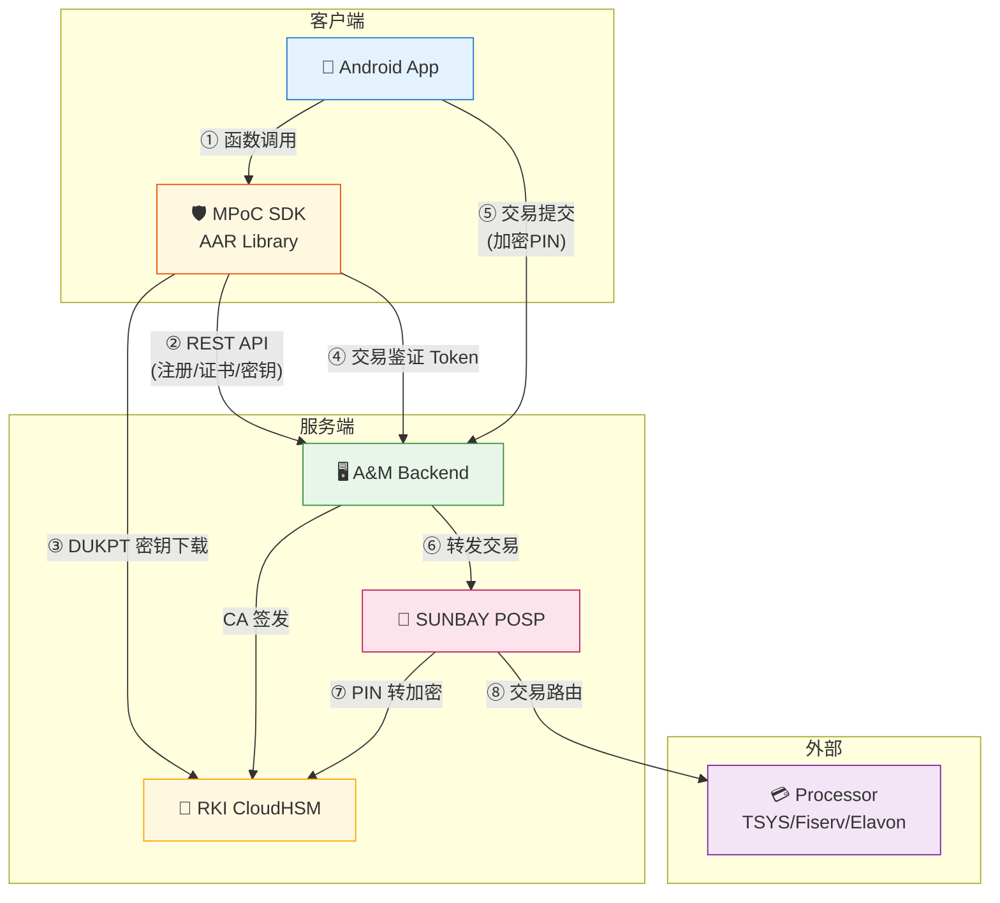
```mermaid
flowchart TB
    subgraph "客户端"
        App[📱 Android App]
        SDK[🛡️ MPoC SDK<br/>AAR Library]
    end
    
    subgraph "服务端"
        Backend[🖥️ A&M Backend]
        POSP[🏦 SUNBAY POSP]
        HSM[🔐 RKI CloudHSM]
    end
    
    subgraph "外部"
        Processor[💳 Processor<br/>TSYS/Fiserv/Elavon]
    end
    
    App -->|"① 函数调用"| SDK
    SDK -->|"② REST API<br/>(注册/证书/密钥)"| Backend
    SDK -->|"③ DUKPT 密钥下载"| HSM
    Backend -->|CA 签发| HSM
    
    SDK -->|"④ 交易鉴证 Token"| Backend
    App -->|"⑤ 交易提交<br/>(加密PIN)"| Backend
    Backend -->|"⑥ 转发交易"| POSP
    POSP -->|"⑦ PIN 转加密"| HSM
    POSP -->|"⑧ 交易路由"| Processor
    
    style App fill:#e3f2fd,stroke:#1976d2
    style SDK fill:#fff8e1,stroke:#e65100
    style Backend fill:#e8f5e9,stroke:#388e3c
    style POSP fill:#fce4ec,stroke:#c2185b
    style HSM fill:#fff8e1,stroke:#ffa000
    style Processor fill:#f3e5f5,stroke:#7b1fa2
```

**处理顺序说明**:
1. **① 函数调用**: App 调用 SDK 接口
2. **② 初始化**: SDK 完成设备注册、证书签发、密钥初始化
3. **③ 密钥下载**: DUKPT 模式下 SDK 直连 HSM 下载密钥
4. **④ 交易鉴证**: 交易前 SDK 向 Backend 获取 Transaction Token
5. **⑤ 交易提交**: App 携带加密 PIN Block 提交到 A&M Backend
6. **⑥ 转发交易**: A&M Backend 转发交易到 POSP
7. **⑦ PIN 转加密**: POSP 在 HSM 内完成 PIN 转加密
8. **⑧ 交易路由**: POSP 将交易发送到 Processor

### 2.2 API 端点总览

#### 2.2.1 MPoC SDK → A&M Backend

| 阶段 | API | 端点 | 方法 |
|------|-----|------|------|
| 设备注册 | 注册设备 | `MPoC/api/devices/register` | POST |
| 证书签发 | CSR 签发 | `MPoC/api/certificates/sign` | POST |
| 证书管理 | 证书续期 | `MPoC/api/certificates/renew` | POST |
| ECC密钥交换 | ECC 密钥交换 | `MPoC/api/keys/ecc/exchange` | POST |
| WBC管理 | WBC 初始化 | `MPoC/api/wbc/initialize` | POST |
| WBC管理 | WBC 密钥轮换 | `MPoC/api/keys/wbc/rotate` | POST |
| 密钥管理 | 会话密钥刷新 | `MPoC/api/keys/session/refresh` | POST |
| 安全监控 | 威胁上报 | `MPoC/api/threats/report` | POST |
| 安全监控 | 定期鉴证 | `MPoC/api/attestation/periodic` | POST |
| 安全监控 | 心跳监控 | `MPoC/api/monitoring/heartbeat` | POST |
| 交易处理 | 交易鉴证 | `MPoC/api/transactions/attest` | POST |
| 离线模式 | 离线授权 | `MPoC/api/offline/authorize` | POST |
| 离线模式 | 离线数据同步 | `MPoC/api/offline/sync` | POST |
| 设备管理 | 设备状态查询 | `MPoC/api/devices/status` | GET |
| 设备管理 | 设备注销 | `MPoC/api/devices/deregister` | POST |
| 版本管理 | SDK 版本检查 | `MPoC/api/sdk/version/check` | POST |

#### 2.2.2 MPoC SDK → RKI CloudHSM

| 阶段 | API | 端点 | 方法 |
|------|-----|------|------|
| DUKPT密钥初始化 | DUKPT 密钥下载 | `/RKI/api/v1/keys/download` | POST |
| DUKPT密钥锁定 | DUKPT 密钥锁定 | `/RKI/api/v1/keys/confirm` | POST |

#### 2.2.3 A&M Backend → RKI CloudHSM (内部)

| API | 端点 | 用途 |
|-----|------|------|
| CA 证书签发 | `/RKI/api/v1/ca/sign` | CSR 证书签发 |

#### 2.2.4 A&M Backend → SUNBAY POSP (内部转发)

| API | 端点 | 方法 | 说明 |
|-----|------|------|------|
| 交易密钥协商 | `MPoC/api/wbc/transaction-key-exchange` | POST | A&M Backend 转发到 POSP 的密钥协商 |

#### 2.2.5 Android App → A&M Backend

| API | 端点 | 方法 | 说明 |
|-----|------|------|------|
| 交易提交 | `MPoC/api/transactions/submit` | POST | App 通过 A&M Backend 提交交易 |

---

## 3. SDK 模块职责

MPoC SDK 内部按职责划分为以下模块：

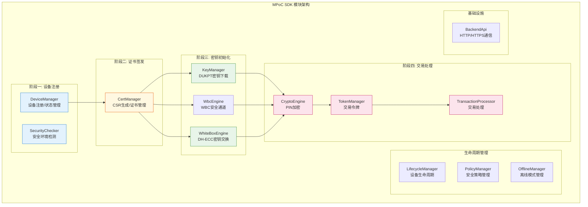
```mermaid
graph TB
    subgraph "MPoC SDK 模块架构"
        subgraph "阶段一: 设备注册"
            DM[DeviceManager<br/>设备注册/状态管理]
            SC[SecurityChecker<br/>安全环境检测]
        end
        
        subgraph "阶段二: 证书签发"
            CM[CertManager<br/>CSR生成/证书管理]
        end
        
        subgraph "阶段三: 密钥初始化"
            KM[KeyManager<br/>DUKPT密钥下载]
            WE[WbcEngine<br/>WBC安全通道]
            WB[WhiteBoxEngine<br/>DH-ECC密钥交换]
        end
        
        subgraph "阶段四: 交易处理"
            CE[CryptoEngine<br/>PIN加密]
            TM[TokenManager<br/>交易令牌]
            TP[TransactionProcessor<br/>交易处理]
        end
        
        subgraph "生命周期管理"
            LM[LifecycleManager<br/>设备生命周期]
            PM[PolicyManager<br/>安全策略管理]
            OM[OfflineManager<br/>离线模式管理]
        end
        
        subgraph "基础设施"
            BA[BackendApi<br/>HTTP/HTTPS通信]
        end
    end
    
    DM --> CM
    CM --> KM
    CM --> WE
    CM --> WB
    KM --> CE
    WE --> CE
    WB --> CE
    CE --> TM
    TM --> TP
    
    style DM fill:#e3f2fd,stroke:#1976d2
    style SC fill:#e3f2fd,stroke:#1976d2
    style CM fill:#fff8e1,stroke:#e65100
    style KM fill:#e8f5e9,stroke:#388e3c
    style WB fill:#e8f5e9,stroke:#388e3c
    style CE fill:#fce4ec,stroke:#c2185b
    style TM fill:#fce4ec,stroke:#c2185b
    style TP fill:#fce4ec,stroke:#c2185b
```

### 3.1 模块职责说明

| 模块 | 职责 | 主要接口 | 调用阶段 |
|------|------|---------|---------|
| **DeviceManager** | 设备注册、状态查询、TEE 类型检测 | `registerDevice()`, `getDeviceStatus()` | 阶段一 |
| **SecurityChecker** | Root/模拟器/Hook 检测、威胁上报 | `checkSecurity()`, `reportThreat()` | 阶段一 |
| **CertManager** | ECC 密钥对生成、CSR 创建、证书存储 | `generateKeyPair()`, `submitCsr()` | 阶段二 |
| **KeyManager** | DUKPT 密钥下载、KSN 管理 | `downloadKey()`, `confirmDownload()` | 阶段三 (SE/TEE) |
| **WbcEngine** | WBC 安全通道建立、三层密钥管理、密钥轮换 | `initializeWbc()`, `exchangeTransactionKey()`, `rotateWbcKey()` | 阶段三 (WhiteBox-WBC) |
| **WhiteBoxEngine** | DH-ECC 密钥交换、会话密钥派生 | `initKeyExchange()`, `deriveSessionKey()` | 阶段三 (WhiteBox-Simple) |
| **CryptoEngine** | PIN Block 生成、加密 (支持 SE/TEE/WhiteBox) | `encryptPin()`, `getTeeType()` | 阶段四 |
| **TokenManager** | 交易令牌申请、有效期管理 | `requestToken()`, `validateToken()` | 阶段四 |
| **TransactionProcessor** | 交易鉴证、交易数据封装 | `attestTransaction()`, `prepareTransaction()` | 阶段四 |
| **LifecycleManager** | 设备生命周期管理、注销流程 | `deregisterDevice()`, `getDeviceStatus()` | 全阶段 |
| **PolicyManager** | 安全策略管理、动态更新 | `updatePolicy()`, `checkCompliance()` | 全阶段 |
| **OfflineManager** | 离线模式管理、数据同步 | `enableOfflineMode()`, `syncOfflineData()` | 全阶段 |
| **BackendApi** | HTTP/TLS 1.3 通信、HTTPS 连接 | (内部模块) | 全阶段 |

---

## 4. 初始化流程总览
### 4.1 初始化状态机

SDK 初始化按以下顺序执行，每个阶段必须成功完成后才能进入下一阶段：

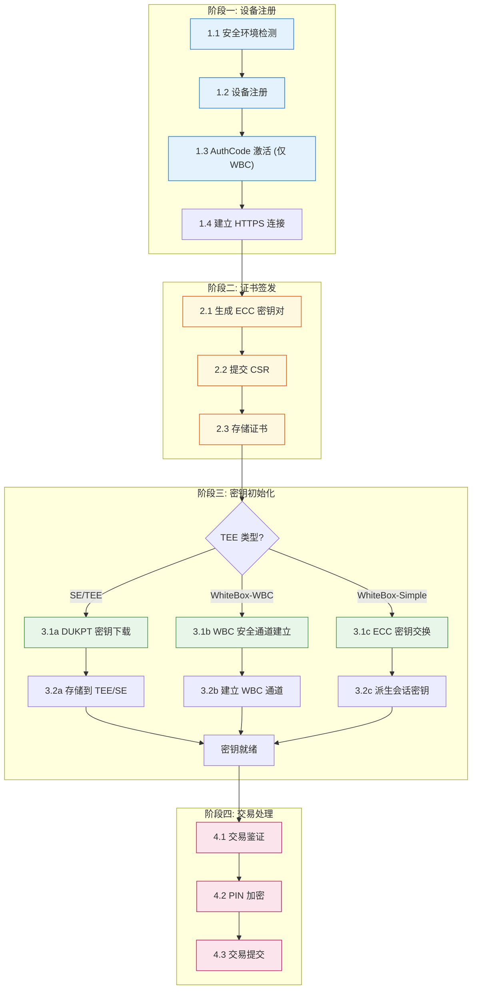
```mermaid
flowchart TB
    subgraph "阶段一: 设备注册"
        A1["1.1 安全环境检测"] --> A2["1.2 设备注册"]
        A2 --> A3["1.3 AuthCode 激活 (仅 WBC)"]
        A3 --> A4["1.4 建立 HTTPS 连接"]
    end
    
    subgraph "阶段二: 证书签发"
        B1["2.1 生成 ECC 密钥对"] --> B2["2.2 提交 CSR"]
        B2 --> B3["2.3 存储证书"]
    end
    
    subgraph "阶段三: 密钥初始化"
        C1{"TEE 类型?"}
        C1 -->|SE/TEE| C2["3.1a DUKPT 密钥下载"]
        C1 -->|WhiteBox-WBC| C3["3.1b WBC 安全通道建立"]
        C1 -->|WhiteBox-Simple| C4["3.1c ECC 密钥交换"]
        C2 --> C5["3.2a 存储到 TEE/SE"]
        C3 --> C6["3.2b 建立 WBC 通道"]
        C4 --> C7["3.2c 派生会话密钥"]
        C5 --> C8["密钥就绪"]
        C6 --> C8
        C7 --> C8
    end
    
    subgraph "阶段四: 交易处理"
        D1["4.1 交易鉴证"] --> D2["4.2 PIN 加密"]
        D2 --> D3["4.3 交易提交"]
    end
    
    A4 --> B1
    B3 --> C1
    C8 --> D1
    
    style A1 fill:#e3f2fd,stroke:#1976d2
    style A2 fill:#e3f2fd,stroke:#1976d2
    style A3 fill:#e3f2fd,stroke:#1976d2
    style B1 fill:#fff8e1,stroke:#e65100
    style B2 fill:#fff8e1,stroke:#e65100
    style B3 fill:#fff8e1,stroke:#e65100
    style C2 fill:#e8f5e9,stroke:#388e3c
    style C3 fill:#e8f5e9,stroke:#388e3c
    style C4 fill:#e8f5e9,stroke:#388e3c
    style D1 fill:#fce4ec,stroke:#c2185b
    style D2 fill:#fce4ec,stroke:#c2185b
    style D3 fill:#fce4ec,stroke:#c2185b
```

### 4.2 TEE 类型说明

SDK 根据设备硬件能力自动检测 TEE 类型，不同类型决定后续密钥初始化方式：

| **TEE 类型** | **说明** | **安全级别** | **密钥初始化方式** | **密钥存储位置** |
|--------------|---------|-------------|------------------|-----------------|
| **SE** | Secure Element，独立安全芯片 | ⭐⭐⭐ 最高 | DUKPT 密钥下载 | SE 芯片内 |
| **TEE** | ARM TrustZone 可信执行环境 | ⭐⭐ 高 | DUKPT 密钥下载 | TEE 安全区 |
| **WhiteBox-WBC** | WBC 白盒加密（每笔交易协商） | ⭐⭐ 高 | WBC 安全通道 + 每笔交易 ECDH | WBC 保护内存 |
| **WhiteBox-Simple** | 简化白盒加密（每笔交易生成新密钥） | ⭐⭐ 高 | DH-ECC 密钥交换 | WhiteBox 保护内存 |

#### 4.2.1 TEE 类型检测算法

SDK 按以下优先级顺序检测设备 TEE 类型：

```java
public enum TeeType {
    SE,              // 最高优先级
    TEE,             // 高优先级  
    WHITEBOX_WBC,    // 中优先级
    WHITEBOX_SIMPLE  // 最低优先级（fallback）
}
```

**检测流程**:
1. **SE 检测**: 检查是否存在独立安全芯片
   - 检测方法: `hasSecureElement()` 
   - 验证: SE 芯片可用性和 DUKPT 支持
2. **TEE 检测**: 检查 ARM TrustZone 支持
   - 检测方法: `hasTrustZone()`
   - 验证: TEE 环境可用性和密钥存储能力
3. **WhiteBox-WBC**: 检查 WBC 白盒加密支持
   - 检测方法: `hasWhiteBoxWBC()`
   - 验证: CommWBC 预置密钥完整性
4. **WhiteBox-Simple**: 默认 fallback 模式
   - 适用: 所有 Android 设备
   - 要求: 最低 Android 7.0 (API 24)

**Fallback 机制**:
- 如果高优先级 TEE 类型检测失败，自动降级到下一级
- 最终 fallback 到 WhiteBox-Simple（保证兼容性）
- 检测结果缓存，避免重复检测

> ⚠️ **重要**: 
> - **WhiteBox-WBC**: 符合端云交互流程设计，使用 AuthCode + CommWBC + SCWBC 三层密钥架构
> - **WhiteBox-Simple**: 简化实现，使用设备证书 + 会话密钥两层架构
> - 所有 TEE 类型都需要先完成证书签发，证书是后续密钥操作的身份凭证

---

## 5. 阶段一：设备注册

### 5.1 流程说明

设备注册是 SDK 初始化的第一步，包括安全环境检测、设备信息上报和 HTTPS 连接建立。

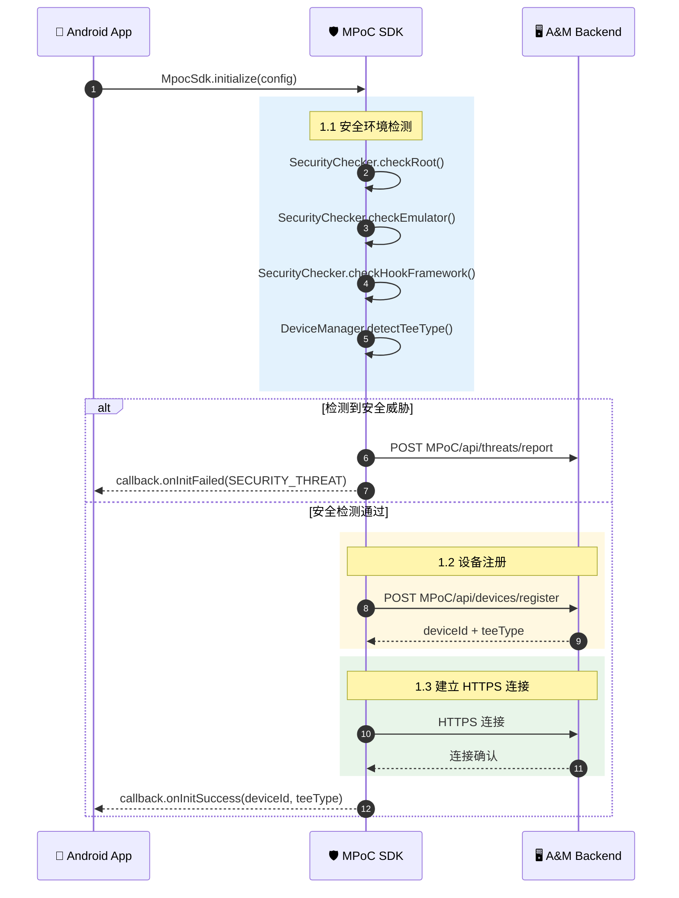
```mermaid
sequenceDiagram
    autonumber
    participant App as 📱 Android App
    participant SDK as 🛡️ MPoC SDK
    participant Backend as 🖥️ A&M Backend

    App->>SDK: MpocSdk.initialize(config)
    
    rect rgb(227, 242, 253)
        Note over SDK: 1.1 安全环境检测
        SDK->>SDK: SecurityChecker.checkRoot()
        SDK->>SDK: SecurityChecker.checkEmulator()
        SDK->>SDK: SecurityChecker.checkHookFramework()
        SDK->>SDK: DeviceManager.detectTeeType()
    end
    
    alt 检测到安全威胁
        SDK->>Backend: POST MPoC/api/threats/report
        SDK-->>App: callback.onInitFailed(SECURITY_THREAT)
    else 安全检测通过
        rect rgb(255, 248, 225)
            Note over SDK,Backend: 1.2 设备注册
            SDK->>Backend: POST MPoC/api/devices/register
            Backend-->>SDK: deviceId + teeType
        end
        
        rect rgb(232, 245, 233)
            Note over SDK,Backend: 1.3 建立 HTTPS 连接
            SDK->>Backend: HTTPS 连接
            Backend-->>SDK: 连接确认
        end
        
        SDK-->>App: callback.onInitSuccess(deviceId, teeType)
    end
```

### 5.2 API: 设备注册

**端点**: `POST MPoC/api/devices/register`

**负责模块**: DeviceManager

**请求**:
```json
{
  "deviceId": "dev-550e8400-e29b-41d4-a716-446655440000",
  "imei": "860000000000001",
  "model": "Samsung Galaxy S23",
  "osVersion": "Android 14",
  "sdkVersion": "1.0.0",
  "appVersion": "2.0.0",
  "hwFingerprint": "base64_encoded_hardware_fingerprint",
  "securityInfo": {
    "isRooted": false,
    "isEmulator": false,
    "hasHookFramework": false,
    "isDebuggerAttached": false,
    "isAppTampered": false,
    "teeAvailable": true,
    "teeType": "TEE"
  }
}
```

**响应**:
```json
{
  "code": 200,
  "data": {
    "deviceId": "dev-550e8400-e29b-41d4-a716-446655440000",
    "status": "REGISTERED",
    "teeType": "TEE",
    "keyMode": "DUKPT"
  },
  "message": "Device registered successfully"
}
```

**响应字段说明**:

| 字段 | 类型 | 说明 |
|------|------|------|
| `deviceId` | string | 设备唯一标识，后续所有 API 调用需携带 |
| `status` | string | 设备状态: `REGISTERED`, `ACTIVATED`, `ACTIVE`, `SUSPENDED`, `DEREGISTERED` |
| `teeType` | string | TEE 类型: `SE`, `TEE`, `WhiteBox-WBC`, `WhiteBox-Simple` |
| `keyMode` | string | 密钥模式: `DUKPT` (SE/TEE), `WBC` (WhiteBox-WBC), `DH-ECC` (WhiteBox-Simple) |

> ⚠️ **重要**: 
> - WhiteBox-WBC 模式需要商户通过**外部渠道**（门户/邮件）获取 AuthCode
> - AuthCode 不在设备注册API中返回，而是通过独立的商户管理流程获得

> 📌 SDK 根据 `teeType` 和 `keyMode` 决定阶段三的密钥初始化方式。

### 5.3 AuthCode 获取与设备激活 (WhiteBox-WBC 模式)

对于 TEE 类型为 `WhiteBox-WBC` 的设备，需要在设备注册后通过 SUNBAY 平台完成设备绑定和 AuthCode 获取流程：

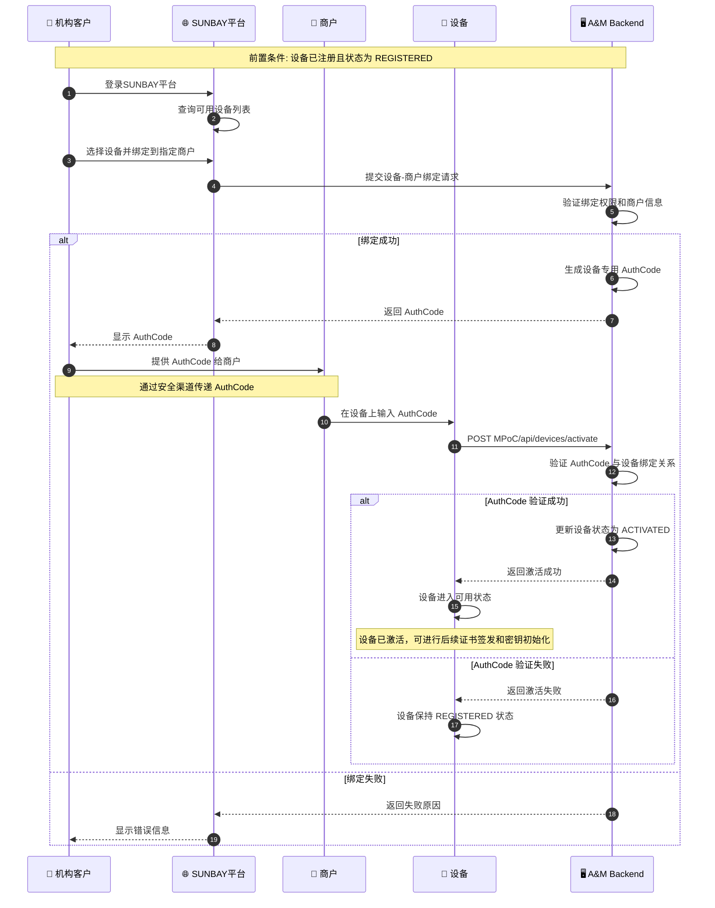
```mermaid
sequenceDiagram
    autonumber
    participant Customer as 👤 机构客户
    participant Platform as 🌐 SUNBAY平台
    participant Merchant as 🏪 商户
    participant Device as 📱 设备
    participant AM as 🖥️ A&M Backend

    Note over Customer,AM: 前置条件: 设备已注册且状态为 REGISTERED
    
    Customer->>Platform: 登录SUNBAY平台
    Platform->>Platform: 查询可用设备列表
    
    Customer->>Platform: 选择设备并绑定到指定商户
    Platform->>AM: 提交设备-商户绑定请求
    AM->>AM: 验证绑定权限和商户信息
    
    alt 绑定成功
        AM->>AM: 生成设备专用 AuthCode
        AM-->>Platform: 返回 AuthCode
        Platform-->>Customer: 显示 AuthCode
        
        Customer->>Merchant: 提供 AuthCode 给商户
        Note over Customer,Merchant: 通过安全渠道传递 AuthCode
        
        Merchant->>Device: 在设备上输入 AuthCode
        Device->>AM: POST MPoC/api/devices/activate
        AM->>AM: 验证 AuthCode 与设备绑定关系
        
        alt AuthCode 验证成功
            AM->>AM: 更新设备状态为 ACTIVATED
            AM-->>Device: 返回激活成功
            Device->>Device: 设备进入可用状态
            Note over Device: 设备已激活，可进行后续证书签发和密钥初始化
        else AuthCode 验证失败
            AM-->>Device: 返回激活失败
            Device->>Device: 设备保持 REGISTERED 状态
        end
    else 绑定失败
        AM-->>Platform: 返回失败原因
        Platform-->>Customer: 显示错误信息
    end
```

> ⚠️ **重要**: 
> - AuthCode 是一次性使用的授权凭证，用于建立机构客户、商户与设备的三方绑定关系
> - 机构客户负责在SUNBAY平台上管理设备分配
> - 商户在设备上输入AuthCode完成设备激活，激活后设备才能进行证书签发和密钥初始化
> - 只有 WhiteBox-WBC 模式的设备需要 AuthCode 激活流程

#### 5.3.1 API: 设备激活

**端点**: `POST MPoC/api/devices/activate`

**负责模块**: DeviceManager

**请求**:
```json
{
  "deviceId": "dev-550e8400-e29b-41d4-a716-446655440000",
  "authCode": "AUTH-1234-5678-9ABC-DEF0",
  "merchantInfo": {
    "merchantId": "merchant-001",
    "terminalId": "terminal-001"
  },
  "timestamp": "2024-12-30T10:00:00Z"
}
```

**响应**:
```json
{
  "code": 200,
  "data": {
    "deviceId": "dev-550e8400-e29b-41d4-a716-446655440000",
    "status": "ACTIVATED",
    "merchantId": "merchant-001",
    "activatedAt": "2024-12-30T10:00:00Z",
    "authCodeUsed": true
  },
  "message": "Device activated successfully"
}
```

**错误响应**:

| 错误码 | 错误类型 | 说明 |
|--------|---------|------|
| 400 | `INVALID_AUTH_CODE` | AuthCode 格式无效 |
| 403 | `AUTH_CODE_EXPIRED` | AuthCode 已过期 |
| 404 | `DEVICE_NOT_FOUND` | 设备不存在 |
| 409 | `DEVICE_ALREADY_ACTIVATED` | 设备已激活 |
| 422 | `AUTH_CODE_MISMATCH` | AuthCode 与设备不匹配 |

### 5.4 API: 威胁上报

**端点**: `POST MPoC/api/threats/report`

**负责模块**: SecurityChecker

**请求 Header**:
```http
Content-Type: application/json
```

**请求**:
```json
{
  "deviceId": "dev-550e8400-e29b-41d4-a716-446655440000",
  "threatType": "ROOT_DETECTED",
  "severity": "HIGH",
  "details": {
    "detectionMethod": "su_binary_check",
    "timestamp": "2024-12-30T10:00:00Z",
    "additionalInfo": "Found su binary at /system/bin/su"
  }
}
```

**响应**:
```json
{
  "code": 200,
  "data": {
    "threatId": "threat-123456",
    "action": "BLOCK_TRANSACTIONS",
    "message": "Device has been flagged for security review"
  },
  "message": "Threat reported successfully"
}
```

**威胁类型**:

| 类型 | 说明 | 严重级别 | SDK 处理 |
|------|------|---------|---------|
| `ROOT_DETECTED` | 检测到 Root | HIGH | 阻止初始化 |
| `EMULATOR_DETECTED` | 检测到模拟器 | HIGH | 阻止初始化 |
| `HOOK_FRAMEWORK_DETECTED` | 检测到 Hook 框架 | HIGH | 阻止初始化 |
| `DEBUGGER_ATTACHED` | 检测到调试器 | MEDIUM | 警告 |
| `TAMPERED_APP` | 应用被篡改 | HIGH | 阻止初始化 |
| `UNSAFE_ENVIRONMENT` | 不安全环境 | MEDIUM | 警告 |

---

## 6. 阶段二：证书签发

### 6.1 流程说明

设备注册成功后，SDK 生成 ECC 密钥对并提交 CSR，由 RKI CloudHSM CA 签发设备证书。**证书是后续 DUKPT 和 WhiteBox 两种模式的共同前提**。

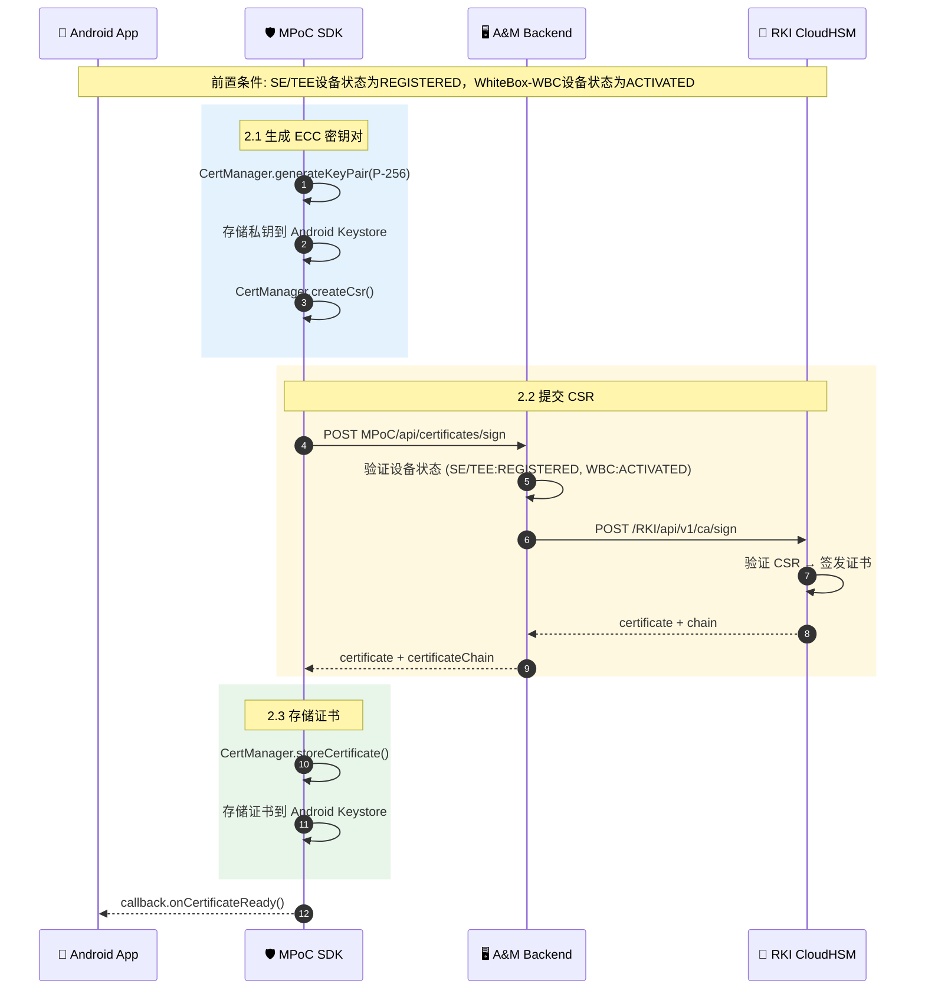
```mermaid
sequenceDiagram
    autonumber
    participant App as 📱 Android App
    participant SDK as 🛡️ MPoC SDK
    participant Backend as 🖥️ A&M Backend
    participant HSM as 🔐 RKI CloudHSM

    Note over App,HSM: 前置条件: SE/TEE设备状态为REGISTERED，WhiteBox-WBC设备状态为ACTIVATED
    
    rect rgb(227, 242, 253)
        Note over SDK: 2.1 生成 ECC 密钥对
        SDK->>SDK: CertManager.generateKeyPair(P-256)
        SDK->>SDK: 存储私钥到 Android Keystore
        SDK->>SDK: CertManager.createCsr()
    end
    
    rect rgb(255, 248, 225)
        Note over SDK,HSM: 2.2 提交 CSR
        SDK->>Backend: POST MPoC/api/certificates/sign
        Backend->>Backend: 验证设备状态 (SE/TEE:REGISTERED, WBC:ACTIVATED)
        Backend->>HSM: POST /RKI/api/v1/ca/sign
        HSM->>HSM: 验证 CSR → 签发证书
        HSM-->>Backend: certificate + chain
        Backend-->>SDK: certificate + certificateChain
    end
    
    rect rgb(232, 245, 233)
        Note over SDK: 2.3 存储证书
        SDK->>SDK: CertManager.storeCertificate()
        SDK->>SDK: 存储证书到 Android Keystore
    end
    
    SDK-->>App: callback.onCertificateReady()
```

### 6.2 证书层次结构

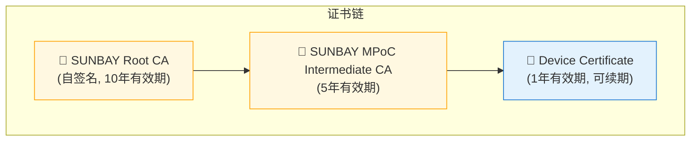
```mermaid
graph TB
    subgraph "证书链"
        RootCA["🔐 SUNBAY Root CA<br/>(自签名, 10年有效期)"]
        IntCA["🔐 SUNBAY MPoC Intermediate CA<br/>(5年有效期)"]
        DevCert["📱 Device Certificate<br/>(1年有效期, 可续期)"]
    end
    
    RootCA --> IntCA
    IntCA --> DevCert
    
    style RootCA fill:#fff8e1,stroke:#ffa000
    style IntCA fill:#fff8e1,stroke:#ffa000
    style DevCert fill:#e3f2fd,stroke:#1976d2
```

### 6.3 API: CSR 证书签发

**端点**: `POST MPoC/api/certificates/sign`

**负责模块**: CertManager

**请求**:
```json
{
  "deviceId": "dev-550e8400-e29b-41d4-a716-446655440000",
  "csr": "-----BEGIN CERTIFICATE REQUEST-----\nMIIBIjANBgkqhkiG9w0BAQEFAAOCAQ8AMIIBCgKCAQEA...\n-----END CERTIFICATE REQUEST-----",
  "csrFormat": "PEM",
  "keyAlgorithm": "EC",
  "keyParams": {
    "curve": "P-256"
  },
  "requestedValidity": 365,
  "certificateProfile": "MPOC_DEVICE"
}
```

**请求参数说明**:

| 参数 | 类型 | 必填 | 说明 |
|------|------|------|------|
| `deviceId` | string | 是 | 设备唯一标识 |
| `csr` | string | 是 | PKCS#10 格式的 CSR (PEM 编码) |
| `csrFormat` | string | 是 | CSR 格式: `PEM` 或 `DER` |
| `keyAlgorithm` | string | 是 | 密钥算法: `EC` |
| `keyParams.curve` | string | 是 | ECC 曲线: `P-256` |
| `requestedValidity` | number | 否 | 请求的证书有效期 (天), 默认 365 |
| `certificateProfile` | string | 是 | 证书配置文件: `MPOC_DEVICE` |

**响应**:
```json
{
  "code": 200,
  "data": {
    "certificate": "-----BEGIN CERTIFICATE-----\nMIIDXTCCAkWgAwIBAgIJAJC1HiIAZAiU...\n-----END CERTIFICATE-----",
    "certificateChain": [
      "-----BEGIN CERTIFICATE-----\n...(Intermediate CA)...\n-----END CERTIFICATE-----",
      "-----BEGIN CERTIFICATE-----\n...(Root CA)...\n-----END CERTIFICATE-----"
    ],
    "serialNumber": "01:23:45:67:89:AB:CD:EF",
    "issuer": "CN=SUNBAY MPoC Intermediate CA, O=SUNBAY, C=US",
    "subject": "CN=dev-550e8400-e29b-41d4-a716-446655440000, O=SUNBAY, C=US",
    "notBefore": "2024-12-30T00:00:00Z",
    "notAfter": "2025-12-30T23:59:59Z",
    "fingerprint": {
      "sha256": "A1:B2:C3:D4:E5:F6:..."
    }
  },
  "message": "Certificate signed successfully"
}
```

**证书配置文件 (Certificate Profile)**:

| Profile | 用途 | 有效期 | Key Usage |
|---------|------|--------|-----------|
| `MPOC_DEVICE` | 设备身份认证 | 1 年 | digitalSignature, clientAuth |

**错误响应**:

| 错误码 | 错误类型 | 说明 |
|--------|---------|------|
| 400 | `INVALID_CSR` | CSR 格式无效或签名验证失败 |
| 403 | `DEVICE_NOT_READY` | 设备状态不允许签发证书 |
| 409 | `CERTIFICATE_EXISTS` | 设备已有有效证书 |
| 500 | `HSM_ERROR` | HSM 签发失败 |

---

## 7. 阶段三：密钥初始化

证书签发完成后，根据 TEE 类型进入不同的密钥初始化流程：

- **SE/TEE 设备**: 使用 DUKPT 密钥下载 (7.1)
- **WhiteBox-WBC 设备**: 使用 WBC 安全通道建立 (7.2)
- **WhiteBox-Simple 设备**: 使用 DH-ECC 密钥交换 (7.3)

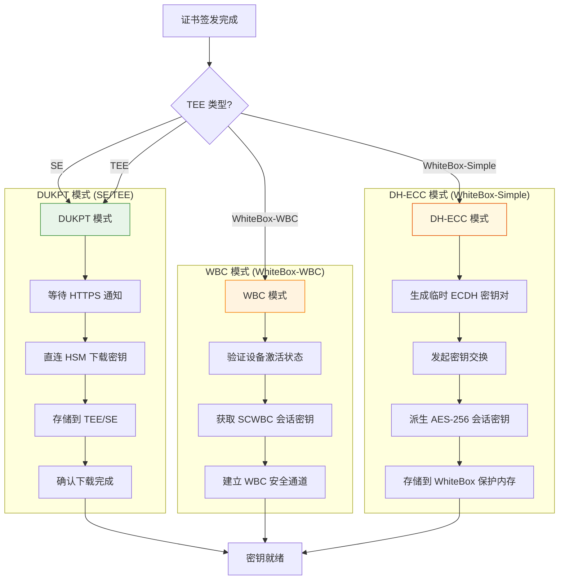
```mermaid
flowchart TB
    A[证书签发完成] --> B{TEE 类型?}
    
    B -->|SE| C[DUKPT 模式]
    B -->|TEE| C
    B -->|WhiteBox-WBC| D[WBC 模式]
    B -->|WhiteBox-Simple| E[DH-ECC 模式]
    
    subgraph "DUKPT 模式 (SE/TEE)"
        C --> C1[等待 HTTPS 通知]
        C1 --> C2[直连 HSM 下载密钥]
        C2 --> C3[存储到 TEE/SE]
        C3 --> C4[确认下载完成]
    end
    
    subgraph "WBC 模式 (WhiteBox-WBC)"
        D --> D1[验证设备激活状态]
        D1 --> D2[获取 SCWBC 会话密钥]
        D2 --> D3[建立 WBC 安全通道]
    end
    
    subgraph "DH-ECC 模式 (WhiteBox-Simple)"
        E --> E1[生成临时 ECDH 密钥对]
        E1 --> E2[发起密钥交换]
        E2 --> E3[派生 AES-256 会话密钥]
        E3 --> E4[存储到 WhiteBox 保护内存]
    end
    
    C4 --> F[密钥就绪]
    D3 --> F
    E4 --> F
    
    style C fill:#e8f5e9,stroke:#388e3c
    style D fill:#fff3e0,stroke:#f57c00
    style E fill:#fff8e1,stroke:#e65100
```

### 7.1 DUKPT 密钥下载 (SE/TEE 模式)

#### 7.1.1 流程说明

适用于 TEE 类型为 `SE` 或 `TEE` 的设备。SDK 直接调用 RKI CloudHSM API 下载密钥，使用设备证书进行身份认证。

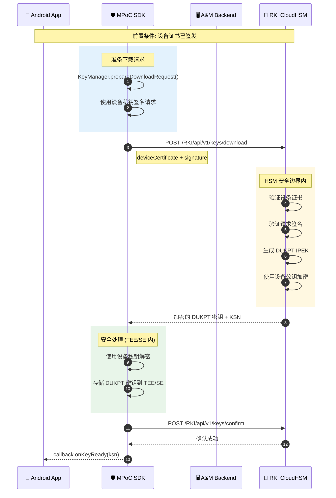
```mermaid
sequenceDiagram
    autonumber
    participant App as 📱 Android App
    participant SDK as 🛡️ MPoC SDK
    participant Backend as 🖥️ A&M Backend
    participant HSM as 🔐 RKI CloudHSM

    Note over App,HSM: 前置条件: 设备证书已签发
    
    rect rgb(227, 242, 253)
        Note over SDK: 准备下载请求
        SDK->>SDK: KeyManager.prepareDownloadRequest()
        SDK->>SDK: 使用设备私钥签名请求
    end
    
    SDK->>HSM: POST /RKI/api/v1/keys/download
    Note right of SDK: deviceCertificate + signature
    
    rect rgb(255, 248, 225)
        Note over HSM: HSM 安全边界内
        HSM->>HSM: 验证设备证书
        HSM->>HSM: 验证请求签名
        HSM->>HSM: 生成 DUKPT IPEK
        HSM->>HSM: 使用设备公钥加密
    end
    
    HSM-->>SDK: 加密的 DUKPT 密钥 + KSN
    
    rect rgb(232, 245, 233)
        Note over SDK: 安全处理 (TEE/SE 内)
        SDK->>SDK: 使用设备私钥解密
        SDK->>SDK: 存储 DUKPT 密钥到 TEE/SE
    end
    
    SDK->>HSM: POST /RKI/api/v1/keys/confirm
    HSM-->>SDK: 确认成功
    
    SDK-->>App: callback.onKeyReady(ksn)
```

> ⚠️ **存储要求**: DUKPT 密钥必须存储在 TEE/SE 安全环境内，**不能**存储到 Android Keystore。

#### 7.1.2 API: DUKPT 密钥下载 (RKI HSM)

**端点**: `POST https://<rki-hsm-host>/RKI/api/v1/keys/download`

**负责模块**: KeyManager

**请求**:
```json
{
  "deviceId": "dev-550e8400-e29b-41d4-a716-446655440000",
  "deviceCertificate": "-----BEGIN CERTIFICATE-----\nMIIDXTCCAkWgAwIBAgIJAJC1HiIAZAiU...\n-----END CERTIFICATE-----",
  "keyType": "DUKPT",
  "timestamp": "2024-12-30T10:00:00Z",
  "signature": "MEUCIQD...",
  "requestId": "req-20241230-001"
}
```

**签名计算方式**:
```
signatureData = deviceId + keyType + timestamp + requestId
signature = ECDSA_Sign(devicePrivateKey, SHA256(signatureData))
```

**响应**:
```json
{
  "code": 200,
  "data": {
    "encryptedKey": "base64_encrypted_ipek",
    "ksn": "FFFF9876543210E00001",
    "keyCheckValue": "A1B2C3",
    "algorithm": "3DES",
    "expiresAt": "2025-12-30T00:00:00Z",
    "encryptionMethod": "ECIES-P256"
  },
  "message": "Key downloaded successfully"
}
```

**响应字段说明**:

| 字段 | 说明 |
|------|------|
| `encryptedKey` | 使用设备证书公钥加密的 DUKPT IPEK |
| `ksn` | Key Serial Number (21 位十六进制) |
| `keyCheckValue` | 密钥校验值 (KCV) |
| `algorithm` | 密钥算法: `3DES` 或 `AES` |
| `encryptionMethod` | 密钥加密方式: `ECIES-P256` |

#### 7.1.3 API: DUKPT 密钥锁定

**端点**: `POST /RKI/api/v1/keys/confirm`

**负责模块**: KeyManager

**请求**:
```json
{
  "deviceId": "dev-550e8400-e29b-41d4-a716-446655440000",
  "ksn": "FFFF9876543210E00001",
  "keyCheckValue": "A1B2C3",
  "downloadedAt": "2024-12-30T10:00:00Z"
}
```

**响应**:
```json
{
  "code": 200,
  "data": {
    "confirmed": true,
    "keyStatus": "ACTIVE"
  },
  "message": "Key download confirmed"
}
```

### 7.2 WBC 安全通道建立 (WhiteBox-WBC 模式)

#### 7.2.1 流程说明

适用于 TEE 类型为 `WhiteBox-WBC` 的设备。使用三层密钥架构：CommWBC（预置）→ SCWBC（会话级）→ 每笔交易密钥（与PSP协商）。

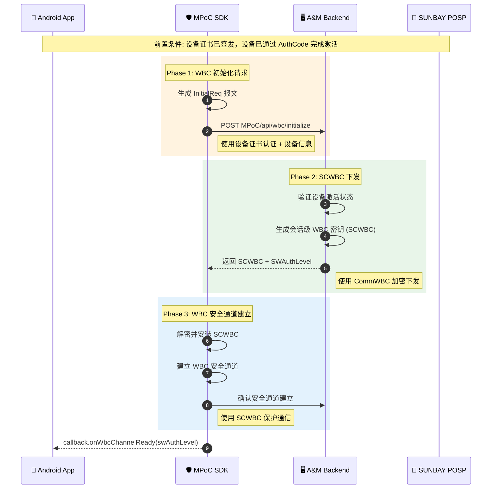
```mermaid
sequenceDiagram
    autonumber
    participant App as 📱 Android App
    participant SDK as 🛡️ MPoC SDK
    participant Backend as 🖥️ A&M Backend
    participant PSP as 🏦 SUNBAY POSP

    Note over App,PSP: 前置条件: 设备证书已签发，设备已通过 AuthCode 完成激活
    
    rect rgb(255, 243, 224)
        Note over SDK: Phase 1: WBC 初始化请求
        SDK->>SDK: 生成 InitialReq 报文
        SDK->>Backend: POST MPoC/api/wbc/initialize
        Note right of SDK: 使用设备证书认证 + 设备信息
    end
    
    rect rgb(232, 245, 233)
        Note over Backend: Phase 2: SCWBC 下发
        Backend->>Backend: 验证设备激活状态
        Backend->>Backend: 生成会话级 WBC 密钥 (SCWBC)
        Backend-->>SDK: 返回 SCWBC + SWAuthLevel
        Note right of Backend: 使用 CommWBC 加密下发
    end
    
    rect rgb(227, 242, 253)
        Note over SDK: Phase 3: WBC 安全通道建立
        SDK->>SDK: 解密并安装 SCWBC
        SDK->>SDK: 建立 WBC 安全通道
        SDK->>Backend: 确认安全通道建立
        Note right of SDK: 使用 SCWBC 保护通信
    end
    
    SDK-->>App: callback.onWbcChannelReady(swAuthLevel)
```

#### 7.2.2 WBC 密钥层次结构

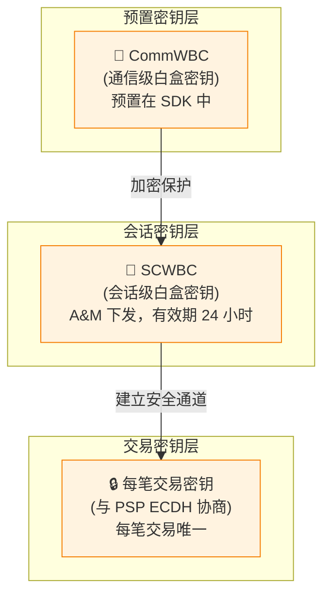
```mermaid
graph TB
    subgraph "预置密钥层"
        CommWBC["🔐 CommWBC<br/>(通信级白盒密钥)<br/>预置在 SDK 中"]
    end
    
    subgraph "会话密钥层"
        SCWBC["🔑 SCWBC<br/>(会话级白盒密钥)<br/>A&M 下发，有效期 24 小时"]
    end
    
    subgraph "交易密钥层"
        TxKey["🔒 每笔交易密钥<br/>(与 PSP ECDH 协商)<br/>每笔交易唯一"]
    end
    
    CommWBC -->|加密保护| SCWBC
    SCWBC -->|建立安全通道| TxKey
    
    style CommWBC fill:#fff3e0,stroke:#f57c00
    style SCWBC fill:#fff3e0,stroke:#f57c00
    style TxKey fill:#fff3e0,stroke:#f57c00
```

| 密钥类型 | 生命周期 | 用途 | 存储位置 |
|---------|---------|------|---------|
| CommWBC | 永久 (预置) | 保护 AuthCode 和 SCWBC 传输 | WBC 保护内存 |
| SCWBC | 24 小时 | 建立设备与 A&M 的安全通道 | WBC 保护内存 |
| **每笔交易密钥** | 单笔交易 | PIN/PAN 加密 | WBC 保护内存 (用后销毁) |

#### 7.2.3 安全通道生命周期管理

**SCWBC 安全通道生命周期**:

1. **建立阶段** (Phase 3 完成后)
   - SCWBC 安装成功，安全通道激活
   - 状态: `CHANNEL_ACTIVE`
   - 有效期: 24小时

2. **使用阶段** (交易密钥协商)
   - 每笔交易前通过 SCWBC 通道协商交易密钥
   - 通道复用，无需重新建立
   - 状态: `CHANNEL_IN_USE`

3. **续期阶段** (接近过期时)
   - 剩余时间 < 2小时时自动续期
   - 后台静默更新 SCWBC
   - 状态: `CHANNEL_RENEWING`

4. **过期处理**
   - SCWBC 过期后自动失效
   - 状态: `CHANNEL_EXPIRED`
   - 需重新执行 WBC 初始化流程

**交易密钥生命周期**:
- **生成**: 每笔交易前 ECDH 协商
- **使用**: 仅用于当前交易的 PIN 加密
- **销毁**: 交易完成后立即销毁 (5分钟内)
- **状态跟踪**: `KEY_GENERATED` → `KEY_ACTIVE` → `KEY_DESTROYED`

#### 7.2.4 API: WBC 初始化

**端点**: `POST MPoC/api/wbc/initialize`

**负责模块**: WbcEngine

**请求**:
```json
{
  "deviceId": "dev-550e8400-e29b-41d4-a716-446655440000",
  "encryptedDeviceFingerprint": "base64_commwbc_encrypted_df",
  "encryptionMethod": "CommWBC",
  "timestamp": "2024-12-30T10:00:00Z",
  "requestId": "wbc-init-20241230-001"
}
```

**响应**:
```json
{
  "code": 200,
  "data": {
    "encryptedScwbc": "base64_commwbc_encrypted_scwbc",
    "encryptedDeviceFingerprint": "base64_bek_encrypted_df",
    "encryptedSwAuthLevel": "base64_bek_encrypted_sw_auth_level",
    "swAuthLevel": "STANDARD",
    "sessionId": "wbc-sess-20241230-001",
    "scwbcExpiresAt": "2024-12-31T10:00:00Z",
    "allowedOperations": ["TRANSACTION", "KEY_EXCHANGE"],
    "policyVersion": "1.2.0"
  },
  "message": "WBC initialization successful"
}
```

#### 7.2.5 WBC 交易密钥协商

每笔交易前，SDK 通过 A&M Backend 与 POSP 进行 ECDH 密钥协商：

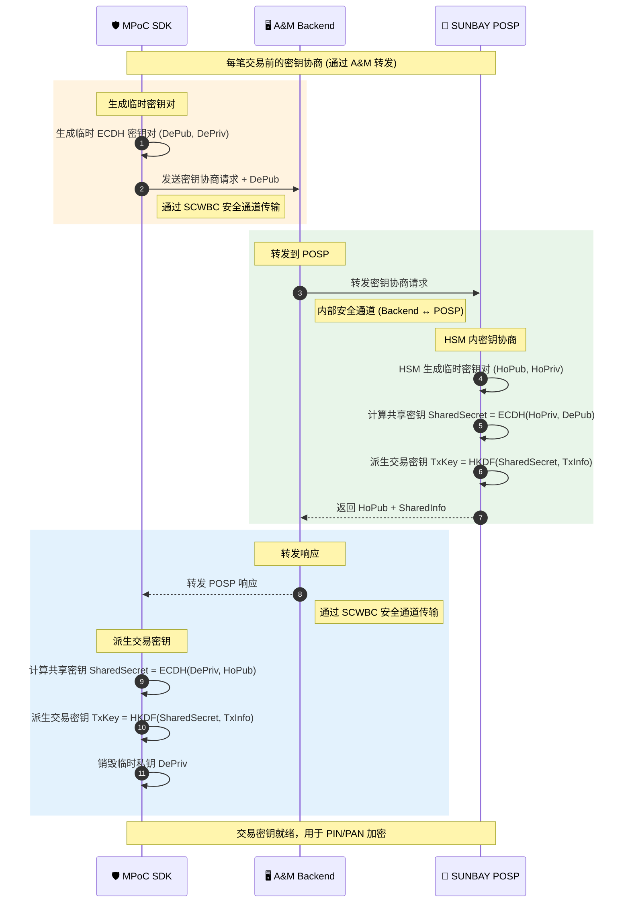
```mermaid
sequenceDiagram
    autonumber
    participant SDK as 🛡️ MPoC SDK
    participant Backend as 🖥️ A&M Backend
    participant PSP as 🏦 SUNBAY POSP

    Note over SDK,PSP: 每笔交易前的密钥协商 (通过 A&M 转发)
    
    rect rgb(255, 243, 224)
        Note over SDK: 生成临时密钥对
        SDK->>SDK: 生成临时 ECDH 密钥对 (DePub, DePriv)
        SDK->>Backend: 发送密钥协商请求 + DePub
        Note right of SDK: 通过 SCWBC 安全通道传输
    end
    
    rect rgb(232, 245, 233)
        Note over Backend: 转发到 POSP
        Backend->>PSP: 转发密钥协商请求
        Note right of Backend: 内部安全通道 (Backend ↔ POSP)
        
        Note over PSP: HSM 内密钥协商
        PSP->>PSP: HSM 生成临时密钥对 (HoPub, HoPriv)
        PSP->>PSP: 计算共享密钥 SharedSecret = ECDH(HoPriv, DePub)
        PSP->>PSP: 派生交易密钥 TxKey = HKDF(SharedSecret, TxInfo)
        PSP-->>Backend: 返回 HoPub + SharedInfo
    end
    
    rect rgb(227, 242, 253)
        Note over Backend: 转发响应
        Backend-->>SDK: 转发 POSP 响应
        Note right of Backend: 通过 SCWBC 安全通道传输
        
        Note over SDK: 派生交易密钥
        SDK->>SDK: 计算共享密钥 SharedSecret = ECDH(DePriv, HoPub)
        SDK->>SDK: 派生交易密钥 TxKey = HKDF(SharedSecret, TxInfo)
        SDK->>SDK: 销毁临时私钥 DePriv
    end
    
    Note over SDK,PSP: 交易密钥就绪，用于 PIN/PAN 加密
```

#### 7.2.6 API: 交易密钥协商

**端点**: `POST MPoC/api/wbc/transaction-key-exchange`

**负责模块**: WbcEngine

> ⚠️ **重要**: 此API由A&M Backend提供，内部转发到SUNBAY POSP

**请求**:
```json
{
  "deviceId": "dev-550e8400-e29b-41d4-a716-446655440000",
  "transactionId": "txn-20241230-001",
  "ephemeralPublicKey": "04a1b2c3d4e5f6...",
  "curve": "P-256",
  "kdfInfo": "SUNBAY_PIN_ENCRYPTION_V1",
  "timestamp": "2024-12-30T10:00:00Z"
}
```

**请求参数说明**:

| 参数 | 类型 | 必填 | 说明 |
|------|------|------|------|
| `deviceId` | string | 是 | 设备唯一标识 |
| `transactionId` | string | 是 | 交易流水号 (由 App 生成，全局唯一) |
| `ephemeralPublicKey` | string | 是 | 临时 ECDH 公钥 (P-256 曲线，未压缩格式 04 + X + Y) |
| `curve` | string | 是 | ECC 曲线: `P-256` |
| `kdfInfo` | string | 是 | 密钥派生信息标签: `SUNBAY_PIN_ENCRYPTION_V1` |
| `timestamp` | string | 是 | 请求时间戳 (UTC) |

**A&M Backend 内部转发到 POSP**:

```json
{
  "deviceId": "dev-550e8400-e29b-41d4-a716-446655440000",
  "transactionId": "txn-20241230-001",
  "ephemeralPublicKey": "04a1b2c3d4e5f6...",
  "curve": "P-256",
  "kdfInfo": "SUNBAY_PIN_ENCRYPTION_V1",
  "timestamp": "2024-12-30T10:00:00Z",
  "merchantId": "merchant-001",
  "terminalId": "term-001"
}
```

**响应**:

```json
{
  "code": 200,
  "data": {
    "serverEphemeralPublicKey": "04f1e2d3c4b5a6...",
    "transactionKeyId": "txkey-20241230-001",
    "kdfParams": {
      "algorithm": "HKDF-SHA256",
      "info": "SUNBAY_PIN_ENCRYPTION_V1",
      "keyLength": 256
    },
    "expiresAt": "2024-12-30T10:05:00Z"
  },
  "message": "Transaction key exchange successful"
}
```

**响应字段说明**:

| 字段 | 类型 | 说明 |
|------|------|------|
| `serverEphemeralPublicKey` | string | 服务端临时 ECDH 公钥 |
| `transactionKeyId` | string | 交易密钥标识符，用于后续 PIN 加密 |
| `kdfParams.algorithm` | string | 密钥派生算法: `HKDF-SHA256` |
| `kdfParams.info` | string | 密钥派生信息 (与请求一致) |
| `kdfParams.keyLength` | number | 密钥长度: 256 位 |
| `expiresAt` | string | 交易密钥过期时间 (UTC)，默认 5 分钟 |

**错误响应**:

| 错误码 | 错误类型 | 说明 |
|--------|---------|------|
| 400 | `INVALID_DEVICE_ID` | 设备ID格式无效 |
| 400 | `INVALID_PUBLIC_KEY` | 临时公钥格式无效 |
| 400 | `INVALID_CURVE` | 不支持的 ECC 曲线 |
| 403 | `DEVICE_NOT_AUTHORIZED` | 设备未授权进行密钥协商 |
| 403 | `WBC_CHANNEL_NOT_READY` | WBC安全通道未建立 |
| 403 | `WBC_CHANNEL_EXPIRED` | WBC安全通道已过期，需重新初始化 |
| 422 | `KEY_EXCHANGE_FAILED` | ECDH密钥协商失败 |
| 422 | `TRANSACTION_NOT_FOUND` | 交易流水号不存在 |
| 500 | `HSM_ERROR` | HSM内部错误 |
| 500 | `POSP_ERROR` | POSP处理错误 |

### 7.3 DH-ECC 密钥交换 (WhiteBox-Simple 模式)

#### 7.3.1 流程说明

适用于 TEE 类型为 `WhiteBox-Simple` 的设备。使用设备证书私钥签名认证，派生会话密钥用于 PIN 加密。

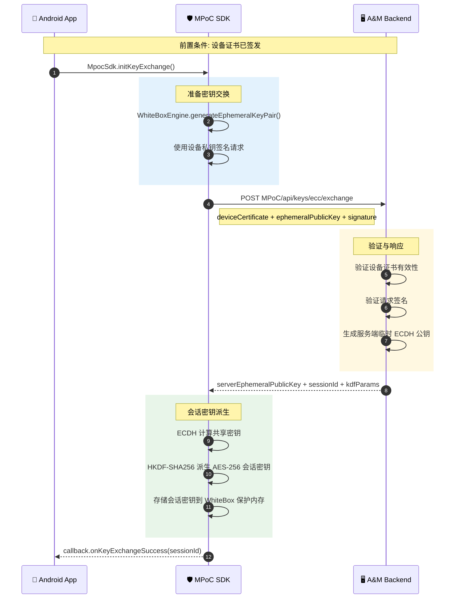
```mermaid
sequenceDiagram
    autonumber
    participant App as 📱 Android App
    participant SDK as 🛡️ MPoC SDK
    participant Backend as 🖥️ A&M Backend

    Note over App,Backend: 前置条件: 设备证书已签发
    
    App->>SDK: MpocSdk.initKeyExchange()
    
    rect rgb(227, 242, 253)
        Note over SDK: 准备密钥交换
        SDK->>SDK: WhiteBoxEngine.generateEphemeralKeyPair()
        SDK->>SDK: 使用设备私钥签名请求
    end
    
    SDK->>Backend: POST MPoC/api/keys/ecc/exchange
    Note right of SDK: deviceCertificate + ephemeralPublicKey + signature
    
    rect rgb(255, 248, 225)
        Note over Backend: 验证与响应
        Backend->>Backend: 验证设备证书有效性
        Backend->>Backend: 验证请求签名
        Backend->>Backend: 生成服务端临时 ECDH 公钥
    end
    
    Backend-->>SDK: serverEphemeralPublicKey + sessionId + kdfParams
    
    rect rgb(232, 245, 233)
        Note over SDK: 会话密钥派生
        SDK->>SDK: ECDH 计算共享密钥
        SDK->>SDK: HKDF-SHA256 派生 AES-256 会话密钥
        SDK->>SDK: 存储会话密钥到 WhiteBox 保护内存
    end
    
    SDK-->>App: callback.onKeyExchangeSuccess(sessionId)
```

#### 7.3.2 密钥层次结构

WhiteBox-Simple 模式包含两层密钥：

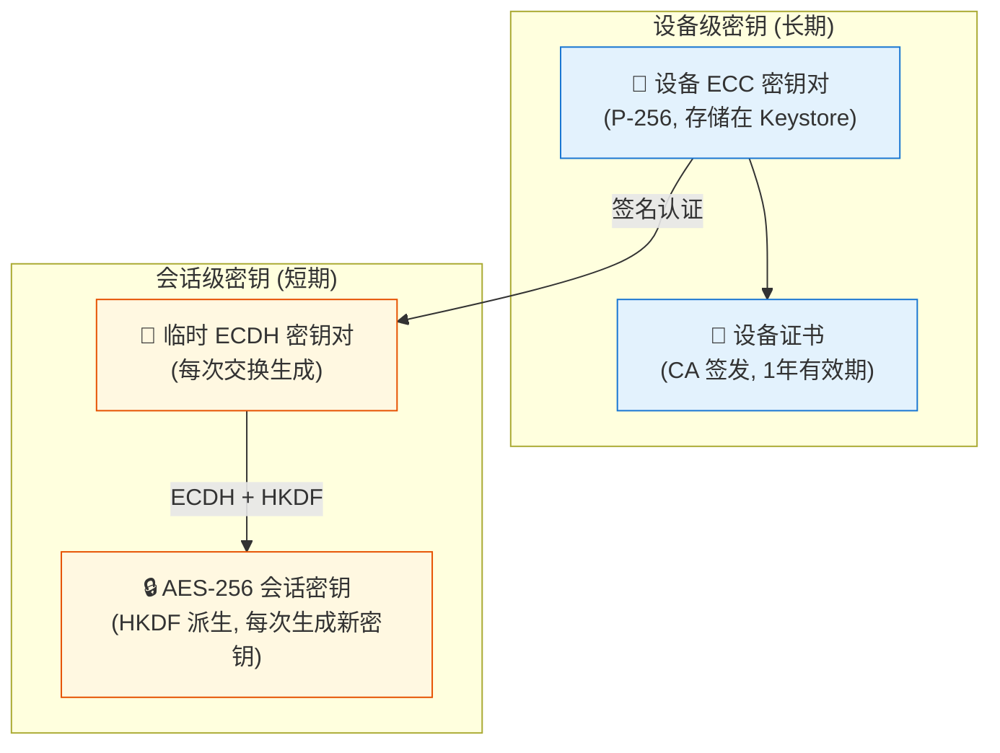
```mermaid
graph TB
    subgraph "设备级密钥 (长期)"
        DevKey["🔐 设备 ECC 密钥对<br/>(P-256, 存储在 Keystore)"]
        DevCert["📜 设备证书<br/>(CA 签发, 1年有效期)"]
    end
    
    subgraph "会话级密钥 (短期)"
        EphKey["🔑 临时 ECDH 密钥对<br/>(每次交换生成)"]
        SessionKey["🔒 AES-256 会话密钥<br/>(HKDF 派生, 每次生成新密钥)"]
    end
    
    DevKey --> DevCert
    DevKey -->|签名认证| EphKey
    EphKey -->|ECDH + HKDF| SessionKey
    
    style DevKey fill:#e3f2fd,stroke:#1976d2
    style DevCert fill:#e3f2fd,stroke:#1976d2
    style EphKey fill:#fff8e1,stroke:#e65100
    style SessionKey fill:#fff8e1,stroke:#e65100
```

| 密钥类型 | 生命周期 | 用途 | 存储位置 |
|---------|---------|------|---------|
| 设备密钥对 | 1 年 (随证书) | 身份认证、请求签名 | Android Keystore |
| 设备证书 | 1 年 (可续期) | 身份验证、公钥分发 | Android Keystore |
| 临时 ECDH 密钥对 | 单次使用 | 会话密钥协商 | 内存 (用后销毁) |
| AES-256 会话密钥 | 每笔交易生成新密钥 | PIN 加密 | WhiteBox 保护内存 |

#### 7.3.3 会话密钥生命周期

| 参数 | 值 | 说明 |
|------|-----|------|
| **密钥生成方式** | 每笔交易生成 | 每笔交易都生成新的会话密钥 |
| **最大交易数** | 无限制 | 每笔交易使用独立密钥，无数量限制 |
| **密钥复用** | 不支持 | 每个会话密钥仅用于单笔交易 |

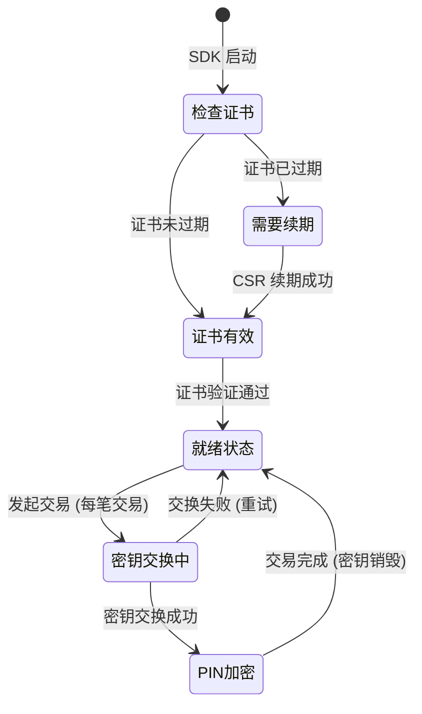
```mermaid
stateDiagram-v2
    [*] --> 检查证书: SDK 启动
    检查证书 --> 证书有效: 证书未过期
    检查证书 --> 需要续期: 证书已过期
    
    需要续期 --> 证书有效: CSR 续期成功
    
    证书有效 --> 就绪状态: 证书验证通过
    
    就绪状态 --> 密钥交换中: 发起交易 (每笔交易)
    密钥交换中 --> PIN加密: 密钥交换成功
    密钥交换中 --> 就绪状态: 交换失败 (重试)
    
    PIN加密 --> 就绪状态: 交易完成 (密钥销毁)
```

#### 7.3.4 API: ECC 密钥交换

**端点**: `POST MPoC/api/keys/ecc/exchange`

**负责模块**: WhiteBoxEngine

**请求**:
```json
{
  "deviceId": "dev-550e8400-e29b-41d4-a716-446655440000",
  "deviceCertificate": "-----BEGIN CERTIFICATE-----\nMIIDXTCCAkWgAwIBAgIJAJC1HiIAZAiU...\n-----END CERTIFICATE-----",
  "ephemeralPublicKey": "04a1b2c3d4e5f6...",
  "curve": "P-256",
  "timestamp": "2024-12-30T10:00:00Z",
  "signature": "MEUCIQD..."
}
```

**签名计算方式**:
```
signatureData = deviceId + ephemeralPublicKey + timestamp
signature = ECDSA_Sign(devicePrivateKey, SHA256(signatureData))
```

**响应**:
```json
{
  "code": 200,
  "data": {
    "serverEphemeralPublicKey": "04f1e2d3c4b5a6...",
    "sessionId": "sess-20241230-abc123",
    "expiresAt": "2024-12-30T10:30:00Z",
    "maxTransactions": 100,
    "curve": "P-256",
    "kdfParams": {
      "algorithm": "HKDF-SHA256",
      "info": "PIN_ENCRYPTION_V1",
      "keyLength": 256
    }
  },
  "message": "Key exchange successful"
}
```

### 7.4 密钥存储位置总结

| 密钥/证书类型 | SE 模式 | TEE 模式 | WhiteBox-WBC 模式 | WhiteBox-Simple 模式 |
|--------------|---------|---------|------------------|-------------------|
| 设备证书 | Android Keystore | Android Keystore | Android Keystore | Android Keystore |
| 设备私钥 | Android Keystore | Android Keystore | Android Keystore | Android Keystore |
| DUKPT IPEK | SE 芯片内 | TEE 安全区 | ❌ 不适用 | ❌ 不适用 |
| CommWBC | ❌ 不适用 | ❌ 不适用 | WBC 保护内存 | ❌ 不适用 |
| SCWBC | ❌ 不适用 | ❌ 不适用 | WBC 保护内存 | ❌ 不适用 |
| 每交易密钥 | ❌ 不适用 | ❌ 不适用 | WBC 保护内存 | ❌ 不适用 |
| 会话密钥 | ❌ 不适用 | ❌ 不适用 | ❌ 不适用 | WhiteBox 保护内存 |

> ⚠️ **重要**: 
> - DUKPT 密钥**不能**存储到 Android Keystore，必须存储在 TEE/SE 安全环境内
> - WBC 相关密钥必须存储在 WBC 保护内存中，不能存储到普通内存或文件系统

---

## 8. 阶段四：交易处理

### 8.1 流程说明

密钥初始化完成后，SDK 进入就绪状态，可以处理交易。交易处理流程如下：

1. **MPoC SDK** 负责：交易鉴证 Token 获取、PIN 加密
2. **Android App** 负责：将加密 PIN Block 提交到 SUNBAY POSP
3. **SUNBAY POSP** 负责：PIN 转加密、路由到 Processor

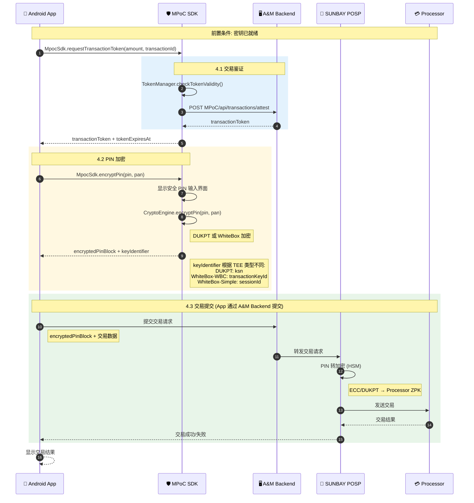
```mermaid
sequenceDiagram
    autonumber
    participant App as 📱 Android App
    participant SDK as 🛡️ MPoC SDK
    participant Backend as 🖥️ A&M Backend
    participant POSP as 🏦 SUNBAY POSP
    participant Processor as 💳 Processor

    Note over App,Processor: 前置条件: 密钥已就绪
    
    App->>SDK: MpocSdk.requestTransactionToken(amount, transactionId)
    
    rect rgb(227, 242, 253)
        Note over SDK,Backend: 4.1 交易鉴证
        SDK->>SDK: TokenManager.checkTokenValidity()
        SDK->>Backend: POST MPoC/api/transactions/attest
        Backend-->>SDK: transactionToken
    end
    
    SDK-->>App: transactionToken + tokenExpiresAt
    
    rect rgb(255, 248, 225)
        Note over App,SDK: 4.2 PIN 加密
        App->>SDK: MpocSdk.encryptPin(pin, pan)
        SDK->>SDK: 显示安全 PIN 输入界面
        SDK->>SDK: CryptoEngine.encryptPin(pin, pan)
        Note right of SDK: DUKPT 或 WhiteBox 加密
        SDK-->>App: encryptedPinBlock + keyIdentifier
        Note right of SDK: keyIdentifier 根据 TEE 类型不同:<br/>DUKPT: ksn<br/>WhiteBox-WBC: transactionKeyId<br/>WhiteBox-Simple: sessionId
    end
    
    rect rgb(232, 245, 233)
        Note over App,Processor: 4.3 交易提交 (App 通过 A&M Backend 提交)
        App->>Backend: 提交交易请求
        Note right of App: encryptedPinBlock + 交易数据
        Backend->>POSP: 转发交易请求
        
        POSP->>POSP: PIN 转加密 (HSM)
        Note right of POSP: ECC/DUKPT → Processor ZPK
        POSP->>Processor: 发送交易
        Processor-->>POSP: 交易结果
        POSP-->>App: 交易成功/失败
    end
    
    App-->>App: 显示交易结果
```

### 8.2 职责划分

| 组件 | 职责 | 说明 |
|------|------|------|
| **MPoC SDK** | 交易鉴证 Token 获取 | 调用 A&M Backend 获取 transactionToken |
| **MPoC SDK** | PIN 加密 | 使用 DUKPT 或 WhiteBox 加密 PIN |
| **Android App** | 交易提交 | 将加密 PIN Block 提交到 POSP |
| **SUNBAY POSP** | PIN 转加密 | 在 HSM 内将 PIN 转加密为 Processor ZPK 格式 |
| **SUNBAY POSP** | 交易路由 | 将交易发送到对应的 Processor |
| **A&M Backend** | Token 管理 | 签发 transactionToken |

### 8.3 API: 交易鉴证 Token 获取

**端点**: `POST MPoC/api/transactions/attest`

**负责模块**: TokenManager

**请求**:
```json
{
  "deviceId": "dev-550e8400-e29b-41d4-a716-446655440000",
  "transactionId": "txn-20241230-001",
  "transactionType": "PAYMENT",
  "amount": 10000,
  "currency": "USD",
  "securityInfo": {
    "isRooted": false,
    "isEmulator": false,
    "hasHookFramework": false,
    "isDebuggerAttached": false,
    "isAppTampered": false,
    "timestamp": "2024-12-30T10:00:00Z"
  }
}
```

**请求参数说明**:

| 参数 | 类型 | 必填 | 说明 |
|------|------|------|------|
| `deviceId` | string | 是 | 设备唯一标识 |
| `transactionId` | string | 是 | 交易流水号 (由 App 生成，全局唯一) |
| `transactionType` | string | 是 | 交易类型: `PAYMENT`, `REFUND`, `VOID`, `PRE_AUTH` |
| `amount` | number | 是 | 交易金额 (最小单位，如分) |
| `currency` | string | 是 | 货币代码 (ISO 4217)，如 `USD`, `CNY` |
| `securityInfo.isRooted` | boolean | 是 | 是否检测到 Root |
| `securityInfo.isEmulator` | boolean | 是 | 是否检测到模拟器 |
| `securityInfo.hasHookFramework` | boolean | 是 | 是否检测到 Hook 框架 |
| `securityInfo.isDebuggerAttached` | boolean | 是 | 是否检测到调试器 |
| `securityInfo.isAppTampered` | boolean | 是 | 应用是否被篡改 |
| `securityInfo.timestamp` | string | 是 | 检测时间戳 (UTC) |

**响应**:
```json
{
  "code": 200,
  "data": {
    "transactionId": "txn-20241230-001",
    "transactionToken": "eyJhbGciOiJIUzI1NiIs...",
    "tokenExpiresAt": "2024-12-30T10:05:00Z",
    "maxAmount": 10000,
    "allowedTransactionTypes": ["PAYMENT"]
  },
  "message": "Transaction token issued"
}
```

**响应字段说明**:

| 字段 | 类型 | 说明 |
|------|------|------|
| `transactionId` | string | 交易流水号 (与请求一致) |
| `transactionToken` | string | 交易令牌 (JWT 格式)，用于后续交易提交 |
| `tokenExpiresAt` | string | 令牌过期时间 (UTC)，默认 5 分钟 |
| `maxAmount` | number | 令牌允许的最大交易金额 |
| `allowedTransactionTypes` | array | 令牌允许的交易类型列表 |

**交易类型说明**:

| 类型 | 说明 |
|------|------|
| `PAYMENT` | 消费交易 |
| `REFUND` | 退款交易 |
| `VOID` | 撤销交易 |
| `PRE_AUTH` | 预授权交易 |

**错误响应**:

| 错误码 | 错误类型 | 说明 |
|--------|---------|------|
| 400 | `INVALID_AMOUNT` | 交易金额无效 |
| 403 | `DEVICE_BLOCKED` | 设备已被阻止交易 |
| 403 | `SECURITY_CHECK_FAILED` | 安全检测失败 (Root/模拟器/Hook 等) |
| 422 | `KEY_NOT_READY` | 密钥未就绪，无法进行交易 |

> 📌 **说明**: `securityInfo` 字段与设备注册接口保持一致，SDK 在每笔交易前重新执行安全检测并上报结果。

### 8.4 App 提交交易到 POSP

PIN 加密完成后，**Android App** 通过 A&M Backend 将交易提交到 SUNBAY POSP。

**A&M Backend 端点**: `POST MPoC/api/transactions/submit`

> ⚠️ **重要**: App 不直接调用 POSP API，而是通过 A&M Backend 转发

**请求**:
```json
{
  "transactionId": "txn-20241230-001",
  "transactionType": "PAYMENT",
  "amount": 10000,
  "currency": "USD",
  "cardData": {
    "pan": "4111111111111111",
    "expiryDate": "1225",
    "encryptedPinBlock": "A1B2C3D4E5F6...",
    "pinBlockFormat": "ISO_9564_FORMAT_0",
    "transactionKeyId": "txkey-20241230-001",
    "encryptionMode": "WBC_ECDH"
  },
  "merchantId": "merchant-001",
  "terminalId": "term-001"
}
```

**A&M Backend 转发到 POSP**:
```json
{
  "transactionId": "txn-20241230-001",
  "transactionType": "PAYMENT",
  "amount": 10000,
  "currency": "USD",
  "cardData": {
    "pan": "4111111111111111",
    "expiryDate": "1225",
    "encryptedPinBlock": "A1B2C3D4E5F6...",
    "pinBlockFormat": "ISO_9564_FORMAT_0",
    "transactionKeyId": "txkey-20241230-001",
    "encryptionMode": "WBC_ECDH"
  },
  "merchantId": "merchant-001",
  "terminalId": "term-001",
  "deviceId": "dev-550e8400-e29b-41d4-a716-446655440000"
}
```

**POSP 处理流程**:

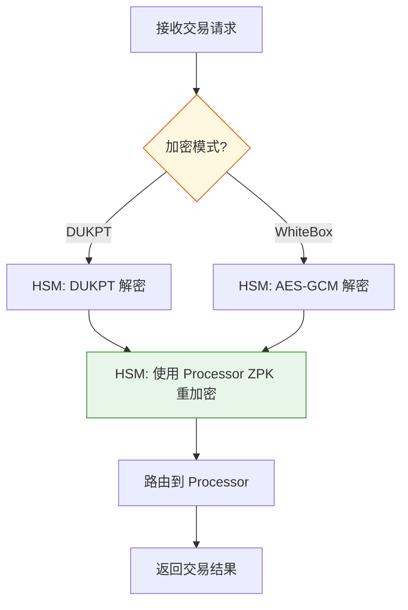
```mermaid
flowchart TB
    A[接收交易请求] --> B{加密模式?}
    
    B -->|DUKPT| C[HSM: DUKPT 解密]
    B -->|WhiteBox| D[HSM: AES-GCM 解密]
    
    C --> E[HSM: 使用 Processor ZPK 重加密]
    D --> E
    
    E --> F[路由到 Processor]
    F --> G[返回交易结果]
    
    style B fill:#fff8e1,stroke:#e65100
    style E fill:#e8f5e9,stroke:#388e3c
```

---

## 9. PIN 加密方案

### 9.1 加密模式对比

| 特性 | DUKPT (SE/TEE) | WhiteBox-WBC | WhiteBox-Simple |
|------|----------------|--------------|-----------------|
| **适用 TEE 类型** | SE, TEE | WhiteBox-WBC | WhiteBox-Simple |
| **密钥来源** | HSM 下载 | WBC 三层架构 | ECDH 协商 |
| **密钥生命周期** | 长期 (直到 KSN 耗尽) | 每笔交易唯一 | 每笔交易生成新密钥 |
| **每笔交易密钥** | 自动派生唯一密钥 | 与 PSP ECDH 协商 | 每笔交易都生成新会话密钥 |
| **网络依赖** | 仅初始下载 | 每笔交易需协商 | 每笔交易需重新交换 |
| **离线支持** | 支持 | 不支持 | 不支持 (每笔交易需网络) |
| **前向安全性** | 每笔交易独立 | 每笔交易独立 | 每笔交易独立 |
| **安全级别** | ⭐⭐⭐ 最高 | ⭐⭐ 高 | ⭐⭐ 高 |
| **商户绑定** | 无需 AuthCode | 需要 AuthCode | 无需 AuthCode |

### 9.2 DUKPT 模式详解

DUKPT (Derived Unique Key Per Transaction) 每笔交易使用唯一派生密钥：

| 参数 | 说明 |
|------|------|
| **BDK** | Base Derivation Key，由 HSM 管理 |
| **KSN** | Key Serial Number，21 位十六进制 |
| **IPEK** | Initial PIN Encryption Key |
| **PIN Block** | ISO 9564 Format 0 |

**KSN 格式**:
```
FFFF 9876543210 E00001
│    │          │
│    │          └── 交易计数器 (21 bits)
│    └────────────── 设备标识 (59 bits)
└───────────────────── 密钥集 ID (4 bits)
```

### 9.3 WhiteBox-WBC 模式详解

WhiteBox-WBC 模式使用三层密钥架构，每笔交易与 PSP 进行 ECDH 协商：

| 组件 | 说明 |
|------|------|
| **CommWBC** | 通信级白盒密钥，预置在 SDK 中 |
| **SCWBC** | 会话级白盒密钥，A&M Backend 下发 |
| **每笔交易密钥** | 与 PSP ECDH 协商，每笔交易唯一 |
| **ECC 曲线** | P-256 (secp256r1) |
| **密钥派生** | HKDF-SHA256 |
| **加密算法** | AES-256-GCM |

**加密流程**:
1. 使用 CommWBC 保护 AuthCode 传输
2. 获取 SCWBC 建立与 A&M 的安全通道
3. 每笔交易前与 PSP 进行 ECDH 协商
4. 派生交易密钥用于 PIN/PAN 加密
5. 交易完成后立即销毁交易密钥

### 9.4 WhiteBox-Simple 模式详解

| 组件 | 说明 |
|------|------|
| **ECC 曲线** | P-256 (secp256r1) |
| **密钥派生** | HKDF-SHA256 |
| **加密算法** | AES-256-GCM |
| **认证标签** | 128-bit |

**加密流程**:
1. 客户端生成 ECC 临时密钥对
2. 与服务端交换公钥
3. ECDH 计算共享密钥
4. HKDF 派生 AES-256 会话密钥
5. AES-GCM 加密 PIN

### 9.5 WhiteBox 模式对比

| 特性 | WhiteBox-WBC | WhiteBox-Simple |
|------|-------------|----------------|
| **密钥架构** | 三层（CommWBC + SCWBC + 每笔交易密钥） | 两层（设备证书 + 会话密钥） |
| **密钥协商** | 每笔交易与PSP协商 | 每笔交易生成新密钥（无需协商） |
| **激活流程** | 需要AuthCode激活 | 无需激活，直接证书签发 |
| **网络依赖** | 每笔交易需要网络协商 | 仅初始化时需要网络 |
| **安全级别** | ⭐⭐ 高 | ⭐⭐ 高 |
| **实现复杂度** | 复杂 | 简单 |
| **适用场景** | 高安全要求，网络稳定 | 网络不稳定，快速部署 |

### 9.6 PIN Block 格式

采用 ISO 9564 Format 0：

```
PIN Block = PIN Field XOR PAN Field

PIN Field:  0 | N | P P P P P P P P P P P P P P
            (N=PIN长度, P=PIN数字, 填充F)

PAN Field:  0 0 0 0 | PAN[3..14] | 0
            (PAN 右起第2位到第13位)
```

---

## 10. 设备生命周期管理

### 10.1 功能概述

设备生命周期管理涵盖设备从注册到注销的完整生命周期，包括状态监控、安全策略动态更新、定期鉴证等功能。

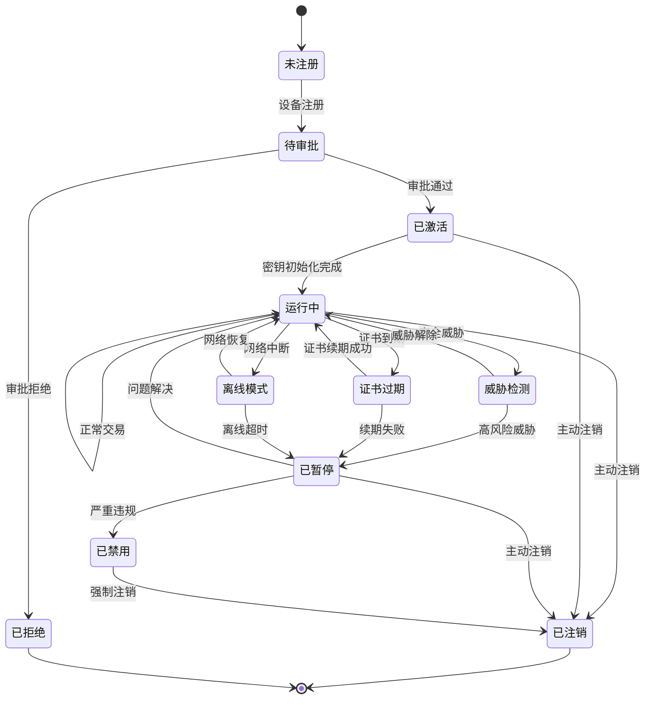
```mermaid
stateDiagram-v2
    [*] --> 未注册
    未注册 --> 待审批: 设备注册
    待审批 --> 已激活: 审批通过
    待审批 --> 已拒绝: 审批拒绝
    
    已激活 --> 运行中: 密钥初始化完成
    运行中 --> 运行中: 正常交易
    运行中 --> 威胁检测: 安全威胁
    运行中 --> 证书过期: 证书到期
    运行中 --> 离线模式: 网络中断
    
    威胁检测 --> 已暂停: 高风险威胁
    威胁检测 --> 运行中: 威胁解除
    
    证书过期 --> 运行中: 证书续期成功
    证书过期 --> 已暂停: 续期失败
    
    离线模式 --> 运行中: 网络恢复
    离线模式 --> 已暂停: 离线超时
    
    已暂停 --> 运行中: 问题解决
    已暂停 --> 已禁用: 严重违规
    
    运行中 --> 已注销: 主动注销
    已激活 --> 已注销: 主动注销
    已暂停 --> 已注销: 主动注销
    已禁用 --> 已注销: 强制注销
    
    已注销 --> [*]
    已拒绝 --> [*]
```

### 10.2 定期鉴证机制

#### 10.2.1 鉴证策略

| 鉴证类型 | 频率 | 触发条件 | 失败处理 |
|---------|------|---------|---------|
| **启动鉴证** | 每次启动 | SDK 初始化 | 阻止初始化 |
| **定期鉴证** | 60 分钟 | 定时器触发 | 暂停交易处理 |
| **交易前鉴证** | 每笔交易 | 交易发起前 | 拒绝当前交易 |
| **威胁触发鉴证** | 实时 | 检测到威胁 | 立即响应策略 |

#### 10.2.2 API: 定期鉴证

**端点**: `POST MPoC/api/attestation/periodic`

**负责模块**: LifecycleManager, PolicyManager

**请求**:
```json
{
  "deviceId": "dev-550e8400-e29b-41d4-a716-446655440000",
  "attestationType": "PERIODIC",
  "deviceState": {
    "uptime": 3600000,
    "lastReboot": "2024-12-30T09:00:00Z",
    "memoryUsage": 75.5,
    "cpuUsage": 45.2,
    "batteryLevel": 85
  },
  "securityState": {
    "isRooted": false,
    "isEmulator": false,
    "hasHookFramework": false,
    "isDebuggerAttached": false,
    "isAppTampered": false,
    "threatLevel": "LOW",
    "lastThreatDetection": null
  },
  "policyVersion": "1.2.0",
  "keyStatus": {
    "teeType": "TEE",
    "keyMode": "DUKPT",
    "ksn": "FFFF9876543210E00001",
    "sessionId": null,
    "keyExpiresAt": "2025-12-30T00:00:00Z"
  },
  "transactionStats": {
    "totalTransactions": 150,
    "successfulTransactions": 148,
    "failedTransactions": 2,
    "lastTransactionAt": "2024-12-30T09:45:00Z"
  },
  "riskSummary": "base64_encoded_risk_assessment",
  "timestamp": "2024-12-30T10:00:00Z"
}
```

**响应**:
```json
{
  "code": 200,
  "data": {
    "attestationResult": "PASS",
    "nextAttestationAt": "2024-12-30T11:00:00Z",
    "policyUpdate": {
      "updateRequired": true,
      "newVersion": "1.3.0",
      "updateType": "INCREMENTAL",
      "policyDelta": {
        "securityLevel": "HIGH",
        "maxOfflineHours": 24,
        "threatResponsePolicy": {
          "rootDetection": "BLOCK",
          "emulatorDetection": "BLOCK",
          "hookDetection": "WARN"
        }
      }
    },
    "keyRotation": {
      "rotationRequired": false,
      "nextRotationAt": "2025-01-15T00:00:00Z"
    },
    "deviceStatus": "ACTIVE",
    "allowedOperations": ["TRANSACTION", "KEY_EXCHANGE", "OFFLINE_MODE"]
  },
  "message": "Periodic attestation completed"
}
```

#### 10.2.3 API: 心跳监控

**端点**: `POST MPoC/api/monitoring/heartbeat`

**负责模块**: LifecycleManager

**请求**:
```json
{
  "deviceId": "dev-550e8400-e29b-41d4-a716-446655440000",
  "status": "ACTIVE",
  "policyVersion": "1.2.0",
  "lastActivity": "2024-12-30T09:55:00Z",
  "timestamp": "2024-12-30T10:00:00Z"
}
```

**响应**:
```json
{
  "code": 200,
  "data": {
    "serverTime": "2024-12-30T10:00:00Z",
    "nextHeartbeatAt": "2024-12-30T10:05:00Z",
    "serviceStatus": "OPERATIONAL",
    "maintenanceWindow": null
  },
  "message": "Heartbeat received"
}
```

### 10.3 密钥轮换管理

#### 10.3.1 轮换策略

| 密钥类型 | 轮换周期 | 触发条件 | 轮换方式 |
|---------|---------|---------|---------|
| **WBC 主密钥** | 30-90 天 | 攻击成本评估 | 主动轮换 |
| **设备证书** | 1-2 年 | 证书到期前 30 天 | 证书续期 |
| **会话密钥** | 15 分钟 | 时间/交易数限制 | 会话刷新 |
| **DUKPT 密钥** | KSN 耗尽时 | KSN 计数器接近上限 | 重新下载 |

#### 10.3.2 API: WBC 密钥轮换

**端点**: `POST MPoC/api/keys/wbc/rotate`

**负责模块**: WbcEngine

> ⚠️ **注意**: 此 API 仅适用于 WhiteBox-WBC 模式

**请求**:
```json
{
  "deviceId": "dev-550e8400-e29b-41d4-a716-446655440000",
  "currentKeyVersion": "1.0",
  "rotationReason": "SCHEDULED",
  "attackCostAssessment": {
    "estimatedCost": 50000,
    "confidenceLevel": "HIGH",
    "assessmentDate": "2024-12-30T00:00:00Z"
  },
  "timestamp": "2024-12-30T10:00:00Z"
}
```

**响应**:
```json
{
  "code": 200,
  "data": {
    "newKeyVersion": "2.0",
    "encryptedNewKey": "base64_encrypted_wbc_key",
    "keyDerivationParams": {
      "algorithm": "HKDF-SHA256",
      "iterations": 10000,
      "salt": "base64_salt"
    },
    "rotationId": "rot-20241230-001",
    "expiresAt": "2025-03-30T00:00:00Z",
    "nextRotationAt": "2025-02-28T00:00:00Z"
  },
  "message": "WBC key rotation successful"
}
```

#### 10.3.3 API: 证书续期

**端点**: `POST MPoC/api/certificates/renew`

**负责模块**: CertManager

**请求**:
```json
{
  "deviceId": "dev-550e8400-e29b-41d4-a716-446655440000",
  "currentCertificate": "-----BEGIN CERTIFICATE-----\n...\n-----END CERTIFICATE-----",
  "newCsr": "-----BEGIN CERTIFICATE REQUEST-----\n...\n-----END CERTIFICATE REQUEST-----",
  "renewalReason": "EXPIRING",
  "timestamp": "2024-12-30T10:00:00Z"
}
```

**响应**:
```json
{
  "code": 200,
  "data": {
    "newCertificate": "-----BEGIN CERTIFICATE-----\n...\n-----END CERTIFICATE-----",
    "certificateChain": ["..."],
    "serialNumber": "02:34:56:78:9A:BC:DE:F0",
    "notBefore": "2024-12-30T00:00:00Z",
    "notAfter": "2025-12-30T23:59:59Z",
    "renewalId": "ren-20241230-001"
  },
  "message": "Certificate renewed successfully"
}
```

#### 10.3.4 API: 会话密钥刷新

> ⚠️ **注意**: 此 API 仅适用于 WhiteBox-WBC 模式。WhiteBox-Simple 模式每笔交易都生成新的会话密钥，无需刷新。

**端点**: `POST MPoC/api/keys/session/refresh`

**负责模块**: WbcEngine (仅 WhiteBox-WBC 模式)

**请求**:
```json
{
  "deviceId": "dev-550e8400-e29b-41d4-a716-446655440000",
  "currentSessionId": "sess-20241230-abc123",
  "refreshReason": "TIME_LIMIT",
  "newEphemeralPublicKey": "04a1b2c3d4e5f6...",
  "timestamp": "2024-12-30T10:00:00Z"
}
```

**响应**:
```json
{
  "code": 200,
  "data": {
    "newSessionId": "sess-20241230-def456",
    "serverEphemeralPublicKey": "04f1e2d3c4b5a6...",
    "expiresAt": "2024-12-31T10:00:00Z",
    "maxTransactions": 50,
    "refreshId": "ref-20241230-001"
  },
  "message": "Session key refreshed successfully"
}
```

### 10.4 设备状态管理

#### 10.4.1 设备状态定义与转换

**设备状态定义**：

| 状态 | 说明 | 适用TEE类型 | 可执行操作 |
|------|------|------------|-----------|
| `REGISTERED` | 设备已注册 | 所有类型 | AuthCode激活(仅WhiteBox-WBC)、证书签发(SE/TEE/WhiteBox-Simple直接进行) |
| `ACTIVATED` | 设备已通过AuthCode激活，可进行证书签发 | WhiteBox-WBC | 证书签发、密钥初始化 |
| `ACTIVE` | 设备完全可用，已完成证书签发和密钥初始化 | 所有类型 | 交易处理、密钥轮换 |
| `SUSPENDED` | 设备被暂停，无法进行交易 | 所有类型 | 等待恢复 |
| `DEREGISTERED` | 设备已注销，无法使用 | 所有类型 | 无 |

**状态转换流程**：

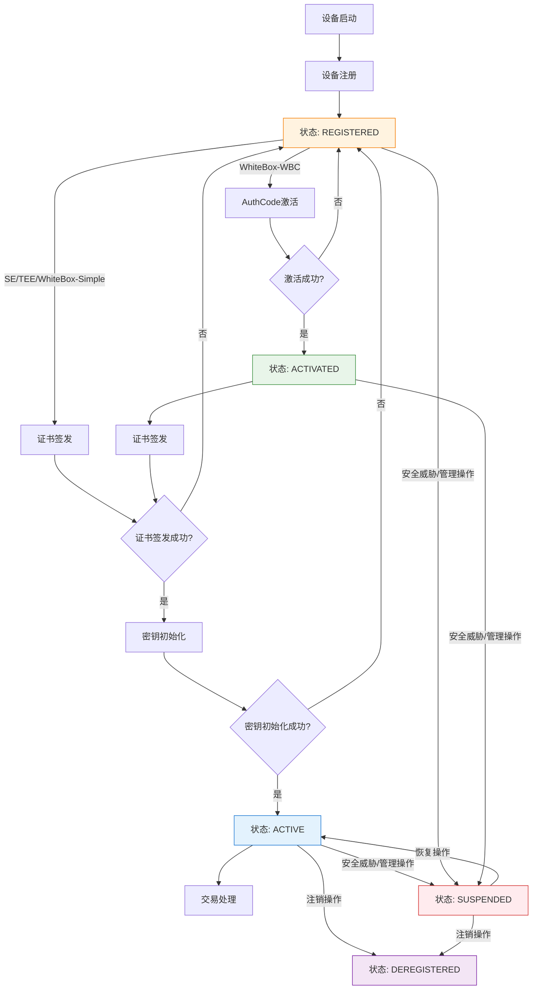
```mermaid
flowchart TB
    Start[设备启动] --> Register[设备注册]
    
    Register --> Registered[状态: REGISTERED]
    
    Registered -->|SE/TEE/WhiteBox-Simple| CertReq[证书签发]
    Registered -->|WhiteBox-WBC| AuthCode[AuthCode激活]
    
    AuthCode --> AuthSuccess{激活成功?}
    AuthSuccess -->|是| Activated[状态: ACTIVATED]
    AuthSuccess -->|否| Registered
    
    Activated --> CertReq2[证书签发]
    CertReq --> CertSuccess{证书签发成功?}
    CertReq2 --> CertSuccess
    
    CertSuccess -->|是| KeyInit[密钥初始化]
    CertSuccess -->|否| Registered
    
    KeyInit --> KeySuccess{密钥初始化成功?}
    KeySuccess -->|是| Active[状态: ACTIVE]
    KeySuccess -->|否| Registered
    
    Active --> Transaction[交易处理]
    
    %% 异常状态转换
    Active -->|安全威胁/管理操作| Suspended[状态: SUSPENDED]
    Registered -->|安全威胁/管理操作| Suspended
    Activated -->|安全威胁/管理操作| Suspended
    
    Suspended -->|恢复操作| Active
    
    Active -->|注销操作| Deregistered[状态: DEREGISTERED]
    Suspended -->|注销操作| Deregistered
    
    style Registered fill:#fff3e0,stroke:#f57c00
    style Activated fill:#e8f5e9,stroke:#388e3c
    style Active fill:#e3f2fd,stroke:#1976d2
    style Suspended fill:#ffebee,stroke:#d32f2f
    style Deregistered fill:#f3e5f5,stroke:#7b1fa2
```

**不同TEE类型的状态流程差异**：

| TEE类型 | 状态流程 | 说明 |
|---------|---------|------|
| SE/TEE | `REGISTERED` → `ACTIVE` | 直接进行证书签发和密钥初始化 |
| WhiteBox-Simple | `REGISTERED` → `ACTIVE` | 直接进行证书签发和密钥初始化 |
| WhiteBox-WBC | `REGISTERED` → `ACTIVATED` → `ACTIVE` | 需要先通过AuthCode激活 |

#### 10.4.2 API: 设备状态查询

**端点**: `GET MPoC/api/devices/status?deviceId={deviceId}`

**负责模块**: LifecycleManager

**响应**:
```json
{
  "code": 200,
  "data": {
    "deviceId": "dev-550e8400-e29b-41d4-a716-446655440000",
    "status": "ACTIVE",
    "registeredAt": "2024-12-01T00:00:00Z",
    "lastActiveAt": "2024-12-30T09:55:00Z",
    "hwFingerprint": "base64_encoded_hardware_fingerprint",
    "swAuthLevel": "STANDARD",
    "certificateStatus": {
      "isValid": true,
      "expiresAt": "2025-12-30T23:59:59Z",
      "daysUntilExpiry": 365
    },
    "keyStatus": {
      "teeType": "TEE",
      "keyMode": "DUKPT",
      "isReady": true,
      "lastRotationAt": "2024-12-01T00:00:00Z",
      "ksn": "FFFF9876543210E00001",
      "sessionId": null
    },
    "securityStatus": {
      "threatLevel": "LOW",
      "lastThreatAt": null,
      "complianceScore": 95,
      "riskAssessment": "base64_encoded_risk_summary"
    },
    "transactionStats": {
      "totalTransactions": 150,
      "todayTransactions": 25,
      "lastTransactionAt": "2024-12-30T09:45:00Z"
    },
    "policyVersion": "1.2.0",
    "sdkVersion": "1.0.0"
  },
  "message": "Device status retrieved"
}
```

#### 10.4.3 API: 设备注销

**端点**: `POST MPoC/api/devices/deregister`

**负责模块**: LifecycleManager

**请求**:
```json
{
  "deviceId": "dev-550e8400-e29b-41d4-a716-446655440000",
  "deregistrationReason": "USER_REQUEST",
  "confirmDataDeletion": true,
  "timestamp": "2024-12-30T10:00:00Z"
}
```

**响应**:
```json
{
  "code": 200,
  "data": {
    "deregistrationId": "dereg-20241230-001",
    "deregisteredAt": "2024-12-30T10:00:00Z",
    "certificateRevoked": true,
    "keysDestroyed": true,
    "dataCleared": true,
    "finalStatus": "DEREGISTERED"
  },
  "message": "Device deregistered successfully"
}
```

---

## 11. 离线支付模式

### 11.1 离线模式概述

离线支付模式符合 PCI MPOC 1F 标准，允许设备在网络中断时继续处理支付交易，但受到严格的时间和安全限制。

#### 11.1.1 离线模式限制

| 限制类型 | 限制值 | 说明 |
|---------|--------|------|
| **A&M 服务响应时间** | 24 小时 | 超过此时间禁用离线支付 |
| **离线运行时间** | 48 小时 | 连续离线运行最大时长 |
| **支持的交易类型** | NFC 非接触 | 仅支持免 PIN 或签名验证 |
| **PIN 验证限制** | 不支持联机 PIN | NFC 不支持脱机 PIN 验证 |
| **数据安全要求** | 云端公钥加密 | 离线交易数据必须加密存储 |

#### 11.1.2 离线模式状态机

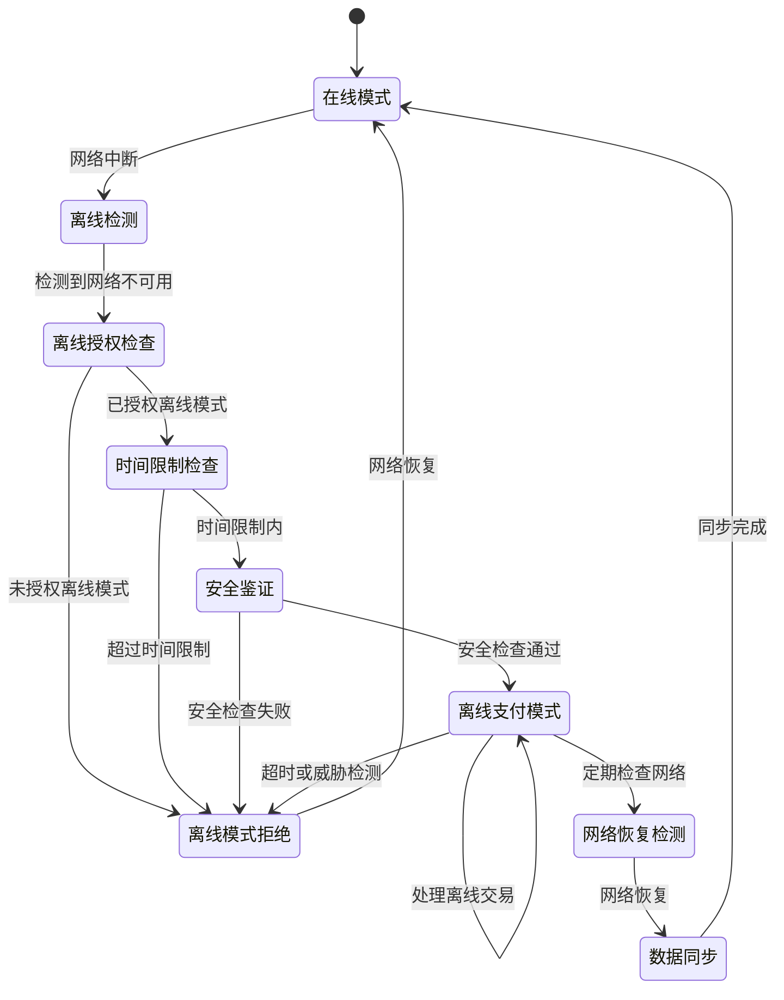
```mermaid
stateDiagram-v2
    [*] --> 在线模式
    在线模式 --> 离线检测: 网络中断
    离线检测 --> 离线授权检查: 检测到网络不可用
    
    离线授权检查 --> 离线模式拒绝: 未授权离线模式
    离线授权检查 --> 时间限制检查: 已授权离线模式
    
    时间限制检查 --> 离线模式拒绝: 超过时间限制
    时间限制检查 --> 安全鉴证: 时间限制内
    
    安全鉴证 --> 离线模式拒绝: 安全检查失败
    安全鉴证 --> 离线支付模式: 安全检查通过
    
    离线支付模式 --> 离线支付模式: 处理离线交易
    离线支付模式 --> 网络恢复检测: 定期检查网络
    离线支付模式 --> 离线模式拒绝: 超时或威胁检测
    
    网络恢复检测 --> 数据同步: 网络恢复
    数据同步 --> 在线模式: 同步完成
    
    离线模式拒绝 --> 在线模式: 网络恢复
```

### 11.2 离线模式授权

#### 11.2.1 API: 离线授权申请

**端点**: `POST MPoC/api/offline/authorize`

**负责模块**: OfflineManager

**请求**:
```json
{
  "deviceId": "dev-550e8400-e29b-41d4-a716-446655440000",
  "requestReason": "NETWORK_UNAVAILABLE",
  "lastOnlineAt": "2024-12-30T08:00:00Z",
  "networkStatus": {
    "wifiAvailable": false,
    "mobileDataAvailable": false,
    "lastSuccessfulConnection": "2024-12-30T08:00:00Z"
  },
  "securityState": {
    "isRooted": false,
    "isEmulator": false,
    "hasHookFramework": false,
    "threatLevel": "LOW"
  },
  "deviceState": {
    "batteryLevel": 85,
    "storageAvailable": 1024000000,
    "lastReboot": "2024-12-30T06:00:00Z"
  },
  "timestamp": "2024-12-30T10:00:00Z"
}
```

**响应**:
```json
{
  "code": 200,
  "data": {
    "offlineAuthorized": true,
    "authorizationId": "offline-20241230-001",
    "maxOfflineHours": 48,
    "maxOfflineTransactions": 50,
    "authorizedUntil": "2025-01-01T10:00:00Z",
    "allowedTransactionTypes": ["NFC_CONTACTLESS"],
    "maxTransactionAmount": 5000,
    "encryptionPublicKey": "-----BEGIN PUBLIC KEY-----\n...\n-----END PUBLIC KEY-----",
    "offlinePolicy": {
      "requireSignature": true,
      "maxPinlessAmount": 2500,
      "securityCheckInterval": 300
    }
  },
  "message": "Offline mode authorized"
}
```

### 11.3 离线交易处理

#### 11.3.1 离线交易流程

```mermaid
sequenceDiagram
    autonumber
    participant App as 📱 Android App
    participant SDK as 🛡️ MPoC SDK
    participant Storage as 🗄️ 本地存储

    Note over App,Storage: 前置条件: 离线模式已授权
    
    App->>SDK: 发起离线支付
    
    rect rgb(227, 242, 253)
        Note over SDK: 离线安全检查
        SDK->>SDK: 检查离线授权有效期
        SDK->>SDK: 检查离线交易数量限制
        SDK->>SDK: 执行增强安全检测
    end
    
    alt 安全检查通过
        rect rgb(255, 248, 225)
            Note over SDK: 离线交易处理
            SDK->>SDK: 生成一次性加密密钥
            SDK->>SDK: 使用云端公钥加密该密钥
            SDK->>SDK: 使用该密钥加密交易数据
            SDK->>SDK: 立即销毁本地加密密钥
        end
        
        rect rgb(232, 245, 233)
            Note over SDK,Storage: 安全存储
            SDK->>Storage: 存储加密交易数据
            SDK->>Storage: 存储加密密钥包
            SDK->>SDK: 数据脱敏处理
        end
        
        SDK-->>App: 返回离线交易成功
        
    else 安全检查失败
        SDK-->>App: 拒绝离线交易
    end
```

#### 11.3.2 离线交易数据格式

```json
{
  "offlineTransactionId": "offline-20241230-001",
  "originalTransactionId": "txn-20241230-001",
  "transactionType": "NFC_CONTACTLESS",
  "amount": 2500,
  "currency": "USD",
  "timestamp": "2024-12-30T10:00:00Z",
  "cardData": {
    "maskedPan": "411111******1111",
    "expiryDate": "1225",
    "cardholderName": "JOHN DOE",
    "emvData": "encrypted_emv_tlv_data"
  },
  "offlineAuthCode": "123456",
  "encryptedData": "base64_encrypted_transaction_data",
  "encryptedKeyPackage": "base64_encrypted_key_package",
  "securityInfo": {
    "threatLevel": "LOW",
    "deviceIntegrity": "VERIFIED",
    "encryptionMethod": "AES-256-GCM"
  }
}
```

### 11.4 离线数据同步

#### 11.4.1 API: 离线数据同步

**端点**: `POST MPoC/api/offline/sync`

**负责模块**: OfflineManager

**请求**:
```json
{
  "deviceId": "dev-550e8400-e29b-41d4-a716-446655440000",
  "syncType": "FULL",
  "offlinePeriod": {
    "startTime": "2024-12-30T08:00:00Z",
    "endTime": "2024-12-30T12:00:00Z",
    "totalOfflineHours": 4
  },
  "offlineTransactions": [
    {
      "offlineTransactionId": "offline-20241230-001",
      "encryptedData": "base64_encrypted_transaction_data",
      "encryptedKeyPackage": "base64_encrypted_key_package",
      "timestamp": "2024-12-30T10:00:00Z"
    }
  ],
  "securityLogs": [
    {
      "logId": "log-20241230-001",
      "eventType": "OFFLINE_TRANSACTION",
      "threatLevel": "LOW",
      "timestamp": "2024-12-30T10:00:00Z"
    }
  ],
  "deviceState": {
    "batteryLevel": 75,
    "storageUsed": 512000000,
    "lastReboot": "2024-12-30T06:00:00Z"
  },
  "timestamp": "2024-12-30T12:00:00Z"
}
```

**响应**:
```json
{
  "code": 200,
  "data": {
    "syncId": "sync-20241230-001",
    "processedTransactions": 1,
    "successfulTransactions": 1,
    "failedTransactions": 0,
    "transactionResults": [
      {
        "offlineTransactionId": "offline-20241230-001",
        "status": "APPROVED",
        "authCode": "789012",
        "processorResponse": "00",
        "settlementDate": "2024-12-30"
      }
    ],
    "securityAssessment": {
      "overallRisk": "LOW",
      "anomaliesDetected": 0,
      "complianceScore": 98
    },
    "nextSyncRequired": false
  },
  "message": "Offline data synchronized successfully"
}
```

---

## 12. SDK 版本管理

### 12.1 功能说明

SDK 版本管理用于确保设备上运行的 MPoC SDK 版本符合安全要求，主要功能包括：

| 功能 | 说明 |
|------|------|
| **版本检查** | SDK 启动时检查是否有新版本可用 |
| **版本上报** | 向后端上报当前 SDK 版本信息 |
| **强制更新** | 当检测到安全漏洞时，强制要求更新 SDK |
| **版本兼容性** | 检查当前版本与后端 API 的兼容性 |

### 12.2 版本检查流程

```mermaid
sequenceDiagram
    autonumber
    participant App as 📱 Android App
    participant SDK as 🛡️ MPoC SDK
    participant Backend as 🖥️ A&M Backend

    App->>SDK: MpocSdk.initialize(config)
    
    rect rgb(227, 242, 253)
        Note over SDK,Backend: 版本检查
        SDK->>Backend: POST MPoC/api/sdk/version/check
        Note right of SDK: 上报当前 SDK 版本
        Backend->>Backend: 检查版本兼容性
        Backend-->>SDK: 版本检查结果
    end
    
    alt 需要强制更新
        SDK-->>App: callback.onUpdateRequired(latestVersion, downloadUrl)
        Note over App: 阻止继续使用，提示更新
    else 有可选更新
        SDK-->>App: callback.onUpdateAvailable(latestVersion, downloadUrl)
        Note over App: 提示更新，可继续使用
    else 版本正常
        SDK->>SDK: 继续初始化流程
    end
```

### 12.3 API: SDK 版本检查

**端点**: `POST MPoC/api/sdk/version/check`

**负责模块**: VersionManager

**请求**:
```json
{
  "deviceId": "dev-550e8400-e29b-41d4-a716-446655440000",
  "sdkVersion": "1.0.0",
  "sdkBuildNumber": 100,
  "appVersion": "2.0.0",
  "appPackageName": "com.example.softpos",
  "osVersion": "Android 14",
  "deviceModel": "Samsung Galaxy S23"
}
```

**请求参数说明**:

| 参数 | 类型 | 必填 | 说明 |
|------|------|------|------|
| `deviceId` | string | 否 | 设备唯一标识 (首次注册前可为空) |
| `sdkVersion` | string | 是 | 当前 SDK 版本号 (语义化版本) |
| `sdkBuildNumber` | number | 是 | SDK 构建号 |
| `appVersion` | string | 是 | 宿主 App 版本号 |
| `appPackageName` | string | 是 | 宿主 App 包名 |
| `osVersion` | string | 是 | Android 系统版本 |
| `deviceModel` | string | 是 | 设备型号 |

**响应**:
```json
{
  "code": 200,
  "data": {
    "currentVersion": "1.0.0",
    "latestVersion": "1.2.0",
    "minRequiredVersion": "1.0.0",
    "updateRequired": false,
    "updateAvailable": true,
    "updateType": "OPTIONAL",
    "releaseNotes": "1. 修复安全漏洞\n2. 性能优化\n3. 新增功能支持",
    "downloadUrl": "https://sdk.sunbay.dev/mpoc-sdk-1.2.0.aar",
    "releaseDate": "2024-12-30",
    "deprecationDate": null,
    "compatibilityStatus": "COMPATIBLE"
  },
  "message": "Version check completed"
}
```

**响应字段说明**:

| 字段 | 类型 | 说明 |
|------|------|------|
| `currentVersion` | string | 当前上报的 SDK 版本 |
| `latestVersion` | string | 最新可用 SDK 版本 |
| `minRequiredVersion` | string | 最低要求版本 (低于此版本必须更新) |
| `updateRequired` | boolean | 是否需要强制更新 |
| `updateAvailable` | boolean | 是否有可用更新 |
| `updateType` | string | 更新类型: `MANDATORY`, `OPTIONAL`, `NONE` |
| `releaseNotes` | string | 版本更新说明 |
| `downloadUrl` | string | SDK 下载地址 |
| `releaseDate` | string | 发布日期 |
| `deprecationDate` | string | 当前版本废弃日期 (null 表示未废弃) |
| `compatibilityStatus` | string | 兼容性状态: `COMPATIBLE`, `DEPRECATED`, `INCOMPATIBLE` |

**更新类型说明**:

| 类型 | 说明 | SDK 处理 |
|------|------|---------|
| `MANDATORY` | 强制更新 | 阻止 SDK 初始化，必须更新后才能使用 |
| `OPTIONAL` | 可选更新 | 提示用户更新，可继续使用当前版本 |
| `NONE` | 无需更新 | 当前已是最新版本 |

**兼容性状态说明**:

| 状态 | 说明 | SDK 处理 |
|------|------|---------|
| `COMPATIBLE` | 完全兼容 | 正常使用 |
| `DEPRECATED` | 已废弃 | 警告提示，建议更新 |
| `INCOMPATIBLE` | 不兼容 | 阻止使用，必须更新 |

**错误响应**:

| 错误码 | 错误类型 | 说明 |
|--------|---------|------|
| 400 | `INVALID_VERSION` | 版本号格式无效 |
| 403 | `SDK_BLOCKED` | SDK 版本已被禁用 |
| 404 | `APP_NOT_REGISTERED` | App 包名未注册 |

### 12.4 版本管理策略

| 策略 | 说明 |
|------|------|
| **安全漏洞修复** | 发现安全漏洞时，将受影响版本标记为 `INCOMPATIBLE`，强制更新 |
| **API 变更** | 后端 API 重大变更时，旧版本 SDK 标记为 `DEPRECATED` |
| **功能废弃** | 功能废弃前提前通知，设置 `deprecationDate` |
| **灰度发布** | 新版本可按设备比例灰度推送 |

---

## 13. 错误处理

### 13.1 通用错误码

| 错误码 | 说明 | 处理建议 |
|--------|------|---------|
| `400` | 请求参数错误 | 检查请求参数格式 |
| `401` | 认证失败 | 重新获取 token |
| `403` | 权限不足 | 检查设备状态 |
| `404` | 资源不存在 | 检查 deviceId 等 |
| `409` | 资源冲突 | 设备已注册等 |
| `422` | 业务逻辑错误 | 查看具体错误信息 |
| `429` | 请求过于频繁 | 降低请求频率 |
| `500` | 服务器内部错误 | 稍后重试 |
| `503` | 服务不可用 | 稍后重试 |

### 13.2 阶段相关错误

| 阶段 | 错误类型 | 说明 | SDK 处理 |
|------|---------|------|---------|
| 设备注册 | `DEVICE_REJECTED` | 设备被拒绝 | 提示用户联系管理员 |
| 证书签发 | `INVALID_CSR` | CSR 格式无效 | 重新生成 CSR |
| 证书签发 | `DEVICE_NOT_READY` | 设备状态不允许签发证书 | 检查设备状态，完成前置步骤 |
| 密钥下载 | `HSM_UNAVAILABLE` | HSM 不可用 | 稍后重试 |
| 密钥交换 | `CERTIFICATE_EXPIRED` | 设备证书已过期 | 发起 CSR 续期 |
| 密钥交换 | `SIGNATURE_INVALID` | 请求签名验证失败 | 检查设备私钥 |
| 密钥轮换 | `ROTATION_FAILED` | 密钥轮换失败 | 继续使用旧密钥，增加监控 |
| 交易处理 | `KEY_EXCHANGE_FAILED` | 密钥交换失败 | 重新进行密钥交换 |
| 交易处理 | `ENCRYPTION_FAILED` | PIN 加密失败 | 检查密钥状态，重新交换 |
| 离线模式 | `OFFLINE_NOT_AUTHORIZED` | 离线模式未授权 | 等待网络恢复 |
| 离线模式 | `OFFLINE_TIME_EXCEEDED` | 离线时间超限 | 强制联网认证 |
| 离线模式 | `OFFLINE_SECURITY_BREACH` | 离线期间安全威胁 | 禁用离线功能 |
| 生命周期 | `DEVICE_SUSPENDED` | 设备被暂停 | 联系管理员 |
| 生命周期 | `POLICY_UPDATE_FAILED` | 策略更新失败 | 使用旧策略，稍后重试 |

### 13.3 错误响应格式

```json
{
  "code": 422,
  "error": {
    "type": "VALIDATION_ERROR",
    "message": "Invalid device ID format",
    "details": {
      "field": "deviceId",
      "reason": "Must be a valid UUID"
    }
  },
  "timestamp": "2024-12-30T10:00:00Z",
  "requestId": "req-abc123"
}
```

### 13.4 重试策略

| 错误类型 | 重试策略 |
|---------|---------|
| 网络超时 | 指数退避，最多 3 次 |
| 5xx 错误 | 指数退避，最多 3 次 |
| 401 错误 | 刷新 token 后重试 1 次 |
| 4xx 其他 | 不重试，返回错误 |

---

## 14. 安全规范

### 14.1 传输安全

| 措施 | 说明 |
|------|------|
| **TLS 1.3** | 所有 API 通信强制使用 TLS 1.3 |
| **证书固定** | 客户端验证服务器证书 |
| **请求签名** | 关键 API 使用 ECDSA 签名 |

### 14.2 数据安全

| 数据类型 | 存储位置 | 保护措施 |
|---------|---------|---------|
| 设备证书 | Android Keystore | 硬件保护 |
| 设备私钥 | Android Keystore | 硬件保护，不可导出 |
| DUKPT 密钥 | TEE/SE | 硬件隔离 |
| WhiteBox 会话密钥 | WhiteBox 保护内存 | 白盒加密 |
| PIN | 仅内存 | 不持久化，用后清除 |
| PAN | 日志脱敏 | 仅显示后 4 位 |

### 14.3 设备安全检测

| 检测项 | 处理方式 |
|--------|---------|
| Root 检测 | 阻止初始化，上报威胁 |
| 模拟器检测 | 阻止初始化，上报威胁 |
| Hook 框架检测 | 阻止初始化，上报威胁 |
| 调试器检测 | 警告，可配置阻止 |
| 应用完整性 | 签名校验，阻止篡改版本 |

### 14.4 合规要求

| 标准 | 要求 |
|------|------|
| **PCI-DSS** | 数据安全标准 |
| **PCI PIN** | PIN 安全标准 |
| **PCI P2PE** | 点对点加密 |
| **PCI MPOC 1F** | 离线支付安全标准 |

---

## 15. 附录

### A. 术语表

| 术语 | 全称 | 说明 |
|------|------|------|
| MPoC | Mobile Point of Contact | 移动接触点 |
| DUKPT | Derived Unique Key Per Transaction | 每笔交易派生唯一密钥 |
| KSN | Key Serial Number | 密钥序列号 |
| BDK | Base Derivation Key | 基础派生密钥 |
| IPEK | Initial PIN Encryption Key | 初始 PIN 加密密钥 |
| HSM | Hardware Security Module | 硬件安全模块 |
| SE | Secure Element | 安全元件，独立安全芯片 |
| TEE | Trusted Execution Environment | 可信执行环境 (ARM TrustZone) |
| WhiteBox | White-Box Cryptography | 白盒加密，软件实现的安全方案 |
| ECC | Elliptic Curve Cryptography | 椭圆曲线加密 |
| ECDH | Elliptic Curve Diffie-Hellman | 椭圆曲线密钥交换 |
| CSR | Certificate Signing Request | 证书签名请求 |
| CA | Certificate Authority | 证书颁发机构 |
| X.509 | - | 公钥证书标准格式 |
| PKCS#10 | Public Key Cryptography Standards #10 | CSR 标准格式 |
| HKDF | HMAC-based Key Derivation Function | 基于 HMAC 的密钥派生函数 |
| WBC | White-Box Cryptography | 白盒加密，软件实现的安全方案 |
| CommWBC | Communication White-Box Cryptography | 通信级白盒加密密钥，预置在 SDK 中 |
| SCWBC | Session Communication White-Box Cryptography | 会话级白盒加密密钥，A&M Backend 下发 |
| BEK | Backend Encryption Key | 后端加密密钥 |
| AuthCode | Authorization Code | 商户侧绑定授权凭证 |
| DF | Device Fingerprint | 设备指纹，包含软硬件测量值的唯一标识 |
| EnDF | Encrypted Device Fingerprint | 加密的设备指纹 |
| SWAuthLevel | Software Authorization Level | 软件授权等级，控制功能开关 |
| EnSWAuthLevel | Encrypted Software Authorization Level | 加密的软件授权等级 |
| hwFingerprint | Hardware Fingerprint | 硬件指纹，设备硬件特征的唯一标识 |
| riskSummary | Risk Summary | 风险评估摘要，设备安全状态的综合评分 |
| SCCERT | Secure Channel Certificate | 安全通道证书 |
| SCPVK/SCPUK | Secure Channel Private/Public Key | 安全通道密钥对 |
| SCCSR | Secure Channel Certificate Signing Request | 安全通道证书签名请求 |
| BECERT | Backend Certificate | 后端证书 |
| KCV | Key Check Value | 密钥校验值 |
| ZPK | Zone PIN Key | 区域 PIN 密钥 |
| POSP | Point of Sale Processor | 销售点处理器 |
| A&M | Authentication & Monitoring | 鉴证与监控服务 |

### B. SDK 接口速查

```java
// 阶段一: 设备注册
MpocSdk.initialize(config, callback)
  → callback.onInitSuccess(deviceId, teeType)
  → callback.onInitFailed(error)

// 阶段二: 证书签发 (SDK 内部自动执行)
  → callback.onCertificateReady()

// 阶段三: 密钥初始化
// DUKPT 模式 (SDK 内部自动执行)
  → callback.onKeyReady(ksn)

// WBC 模式 (WhiteBox-WBC)
MpocSdk.initializeWbc(authCode, callback)
  → callback.onWbcChannelReady(swAuthLevel)
  → callback.onWbcInitFailed(error)

MpocSdk.exchangeTransactionKey(transactionId, callback)
  → callback.onTransactionKeyReady(keyId)
  → callback.onTransactionKeyFailed(error)

// WhiteBox-Simple 模式
MpocSdk.initKeyExchange()
  → callback.onKeyExchangeSuccess(sessionId)
  → callback.onKeyExchangeFailed(error)

// 阶段四: 交易处理
// 4.1 获取交易鉴证 Token (SDK 负责)
MpocSdk.requestTransactionToken(amount, transactionId, callback)
  → callback.onTokenReady(transactionToken, expiresAt)
  → callback.onTokenFailed(error)

// 4.2 PIN 加密 (SDK 负责)
MpocSdk.encryptPin(pin, pan, callback)
  → callback.onPinEncrypted(encryptedPinBlock, keyIdentifier, keyType)
  → callback.onPinEncryptFailed(error)

// 4.3 交易提交 (App 负责，通过 A&M Backend 转发到 POSP)
// App 使用 HTTP Client 提交到 A&M Backend:
// POST MPoC/api/transactions/submit
// Body: { encryptedPinBlock, transactionId, cardData, ... }

// 生命周期管理
MpocSdk.performPeriodicAttestation(callback)
  → callback.onAttestationSuccess(policyUpdate)
  → callback.onAttestationFailed(error)

MpocSdk.sendHeartbeat()
  → callback.onHeartbeatSuccess()

MpocSdk.rotateKeys(keyType, callback)
  → callback.onKeyRotationSuccess()
  → callback.onKeyRotationFailed(error)

// 离线模式
MpocSdk.requestOfflineAuthorization(callback)
  → callback.onOfflineAuthorized(maxHours, maxTransactions)
  → callback.onOfflineDenied(reason)

MpocSdk.processOfflineTransaction(transactionData, callback)
  → callback.onOfflineTransactionSuccess(offlineId)
  → callback.onOfflineTransactionFailed(error)

MpocSdk.syncOfflineData(callback)
  → callback.onSyncSuccess(results)
  → callback.onSyncFailed(error)

// 工具方法
MpocSdk.getDeviceStatus() → DeviceStatus
MpocSdk.getTeeType() → TeeType (SE/TEE/WhiteBox-WBC/WhiteBox-Simple)
MpocSdk.forceKeyRefresh() → void
MpocSdk.deregisterDevice(callback) → void
```

> ⚠️ **重要**: MPoC SDK 只负责 Token 获取和 PIN 加密，**交易提交由 Android App 通过 A&M Backend 转发到 POSP**。

### C. 版本历史

| 版本 | 日期 | 变更说明 |
|------|------|---------|
| v1.0 | 2024-12-30 | 初始版本 |
| v1.1 | 2024-12-30 | 增加 CSR 证书签发 API |
| v1.2 | 2024-12-31 | 明确 TEE 类型与密钥模式对应关系 |
| v2.0 | 2024-12-31 | 按 SDK 初始化调用顺序重构文档结构，明确模块职责划分 |
| v2.1 | 2024-12-31 | 统一 securityInfo 字段；交易鉴证增加 transactionId；RKI API 前缀改为 /RKI/api/v1；补充 accessToken 使用说明和 API Header |
| v2.2 | 2024-12-31 | 明确交易处理职责划分：SDK 负责 Token 获取和 PIN 加密，App 通过 A&M Backend 提交交易 |
| v2.3 | 2024-12-31 | A&M Backend API 路径从 /MPoC/api/v1 修改为 MPoC/api |
| v2.4 | 2024-12-31 | 移除 POSP Token 验证流程；通信关系图增加处理顺序号；密钥下载确认改为 DUKPT 密钥锁定 |
| v2.5 | 2024-12-31 | 增加 SDK 版本管理 API |
| v2.6 | 2024-12-31 | WebSocket 修改为 HTTPS；Futurex 修改为 RKI |
| v2.7 | 2024-12-31 | 移除 POSP 验证 transactionToken 流程 |
| v2.8 | 2024-12-31 | 修复章节编号错误；更新通信关系图描述 |
| v3.0 | 2026-01-08 | 补充设备生命周期管理、离线支付模式、密钥轮换等完整API设计；统一术语表和概念解释；增加定期鉴证、心跳监控、HTTPS推送通知机制 |
| v3.1 | 2026-01-08 | 增加两种WhiteBox模式支持：WhiteBox-WBC（三层密钥架构，每笔交易协商）和WhiteBox-Simple（每笔交易生成新密钥）；补充WBC相关API和流程描述 |
| v3.2 | 2026-01-08 | 统一终端相关字段与端云交互流程文档：增加hwFingerprint、swAuthLevel、riskSummary等字段；修正API请求响应格式；完善术语表定义 |
| v3.3 | 2026-01-08 | 修正逻辑错误：移除设备注册API中的authCode字段；增加AuthCode外部获取流程；修正WBC交易密钥协商API端点；完善流程描述的准确性 |
| v3.4 | 2026-01-08 | 修正WhiteBox-Simple模式密钥层次结构：移除30分钟有效期限制，改为每笔交易都生成新的会话密钥；更新相关API和错误处理；提升安全级别为⭐⭐高 |
| v3.5 | 2026-01-08 | 移除HTTPS推送通知机制和accessToken认证机制：删除2.3节推送通知内容、移除所有API的Authorization头、简化设备注册响应、移除NotificationManager模块 |
| v3.6 | 2026-01-08 | 修改AuthCode获取流程：更新7.2.1节为SUNBAY平台模式，机构客户在平台绑定设备到商户，商户在设备上输入AuthCode激活 |
| v3.7 | 2026-01-08 | 修复文档错误和不一致性：更新版本号到v3.7、修正PIN加密方案描述、统一WhiteBox-Simple安全级别为⭐⭐高、移除通信图中HTTPS推送引用、更新WhiteBox-Simple描述 |
| v3.8 | 2026-01-09 | 重新梳理设备状态流程：统一设备状态定义(REGISTERED/ACTIVATED/ACTIVE/SUSPENDED/DEREGISTERED)、修复章节编号错误(13.1-13.4)、完善设备状态转换图、修正证书签发前置条件 |
