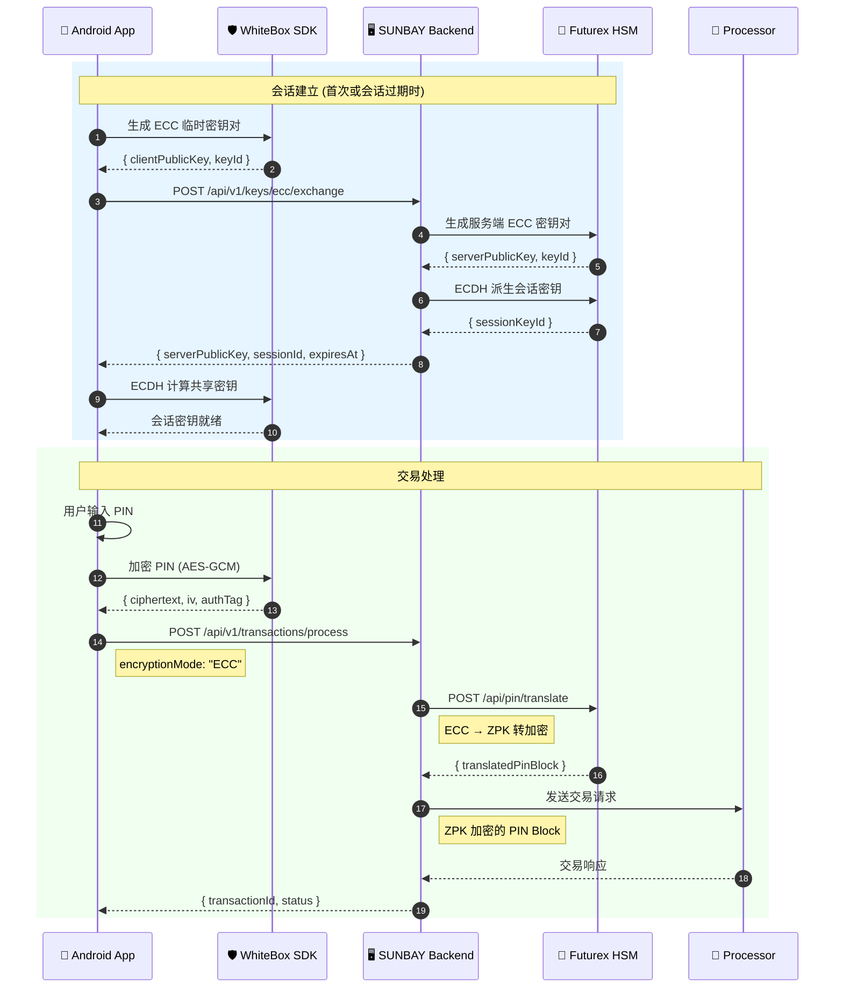

# SUNBAY SoftPOS PIN 加密安全处理方案

**版本**: v1.0  
**日期**: 2024-12-30  
**状态**: 设计确认  
**作者**: SUNBAY 技术团队

---

## 目录

1. [概述](#1-概述)
2. [技术决策](#2-技术决策)
3. [系统架构](#3-系统架构)
4. [密钥层次结构](#4-密钥层次结构)
5. [WhiteBox DH-ECC 方案详解](#5-whitebox-dh-ecc-方案详解)
6. [Futurex CloudHSM 集成](#6-futurex-cloudhsm-集成)
7. [多 Processor 对接](#7-多-processor-对接)
8. [API 设计](#8-api-设计)
9. [安全考虑](#9-安全考虑)
10. [合规要求](#10-合规要求)

---

## 1. 概述

### 1.1 背景

SUNBAY SoftPOS 是一款面向美国市场的移动支付解决方案，将 Android 智能手机转变为 POS 终端。
本文档描述 PIN 加密的端到端安全处理方案，确保持卡人 PIN 在整个交易链路中的安全性。

### 1.2 核心挑战

| 挑战 | 说明 |
|------|------|
| **移动端安全** | Android 设备缺乏传统 POS 的硬件安全模块 |
| **PIN 传输安全** | PIN 需要安全传输到 Processor |
| **多 Processor 对接** | 需要同时对接 TSYS、Fiserv、Elavon |
| **合规要求** | 满足 PCI-DSS、PCI PIN 等安全标准 |

### 1.3 解决方案概述

采用 **WhiteBox DH-ECC** 加密方案：

```
Android App (WhiteBox) ──ECC加密──► SUNBAY Backend (HSM) ──ZPK加密──► Processor ──► Card Network
```

- **Android 端**: 自研 WhiteBox SDK，使用 DH-ECC 算法加密 PIN
- **后端**: Futurex CloudHSM 进行 PIN 转加密 (ECC → ZPK)
- **Processor**: 接收 ZPK 加密的 ISO 9564 Format 0 PIN Block

---

## 2. 技术决策

### 2.1 决策汇总

| 项目 | 决策 | 说明 |
|------|------|------|
| **HSM 选型** | Futurex CloudHSM | 传统支付 HSM 厂商，功能全面 |
| **PCI PIN 认证** | SUNBAY 自建 | 自行获取 PCI PIN 认证 |
| **Processor** | TSYS + Fiserv + Elavon | 全部对接，支持路由 |
| **WhiteBox SDK** | 自研 | 完全自主可控 |
| **ECC 曲线** | P-256 (secp256r1) | NIST 推荐，广泛支持 |
| **PIN Block 格式** | ISO 9564 Format 0 | 行业标准 |
| **加密算法** | 3DES + AES | 兼容不同 Processor 要求 |

### 2.2 方案对比

| 方案 | 安全级别 | 复杂度 | 适用场景 |
|------|---------|--------|---------|
| **DUKPT** | 高 | 中 | 标准 POS 交易 |
| **WhiteBox DH-ECC** | 极高 | 高 | SoftPOS 高安全场景 |

选择 WhiteBox DH-ECC 的原因：
- 抗白盒攻击，适合移动端不可信环境
- 前向安全，每次会话使用临时密钥
- 动态密钥协商，无需预置密钥

---

## 3. 系统架构

### 3.1 整体架构图

> 📊 **Draw.io 图**: [pin-encryption-architecture.drawio](./diagrams/pin-encryption-architecture.drawio)

```
┌─────────────────────────────────────────────────────────────────────────────────────────┐
│                           SUNBAY SoftPOS WhiteBox DH-ECC 架构                            │
├─────────────────────────────────────────────────────────────────────────────────────────┤
│                                                                                         │
│  ┌─────────────────────┐                                                                │
│  │   📱 Android App    │                                                                │
│  │  ┌───────────────┐  │                                                                │
│  │  │ WhiteBox SDK  │  │  ← 自研，抗白盒攻击                                             │
│  │  │  (自研)       │  │                                                                │
│  │  │ • ECC P-256   │  │                                                                │
│  │  │ • ECDH        │  │                                                                │
│  │  │ • AES-GCM     │  │                                                                │
│  │  └───────────────┘  │                                                                │
│  └──────────┬──────────┘                                                                │
│             │ ECC 加密 PIN Block                                                        │
│             │ (AES-GCM)                                                                 │
│             ▼                                                                           │
│  ┌─────────────────────────────────────────────────────────────────┐                    │
│  │                    🖥️ SUNBAY Backend                            │                    │
│  │  ┌─────────────────────────────────────────────────────────┐   │                    │
│  │  │              Futurex CloudHSM                           │   │                    │
│  │  │  ┌─────────────┐    ┌─────────────┐    ┌─────────────┐  │   │                    │
│  │  │  │ ECC 私钥    │    │ PIN 转加密  │    │ ZPK 管理    │  │   │                    │
│  │  │  │ (会话密钥)  │ ─► │ ECC → ZPK   │ ─► │ (per Proc)  │  │   │                    │
│  │  │  └─────────────┘    └─────────────┘    └─────────────┘  │   │                    │
│  │  └─────────────────────────────────────────────────────────┘   │                    │
│  └──────────┬──────────────────────┬──────────────────┬───────────┘                    │
│             │                      │                  │                                 │
│             │ ZPK₁ 加密            │ ZPK₂ 加密        │ ZPK₃ 加密                       │
│             ▼                      ▼                  ▼                                 │
│  ┌─────────────────┐    ┌─────────────────┐    ┌─────────────────┐                      │
│  │   🏦 TSYS       │    │   🏦 Fiserv     │    │   🏦 Elavon     │                      │
│  │  ZMK 交换       │    │  ZMK 交换       │    │  ZMK 交换       │                      │
│  │  (PCI PIN)      │    │  (PCI PIN)      │    │  (PCI PIN)      │                      │
│  └────────┬────────┘    └────────┬────────┘    └────────┬────────┘                      │
│           └──────────────────────┼──────────────────────┘                               │
│                                  ▼                                                      │
│                         ┌─────────────────┐                                             │
│                         │  💳 Card Network │                                             │
│                         │  (Visa/MC/etc)  │                                             │
│                         └─────────────────┘                                             │
└─────────────────────────────────────────────────────────────────────────────────────────┘
```

### 3.2 数据流

```
┌─────────────────────────────────────────────────────────────────────────────┐
│                           PIN 加密数据流                                     │
├─────────────────────────────────────────────────────────────────────────────┤
│                                                                             │
│  用户输入 PIN                                                                │
│       │                                                                     │
│       ▼                                                                     │
│  ┌─────────────────────────────────────────────────────────────────────┐   │
│  │ Android WhiteBox SDK                                                │   │
│  │  1. 使用会话共享密钥派生 AES-256 密钥                                 │   │
│  │  2. AES-GCM 加密 PIN                                                │   │
│  │  3. 输出: { ciphertext, iv, authTag, sessionId }                    │   │
│  └─────────────────────────────────────────────────────────────────────┘   │
│       │                                                                     │
│       │ HTTPS/TLS 1.3                                                       │
│       ▼                                                                     │
│  ┌─────────────────────────────────────────────────────────────────────┐   │
│  │ SUNBAY Backend                                                      │   │
│  │  1. 验证 sessionId 有效性                                            │   │
│  │  2. 调用 Futurex HSM 转加密 API                                      │   │
│  │  3. 路由选择目标 Processor                                           │   │
│  └─────────────────────────────────────────────────────────────────────┘   │
│       │                                                                     │
│       ▼                                                                     │
│  ┌─────────────────────────────────────────────────────────────────────┐   │
│  │ Futurex CloudHSM (内部处理，明文 PIN 不出 HSM)                        │   │
│  │  1. AES-GCM 解密，验证 authTag                                       │   │
│  │  2. 构造 ISO 9564 Format 0 PIN Block                                │   │
│  │  3. 使用目标 Processor 的 ZPK 加密                                   │   │
│  │  4. 输出: { translatedPinBlock, format, kcv }                       │   │
│  └─────────────────────────────────────────────────────────────────────┘   │
│       │                                                                     │
│       │ ISO 8583 / REST API                                                 │
│       ▼                                                                     │
│  ┌─────────────────────────────────────────────────────────────────────┐   │
│  │ Processor (TSYS/Fiserv/Elavon)                                      │   │
│  │  1. 使用 ZPK 解密 PIN Block                                          │   │
│  │  2. 转发到 Card Network                                              │   │
│  └─────────────────────────────────────────────────────────────────────┘   │
│                                                                             │
└─────────────────────────────────────────────────────────────────────────────┘
```

---

## 4. 密钥层次结构

### 4.1 密钥分布

> 📊 **Draw.io 图**: [key-hierarchy.drawio](./diagrams/key-hierarchy.drawio)

```
┌─────────────────────────────────────────────────────────────────┐
│                      密钥层次结构                                │
├─────────────────────────────────────────────────────────────────┤
│                                                                 │
│  Android 端 (WhiteBox SDK)                                      │
│  ├── ECC 临时密钥对 (P-256)                                      │
│  │   ├── 私钥: WhiteBox 保护存储                                 │
│  │   └── 公钥: 发送给服务端                                      │
│  └── 会话密钥 (AES-256)                                          │
│      └── 由 ECDH 共享密钥 + HKDF 派生                            │
│                                                                 │
│  SUNBAY Backend (Futurex HSM)                                   │
│  ├── ECC 临时密钥对 (P-256)                                      │
│  │   ├── 私钥: HSM 内部存储，不可导出                            │
│  │   └── 公钥: 返回给客户端                                      │
│  ├── 会话密钥 (AES-256)                                          │
│  │   └── 由 ECDH 共享密钥 + HKDF 派生，存储在 HSM                │
│  └── ZPK (Zone PIN Key) × 3                                     │
│      ├── ZPK_TSYS: 与 TSYS 交换的 PIN 加密密钥                   │
│      ├── ZPK_Fiserv: 与 Fiserv 交换的 PIN 加密密钥               │
│      └── ZPK_Elavon: 与 Elavon 交换的 PIN 加密密钥               │
│                                                                 │
│  Processor 端                                                   │
│  └── ZMK (Zone Master Key)                                      │
│      └── 用于加密传输 ZPK                                        │
│                                                                 │
└─────────────────────────────────────────────────────────────────┘
```

### 4.2 密钥生命周期

| 密钥类型 | 生成方 | 存储位置 | 有效期 | 轮换策略 |
|---------|--------|---------|--------|---------|
| ECC 临时密钥对 (客户端) | WhiteBox SDK | 设备内存 | 会话级 | 每次会话 |
| ECC 临时密钥对 (服务端) | Futurex HSM | HSM | 会话级 | 每次会话 |
| 会话密钥 (AES-256) | ECDH 派生 | 两端 | 30 分钟 | 过期重建 |
| ZPK | Processor | HSM | 24 小时 | 每日轮换 |
| ZMK | Processor | HSM | 1 年 | 年度轮换 |

---

## 5. WhiteBox DH-ECC 方案详解

### 5.1 DH-ECC 密钥交换原理

```
┌─────────────────────────────────────────────────────────────────┐
│                    DH-ECC 密钥交换流程                           │
├─────────────────────────────────────────────────────────────────┤
│                                                                 │
│  Client (WhiteBox)              Server (HSM)                    │
│  ─────────────────              ────────────                    │
│                                                                 │
│  1. 生成临时密钥对               1. 生成临时密钥对                │
│     (client_priv, client_pub)      (server_priv, server_pub)   │
│                                                                 │
│  2. 发送 client_pub ──────────────────────────────────────────► │
│                                                                 │
│  3. ◄────────────────────────────────────── 返回 server_pub    │
│                                                                 │
│  4. ECDH 计算:                                                  │
│     shared = client_priv × server_pub                          │
│            = server_priv × client_pub (数学等价)                │
│                                                                 │
│  5. 密钥派生:                                                   │
│     aes_key = HKDF-SHA256(shared, info="PIN_ENCRYPTION_V1")    │
│                                                                 │
└─────────────────────────────────────────────────────────────────┘
```

### 5.2 WhiteBox SDK 功能模块

| 模块 | 功能 | 实现要点 |
|------|------|---------|
| **ECC 密钥生成** | 生成 P-256 临时密钥对 | 使用安全随机数生成器 |
| **ECDH** | 计算共享密钥 | 椭圆曲线点乘运算 |
| **HKDF** | 密钥派生 | SHA-256 + 盐值 + 上下文信息 |
| **AES-GCM** | 认证加密 | 256-bit 密钥，128-bit 认证标签 |
| **白盒保护** | 密钥混淆 | 查表法、多项式混淆、代码混淆 |
| **安全存储** | 密钥存储 | Android Keystore + 额外混淆 |
| **抗调试** | 防逆向 | 检测调试器、Hook 框架 |

### 5.3 PIN 加密流程

```kotlin
// Android WhiteBox SDK 伪代码

class WhiteBoxPinEncryptor(private val sessionKey: ByteArray) {
    
    fun encryptPin(pin: String, pan: String): EncryptedPinBlock {
        // 1. 验证 PIN 格式 (4-12 位数字)
        require(pin.matches(Regex("^\\d{4,12}$")))
        
        // 2. 生成随机 IV (12 bytes for GCM)
        val iv = SecureRandom().generateSeed(12)
        
        // 3. 构造待加密数据
        val pinData = buildPinData(pin, pan)
        
        // 4. AES-GCM 加密
        val cipher = Cipher.getInstance("AES/GCM/NoPadding")
        val spec = GCMParameterSpec(128, iv)
        cipher.init(Cipher.ENCRYPT_MODE, SecretKeySpec(sessionKey, "AES"), spec)
        
        val ciphertext = cipher.doFinal(pinData)
        
        // 5. 提取认证标签 (最后 16 bytes)
        val authTag = ciphertext.takeLast(16).toByteArray()
        val encryptedData = ciphertext.dropLast(16).toByteArray()
        
        return EncryptedPinBlock(
            encryptedData = Base64.encode(encryptedData),
            iv = Base64.encode(iv),
            authTag = Base64.encode(authTag)
        )
    }
    
    private fun buildPinData(pin: String, pan: String): ByteArray {
        // 构造 PIN 数据结构
        // 格式: [PIN长度(1byte)][PIN(填充到8bytes)][PAN后12位]
        val pinBytes = pin.toByteArray()
        val panLast12 = pan.takeLast(12).toByteArray()
        return byteArrayOf(pin.length.toByte()) + pinBytes.padEnd(8) + panLast12
    }
}

data class EncryptedPinBlock(
    val encryptedData: String,  // Base64
    val iv: String,             // Base64
    val authTag: String         // Base64
)
```

---

## 6. Futurex CloudHSM 集成

### 6.1 HSM API 调用序列

```
┌──────────────────────────────────────────────────────────────────────────────────────┐
│                         Futurex CloudHSM API 调用序列                                 │
├──────────────────────────────────────────────────────────────────────────────────────┤
│                                                                                      │
│  阶段一：密钥交换 (会话建立时，一次性)                                                 │
│  ════════════════════════════════════════                                            │
│                                                                                      │
│  SUNBAY Backend                          Futurex CloudHSM                            │
│       │                                        │                                     │
│       │  1. POST /api/keys/ecc/generate        │                                     │
│       │  { curve: "P-256", keyUsage: "ECDH" }  │                                     │
│       │ ─────────────────────────────────────► │                                     │
│       │                                        │  生成 ECC 密钥对                     │
│       │  { keyId, publicKey, curve }           │                                     │
│       │ ◄───────────────────────────────────── │                                     │
│       │                                        │                                     │
│       │  2. POST /api/keys/ecdh/derive         │                                     │
│       │  { privateKeyId, peerPublicKey,        │                                     │
│       │    kdfAlgorithm: "HKDF-SHA256" }       │                                     │
│       │ ─────────────────────────────────────► │                                     │
│       │                                        │  ECDH + KDF 派生会话密钥             │
│       │  { derivedKeyId, algorithm }           │                                     │
│       │ ◄───────────────────────────────────── │                                     │
│       │                                        │                                     │
│                                                                                      │
│  阶段二：PIN 转加密 (每笔交易)                                                        │
│  ════════════════════════════════                                                    │
│                                                                                      │
│  SUNBAY Backend                          Futurex CloudHSM                            │
│       │                                        │                                     │
│       │  3. POST /api/pin/translate            │                                     │
│       │  {                                     │                                     │
│       │    sourceEncryption: {                 │                                     │
│       │      keyId, algorithm: "AES-GCM",      │                                     │
│       │      encryptedData, iv, authTag        │                                     │
│       │    },                                  │                                     │
│       │    pinBlockConstruction: {             │                                     │
│       │      format: "ISO9564-0", pan          │                                     │
│       │    },                                  │                                     │
│       │    targetEncryption: {                 │                                     │
│       │      keyId: "zpk-tsys-001",            │                                     │
│       │      algorithm: "3DES-CBC"             │                                     │
│       │    }                                   │                                     │
│       │  }                                     │                                     │
│       │ ─────────────────────────────────────► │                                     │
│       │                                        │  HSM 内部:                           │
│       │                                        │  1. AES-GCM 解密                     │
│       │                                        │  2. 构造 PIN Block                   │
│       │                                        │  3. ZPK 加密                         │
│       │  { translatedPinBlock, format, kcv }   │                                     │
│       │ ◄───────────────────────────────────── │                                     │
│       │                                        │                                     │
└──────────────────────────────────────────────────────────────────────────────────────┘
```

### 6.2 核心 API 定义

#### API 1: ECC 密钥生成

```http
POST /api/keys/ecc/generate
Authorization: Bearer {futurex_api_token}
Content-Type: application/json

{
  "curve": "P-256",
  "keyUsage": "ECDH",
  "keyLabel": "session_{device_id}_{timestamp}",
  "exportable": false
}
```

**响应**:
```json
{
  "keyId": "ecc-key-001",
  "publicKey": "04a1b2c3d4e5f6...",
  "curve": "P-256",
  "createdAt": "2024-12-30T10:00:00Z"
}
```

#### API 2: ECDH 密钥派生

```http
POST /api/keys/ecdh/derive
Authorization: Bearer {futurex_api_token}
Content-Type: application/json

{
  "privateKeyId": "ecc-key-001",
  "peerPublicKey": "04f1e2d3c4b5a6...",
  "kdfAlgorithm": "HKDF-SHA256",
  "kdfInfo": "PIN_ENCRYPTION_V1",
  "derivedKeyLength": 256,
  "derivedKeyLabel": "aes_session_{session_id}",
  "derivedKeyUsage": "DECRYPT"
}
```

**响应**:
```json
{
  "derivedKeyId": "aes-session-001",
  "algorithm": "AES-256",
  "keyCheckValue": "A1B2C3"
}
```

#### API 3: PIN 转加密

```http
POST /api/pin/translate
Authorization: Bearer {futurex_api_token}
Content-Type: application/json

{
  "sourceEncryption": {
    "keyId": "aes-session-001",
    "algorithm": "AES-GCM",
    "encryptedData": "base64_ciphertext",
    "iv": "base64_iv",
    "authTag": "base64_tag"
  },
  "pinBlockConstruction": {
    "format": "ISO9564-0",
    "pan": "4111111111111111"
  },
  "targetEncryption": {
    "keyId": "zpk-tsys-001",
    "algorithm": "3DES-CBC"
  }
}
```

**响应**:
```json
{
  "translatedPinBlock": "1A2B3C4D5E6F7890",
  "format": "ISO9564-0",
  "targetKeyId": "zpk-tsys-001",
  "keyCheckValue": "ABC123"
}
```

### 6.3 HSM 内部转加密流程

> 📊 **Draw.io 图**: [pin-translation-flow.drawio](./diagrams/pin-translation-flow.drawio)

```
┌─────────────────────────────────────────────────────────────────┐
│              Futurex HSM 内部 PIN 转加密流程                     │
├─────────────────────────────────────────────────────────────────┤
│                                                                 │
│  输入:                                                          │
│  ├── ECC 加密的 PIN 数据 (AES-GCM ciphertext)                   │
│  ├── IV + AuthTag                                               │
│  ├── 会话密钥 ID                                                 │
│  ├── PAN (用于构造 PIN Block)                                   │
│  └── 目标 ZPK ID                                                │
│                                                                 │
│  ┌─────────────────────────────────────────────────────────┐   │
│  │ Step 1: AES-GCM 解密                                    │   │
│  │  • 使用会话密钥解密                                      │   │
│  │  • 验证 AuthTag 完整性                                   │   │
│  │  • 得到明文 PIN (仅在 HSM 安全边界内)                    │   │
│  └─────────────────────────────────────────────────────────┘   │
│                          │                                      │
│                          ▼                                      │
│  ┌─────────────────────────────────────────────────────────┐   │
│  │ Step 2: 构造 ISO 9564 Format 0 PIN Block                │   │
│  │                                                         │   │
│  │  PIN Block = PIN Field XOR PAN Field                    │   │
│  │                                                         │   │
│  │  PIN Field:  0 | N | P P P P P P P P P P P P P P        │   │
│  │              (N=PIN长度, P=PIN数字, 填充F)               │   │
│  │                                                         │   │
│  │  PAN Field:  0 0 0 0 | PAN[3..14] | 0                   │   │
│  │              (PAN 右起第2位到第13位)                     │   │
│  │                                                         │   │
│  │  示例:                                                  │   │
│  │  PIN = "1234", PAN = "4111111111111111"                 │   │
│  │  PIN Field = 0x041234FFFFFFFFFF                         │   │
│  │  PAN Field = 0x0000111111111111                         │   │
│  │  PIN Block = 0x041225EEEEEEEEEE                         │   │
│  └─────────────────────────────────────────────────────────┘   │
│                          │                                      │
│                          ▼                                      │
│  ┌─────────────────────────────────────────────────────────┐   │
│  │ Step 3: ZPK 加密                                        │   │
│  │  • 使用目标 Processor 的 ZPK                            │   │
│  │  • 3DES-CBC 或 AES-CBC 加密                             │   │
│  │  • 输出 16 字符 HEX 字符串                              │   │
│  └─────────────────────────────────────────────────────────┘   │
│                          │                                      │
│                          ▼                                      │
│  输出:                                                          │
│  ├── translatedPinBlock: "1A2B3C4D5E6F7890"                    │
│  ├── format: "ISO9564-0"                                       │
│  └── keyCheckValue: "ABC123" (ZPK 校验值)                      │
│                                                                 │
└─────────────────────────────────────────────────────────────────┘
```

---

## 7. 多 Processor 对接

### 7.1 Processor 配置

| Processor | 接口类型 | PIN Block 格式 | 加密算法 | ZPK 轮换周期 |
|-----------|---------|---------------|---------|-------------|
| **TSYS** | ISO 8583 | ISO 9564-0 | 3DES | 24 小时 |
| **Fiserv** | REST API | ISO 9564-0 | AES-128 | 24 小时 |
| **Elavon** | ISO 8583 | ISO 9564-0 | 3DES | 24 小时 |

### 7.2 ZPK 管理

```
┌─────────────────────────────────────────────────────────────────┐
│                      ZPK 管理架构                                │
├─────────────────────────────────────────────────────────────────┤
│                                                                 │
│  ┌─────────────────────────────────────────────────────────┐   │
│  │                   Futurex CloudHSM                       │   │
│  │  ┌─────────────┐  ┌─────────────┐  ┌─────────────┐      │   │
│  │  │ ZMK_TSYS    │  │ ZMK_Fiserv  │  │ ZMK_Elavon  │      │   │
│  │  │ (长期密钥)  │  │ (长期密钥)  │  │ (长期密钥)  │      │   │
│  │  └──────┬──────┘  └──────┬──────┘  └──────┬──────┘      │   │
│  │         │                │                │              │   │
│  │         ▼                ▼                ▼              │   │
│  │  ┌─────────────┐  ┌─────────────┐  ┌─────────────┐      │   │
│  │  │ ZPK_TSYS    │  │ ZPK_Fiserv  │  │ ZPK_Elavon  │      │   │
│  │  │ (每日轮换)  │  │ (每日轮换)  │  │ (每日轮换)  │      │   │
│  │  │ 3DES        │  │ AES-128     │  │ 3DES        │      │   │
│  │  └─────────────┘  └─────────────┘  └─────────────┘      │   │
│  └─────────────────────────────────────────────────────────┘   │
│                                                                 │
│  ZPK 轮换流程:                                                  │
│  1. Processor 生成新 ZPK                                        │
│  2. 使用 ZMK 加密 ZPK 传输给 SUNBAY                             │
│  3. SUNBAY 导入新 ZPK 到 HSM                                    │
│  4. 旧 ZPK 标记为过期，保留 24 小时用于在途交易                  │
│                                                                 │
└─────────────────────────────────────────────────────────────────┘
```

### 7.3 交易路由策略

```rust
// 交易路由逻辑伪代码

enum Processor {
    TSYS,
    Fiserv,
    Elavon,
}

struct RoutingConfig {
    card_brand_rules: HashMap<CardBrand, Processor>,
    mcc_rules: HashMap<MccRange, Processor>,
    amount_rules: Vec<AmountRule>,
    fallback: Processor,
}

fn route_transaction(
    card_brand: CardBrand,
    mcc: u16,
    amount: u64,
    config: &RoutingConfig,
) -> Processor {
    // 1. 按卡组织路由
    if let Some(processor) = config.card_brand_rules.get(&card_brand) {
        return *processor;
    }
    
    // 2. 按 MCC 路由
    for (range, processor) in &config.mcc_rules {
        if range.contains(mcc) {
            return *processor;
        }
    }
    
    // 3. 按金额路由 (费率优化)
    for rule in &config.amount_rules {
        if rule.matches(amount) {
            return rule.processor;
        }
    }
    
    // 4. 默认路由
    config.fallback
}
```

---

## 8. API 设计

### 8.1 Android 端 API

#### 8.1.1 ECC 密钥交换

```http
POST /api/v1/keys/ecc/exchange
Content-Type: application/json

{
  "deviceId": "dev-550e8400-e29b-41d4-a716-446655440000",
  "clientPublicKey": "04a1b2c3d4e5f6...",
  "curve": "P-256",
  "keyId": "wb-key-20241230-001",
  "timestamp": "2024-12-30T10:00:00Z"
}
```

**响应**:
```json
{
  "code": 200,
  "data": {
    "serverPublicKey": "04f1e2d3c4b5a6...",
    "sessionId": "sess-20241230-abc123",
    "expiresAt": "2024-12-30T10:30:00Z",
    "curve": "P-256",
    "kdfParams": {
      "algorithm": "HKDF-SHA256",
      "info": "PIN_ENCRYPTION_V1",
      "keyLength": 256
    }
  },
  "message": "Key exchange successful"
}
```

#### 8.1.2 交易处理 (ECC 模式)

```http
POST /api/v1/transactions/process
Content-Type: application/json

{
  "deviceId": "dev-550e8400-e29b-41d4-a716-446655440000",
  "transactionType": "PAYMENT",
  "amount": 10000,
  "currency": "USD",
  "encryptedPinBlock": "base64_aes_gcm_ciphertext",
  "encryptionMode": "ECC",
  "sessionId": "sess-20241230-abc123",
  "iv": "base64_initialization_vector",
  "authTag": "base64_gcm_auth_tag",
  "cardNumberMasked": "4111****1111",
  "pan": "4111111111111111",
  "transactionToken": "eyJhbGciOiJIUzI1NiIs..."
}
```

**响应**:
```json
{
  "code": 200,
  "data": {
    "transactionId": "txn-123456",
    "status": "SUCCESS",
    "processorRef": "TSYS-REF-789",
    "processedAt": "2024-12-30T10:00:05Z"
  },
  "message": "Transaction processed successfully"
}
```

### 8.2 完整交易流程时序图



---

## 9. 安全考虑

### 9.1 安全特性汇总

| 安全特性 | 实现方式 | 防护目标 |
|---------|---------|---------|
| **前向安全** | 每次会话使用临时 ECC 密钥 | 历史会话无法被破解 |
| **白盒保护** | 密钥混淆、代码混淆 | 抗内存提取攻击 |
| **认证加密** | AES-GCM | 加密 + 完整性保护 |
| **会话时效** | 30 分钟过期 | 降低密钥泄露风险 |
| **HSM 隔离** | 明文 PIN 不出 HSM | 服务端无法获取明文 |
| **传输安全** | TLS 1.3 | 防中间人攻击 |
| **重放防护** | 时间戳 + 一次性 Token | 防重放攻击 |

### 9.2 威胁模型与对策

| 威胁 | 攻击方式 | 对策 |
|------|---------|------|
| **内存提取** | 调试器、内存转储 | WhiteBox 混淆、抗调试检测 |
| **中间人攻击** | 网络嗅探、代理 | TLS 1.3 + 证书固定 |
| **重放攻击** | 重发历史请求 | 时间戳验证、一次性 Token |
| **侧信道攻击** | 时序分析、功耗分析 | 常量时间实现 |
| **逆向工程** | 反编译、动态分析 | 代码混淆、完整性校验 |
| **密钥泄露** | 服务端入侵 | HSM 存储、密钥不可导出 |

### 9.3 安全审计日志

```json
{
  "eventType": "PIN_TRANSLATION",
  "timestamp": "2024-12-30T10:00:05.123Z",
  "sessionId": "sess-20241230-abc123",
  "deviceId": "dev-550e8400",
  "transactionId": "txn-123456",
  "sourceKeyId": "aes-session-001",
  "targetKeyId": "zpk-tsys-001",
  "targetProcessor": "TSYS",
  "result": "SUCCESS",
  "hsmRequestId": "hsm-req-789",
  "latencyMs": 45
}
```

---

## 10. 合规要求

### 10.1 认证要求

| 认证 | 状态 | 说明 |
|------|------|------|
| **PCI-DSS** | ✅ 已认证 | 数据安全标准 |
| **PCI PIN** | 🔄 进行中 | PIN 安全标准，ZPK 交换必需 |
| **PCI P2PE** | 📋 计划中 | 点对点加密 |
| **EMVCo** | 📋 计划中 | 非接触支付 |

### 10.2 PCI PIN 认证要点

| 要求 | 实现 |
|------|------|
| PIN 加密设备安全 | WhiteBox SDK + 设备安全检测 |
| PIN 传输安全 | ECC 加密 + TLS 1.3 |
| PIN 处理安全 | HSM 内部转加密，明文不出 HSM |
| 密钥管理 | HSM 存储，定期轮换 |
| 审计日志 | 完整的操作日志记录 |

### 10.3 合规检查清单

- [ ] WhiteBox SDK 通过安全评估
- [ ] Futurex HSM 配置符合 PCI PIN 要求
- [ ] ZPK 交换流程文档化
- [ ] 密钥轮换策略实施
- [ ] 审计日志保留 1 年以上
- [ ] 安全事件响应流程建立
- [ ] 年度渗透测试完成
- [ ] 员工安全培训完成

---

## 附录

### A. 术语表

| 术语 | 全称 | 说明 |
|------|------|------|
| **DH-ECC** | Diffie-Hellman Elliptic Curve Cryptography | 椭圆曲线 Diffie-Hellman 密钥交换 |
| **ECDH** | Elliptic Curve Diffie-Hellman | 椭圆曲线 DH 算法 |
| **HSM** | Hardware Security Module | 硬件安全模块 |
| **ZPK** | Zone PIN Key | 区域 PIN 加密密钥 |
| **ZMK** | Zone Master Key | 区域主密钥 |
| **KCV** | Key Check Value | 密钥校验值 |
| **PIN Block** | - | PIN 加密数据块 |
| **ISO 9564** | - | PIN 安全标准 |
| **HKDF** | HMAC-based Key Derivation Function | 基于 HMAC 的密钥派生函数 |
| **AES-GCM** | AES Galois/Counter Mode | AES 伽罗瓦计数器模式 |

### B. 参考文档

- [ISO 9564 PIN Security Standard](https://www.iso.org/standard/68014.html)
- [PCI PIN Security Requirements](https://www.pcisecuritystandards.org/document_library)
- [NIST SP 800-56A - Pair-Wise Key Establishment](https://csrc.nist.gov/publications/detail/sp/800-56a/rev-3/final)
- [Futurex CloudHSM Documentation](https://www.futurex.com/products/cloudhsm)

---

**文档版本**: v1.0  
**最后更新**: 2024-12-30  
**维护者**: SUNBAY 技术团队
