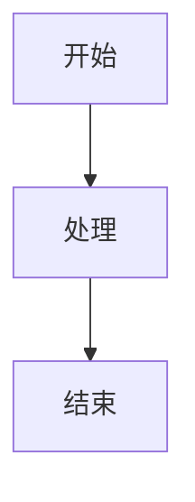
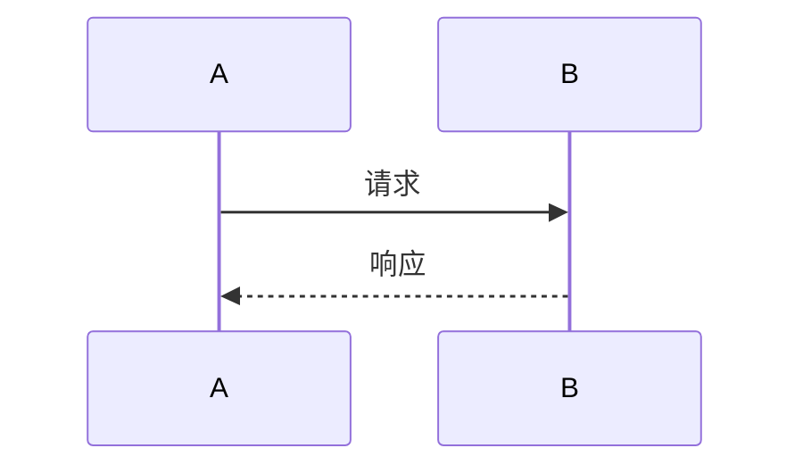

# SUNBAY SoftPOS Slidev 演示文稿

这是一个使用 Slidev 制作的专业演示文稿，包含丰富的样式、动画和图表。

## 🎨 特点

- ✅ **专业主题** - 使用 Seriph 主题
- ✅ **丰富动画** - v-click 渐进式显示
- ✅ **多种布局** - 封面、两栏、图片、居中等
- ✅ **图表支持** - Mermaid 流程图和序列图
- ✅ **图标支持** - Carbon 图标库
- ✅ **代码高亮** - Shiki 语法高亮
- ✅ **响应式** - 自适应不同屏幕

## 🚀 快速开始

### 1. 安装依赖

```bash
cd docs/solution
npm install
```

### 2. 启动开发服务器

```bash
npm run dev
```

然后在浏览器中打开 http://localhost:3030

### 3. 导出 PDF

```bash
npm run export
```

会生成 `slides-export.pdf` 文件

### 4. 构建静态网站

```bash
npm run build
```

会在 `dist/` 目录生成静态文件

## 📖 使用说明

### 演示控制

- **空格/→** - 下一页
- **←** - 上一页
- **o** - 显示概览
- **d** - 切换暗色模式
- **f** - 全屏
- **g** - 显示网格
- **c** - 显示摄像头
- **r** - 录制

### 演讲者模式

按 `s` 键进入演讲者模式，可以看到：
- 当前幻灯片
- 下一张幻灯片
- 演讲备注
- 计时器

## 🎨 自定义样式

### 修改主题颜色

在 `slides.md` 的 frontmatter 中修改：

```yaml
---
theme: seriph
themeConfig:
  primary: '#ff6000'  # 主色调
---
```

### 添加自定义 CSS

创建 `style.css` 文件：

```css
.slidev-layout {
  background: linear-gradient(to bottom, #fff, #f5f5f5);
}
```

然后在 frontmatter 中引入：

```yaml
---
css: unocss
---
```

## 📊 添加图表

### Mermaid 流程图

````markdown

````

### Mermaid 序列图

````markdown

````

## 🖼️ 添加图片

### 背景图片

```markdown
---
layout: image-right
image: https://example.com/image.jpg
---
```

### 内联图片

```markdown

```

## 🎭 布局类型

### 封面页

```markdown
---
layout: cover
---
```

### 两栏布局

```markdown
---
layout: two-cols
---

左侧内容

::right::

右侧内容
```

### 图片右侧

```markdown
---
layout: image-right
image: url
---
```

### 居中

```markdown
---
layout: center
class: text-center
---
```

### 结束页

```markdown
---
layout: end
---
```

## 🎬 动画效果

### 渐进显示

```markdown
<v-clicks>

- 第一项
- 第二项
- 第三项

</v-clicks>
```

### 单个元素

```markdown
<div v-click>
  点击后显示
</div>
```

### 点击后显示

```markdown
<div v-after>
  前一个元素显示后才显示
</div>
```

## 🔧 高级功能

### 添加备注

```markdown
---
# 这是幻灯片内容
---

<!--
这是演讲者备注
只在演讲者模式中可见
-->
```

### 代码高亮

````markdown
```ts {2-4|5-7}
function hello() {
  // 第一步高亮
  console.log('Hello')
  
  // 第二步高亮
  console.log('World')
}
```
````

### 嵌入组件

```markdown
<Tweet id="1234567890" />
<YouTube id="dQw4w9WgXcQ" />
```

## 📦 导出选项

### 导出 PDF

```bash
npm run export
```

### 导出 PNG

```bash
slidev export slides.md --format png
```

### 导出 PPTX

```bash
slidev export slides.md --format pptx
```

## 🌐 部署

### 部署到 Netlify

1. 构建静态文件：
```bash
npm run build
```

2. 上传 `dist/` 目录到 Netlify

### 部署到 Vercel

1. 连接 GitHub 仓库
2. 设置构建命令：`npm run build`
3. 设置输出目录：`dist`

### 部署到 GitHub Pages

```bash
npm run build
cd dist
git init
git add -A
git commit -m 'deploy'
git push -f git@github.com:username/repo.git master:gh-pages
```

## 🎯 最佳实践

### 1. 内容组织

- 每页不超过 3-5 个要点
- 使用图表代替大段文字
- 保持视觉一致性

### 2. 动画使用

- 适度使用动画，不要过度
- 重要内容使用 v-click
- 保持动画流畅

### 3. 图片优化

- 使用高质量图片
- 压缩图片大小
- 使用 CDN 加速

### 4. 演讲准备

- 提前测试演示
- 准备演讲备注
- 练习演讲时间

## 🔗 相关资源

- **Slidev 官网**: https://sli.dev/
- **Slidev 文档**: https://sli.dev/guide/
- **主题市场**: https://sli.dev/themes/gallery.html
- **示例**: https://sli.dev/showcases.html

## 💡 提示

1. **开发时自动刷新**: 修改 `slides.md` 后会自动刷新浏览器
2. **快捷键**: 按 `?` 查看所有快捷键
3. **打印**: 使用浏览器打印功能可以打印幻灯片
4. **分享**: 可以直接分享开发服务器的 URL

## 🐛 常见问题

### Q: 图表不显示？

A: 确保安装了 Mermaid 依赖：
```bash
npm install @slidev/mermaid
```

### Q: 导出 PDF 失败？

A: 确保安装了 Playwright：
```bash
npm install -D playwright-chromium
```

### Q: 自定义字体？

A: 在 `style.css` 中添加：
```css
@import url('https://fonts.googleapis.com/css2?family=Noto+Sans+SC&display=swap');

.slidev-layout {
  font-family: 'Noto Sans SC', sans-serif;
}
```

---

**享受演示！** 🎉
