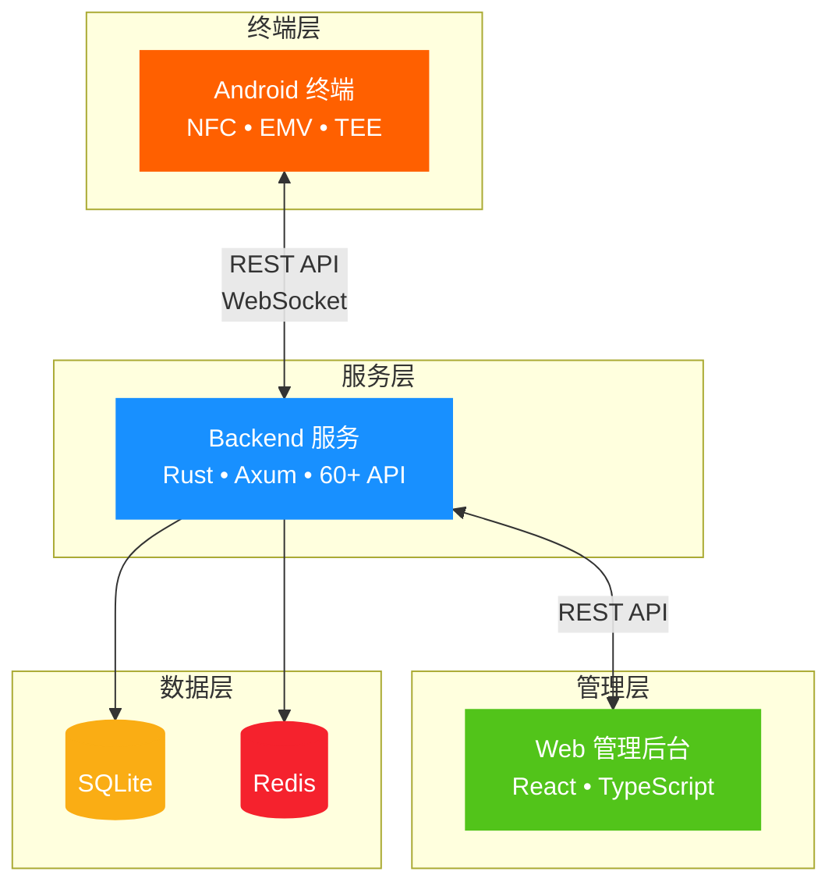
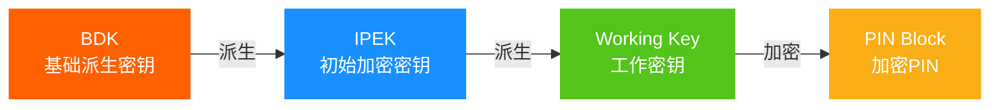
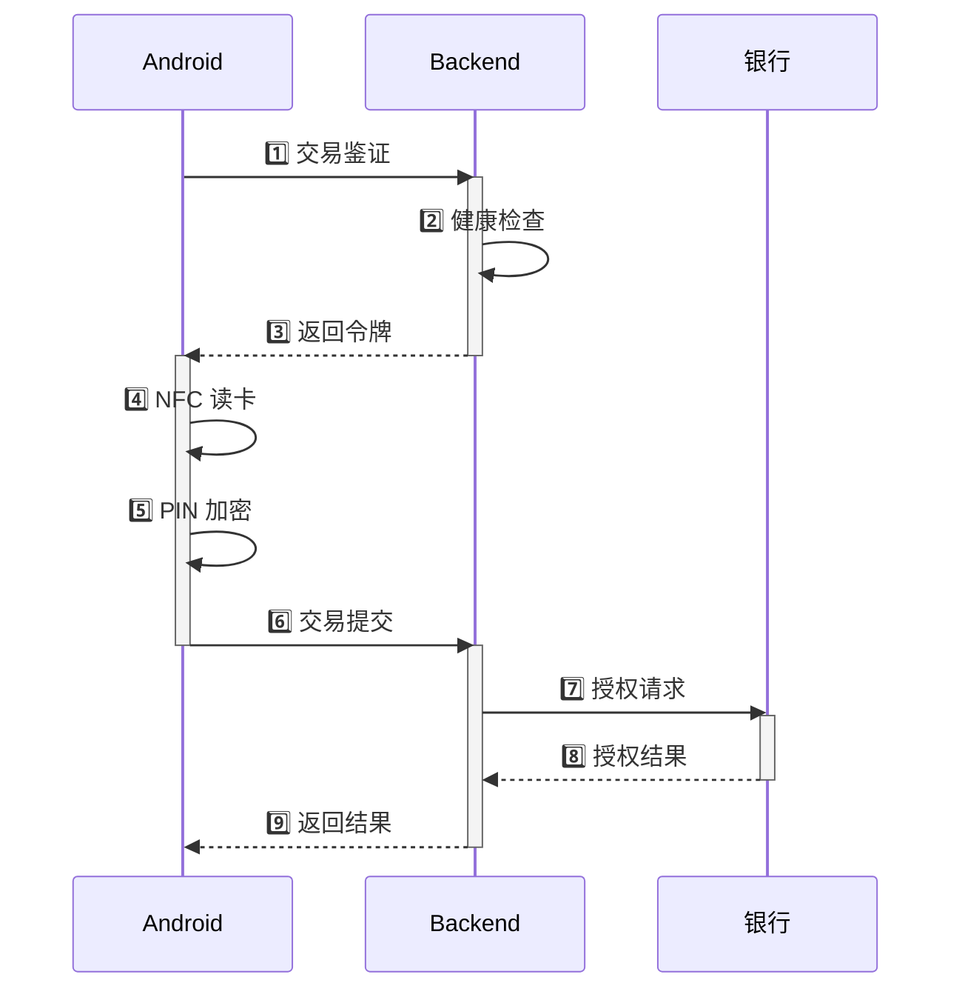

  

    SUNBAY
  

  

    SoftPOS
  

  

    企业级移动支付终端管理平台
  

  

    

      <carbon-security class="text-orange-500" />
      金融级安全
    

    

      <carbon-chip class="text-blue-500" />
      现代化技术
    

    

      <carbon-cloud class="text-green-500" />
      云端管理
    

  

---
layout: center
class: text-center
---

# 核心数据

  

    

    

      
3

      
平台

    

  

  
  

    

    

      
60+

      
API

    

  

  
  

    

    

      
18K+

      
代码行

    

  

  
  

    

    

      
91%

      
完成度

    

  

---
layout: center
---

# 系统架构

---
layout: two-cols
class: px-8
---

# Backend 架构

  

  

    
API Layer

    
60+ RESTful API • WebSocket

  

  

  

    
Business Logic

    
7 个核心服务

  

  

  

    
Data Access

    
6 个 Repository

  

  

  

    
Infrastructure

    
SQLite • Redis • HSM

  

::right::

## 核心服务

  <carbon-security class="text-orange-500 text-xl" />
  

    
设备服务

    
注册 • 审批 • 生命周期

  

  <carbon-password class="text-blue-500 text-xl" />
  

    
密钥管理

    
DUKPT • 注入 • 更新

  

  <carbon-health-cross class="text-green-500 text-xl" />
  

    
健康检查

    
评分 • 监控 • 分析

  

  <carbon-warning class="text-red-500 text-xl" />
  

    
威胁检测

    
检测 • 评估 • 响应

  

  <carbon-purchase class="text-purple-500 text-xl" />
  

    
交易服务

    
鉴证 • 处理 • 令牌

  

---
layout: center
---

# 密钥管理 - DUKPT

  

    

      <carbon-locked class="text-orange-500" />
      TEE 安全存储
    

    

      <carbon-encryption class="text-blue-500" />
      RSA-2048 加密
    

    

      <carbon-certificate-check class="text-green-500" />
      ANSI X9.24 标准
    

  

---
layout: center
---

# 交易处理流程

---
layout: center
class: text-center
---

# 安全保障

  

  

    <carbon-security class="text-5xl text-orange-500 mb-4 mx-auto" />
    
多层防护

    

      
应用层 • 传输层

      
数据层 • 设备层

    

  

  

  

    <carbon-certificate-check class="text-5xl text-blue-500 mb-4 mx-auto" />
    
国际标准

    

      
PCI MPoC

      
ISO 9564 • ANSI X9.24

    

  

  

  

    <carbon-chip class="text-5xl text-green-500 mb-4 mx-auto" />
    
TEE 安全

    

      
可信执行环境

      
Hardware Attestation

    

  

  

  

    <carbon-encryption class="text-5xl text-purple-500 mb-4 mx-auto" />
    
端到端加密

    

      
TLS 1.3

      
DUKPT 密钥派生

    

  

---
layout: two-cols
class: px-8
---

# 技术栈

  

  

    

      <carbon-logo-rust class="text-3xl text-orange-500" />
      

        
Rust

        
Backend

      

    

    

      高性能 • 内存安全 • 并发安全
    

  

  

  

    

      <carbon-logo-react class="text-3xl text-blue-500" />
      

        
React

        
Frontend

      

    

    

      组件化 • TypeScript • 现代化
    

  

  

  

    

      <carbon-mobile class="text-3xl text-green-500" />
      

        
Kotlin

        
Android

      

    

    

      现代语言 • Jetpack Compose • MVVM
    

  

::right::

## 项目成果

  

    Backend
    100%
  

  

    

  

  
7,500 行代码 • 50+ 文件

  

    Frontend
    72%
  

  

    

  

  
5,000 行代码 • 80+ 文件

  

    Android
    100%
  

  

    

  

  
6,000 行代码 • 60+ 文件

  

    

      91%
    

    
总体完成度

    
🚀 生产就绪

  

---
layout: center
class: text-center
---

# 核心优势

  

  

    <carbon-rocket class="text-5xl text-orange-500 mb-4 mx-auto" />
    
技术领先

    

      
• 现代化技术栈

      
• 企业级架构

      
• 高性能可扩展

    

  

  

  

    <carbon-security class="text-5xl text-blue-500 mb-4 mx-auto" />
    
安全可靠

    

      
• 金融级安全

      
• 多层防护

      
• 符合国际标准

    

  

  

  

    <carbon-chart-line class="text-5xl text-green-500 mb-4 mx-auto" />
    
完整功能

    

      
• 设备全生命周期

      
• 实时监控检测

      
• 灵活密钥管理

    

  

---
layout: center
class: text-center
---

  

    SUNBAY SoftPOS
  

  

    让移动支付更安全、更简单、更高效
  

  
  

    

      
核心优势

      

        

          <carbon-checkmark class="text-green-500" />
          金融级安全保障
        

        

          <carbon-checkmark class="text-green-500" />
          完整设备管理
        

        

          <carbon-checkmark class="text-green-500" />
          现代化技术栈
        

      

    

    
    

      
项目状态

      

        

          <carbon-checkmark-filled class="text-orange-500" />
          Backend 100%
        

        

          <carbon-checkmark-filled class="text-orange-500" />
          Android 100%
        

        

          <carbon-in-progress class="text-blue-500" />
          Frontend 72%
        

      

    

  

  
  

    
联系方式

    

      <a href="https://github.com/sunbay" class="flex items-center gap-2 hover:text-orange-500 transition-colors">
        <carbon-logo-github />
        GitHub
      </a>
      

        <carbon-email />
        技术支持
      

      

        <carbon-document />
        docs/solution/
      

    

  

