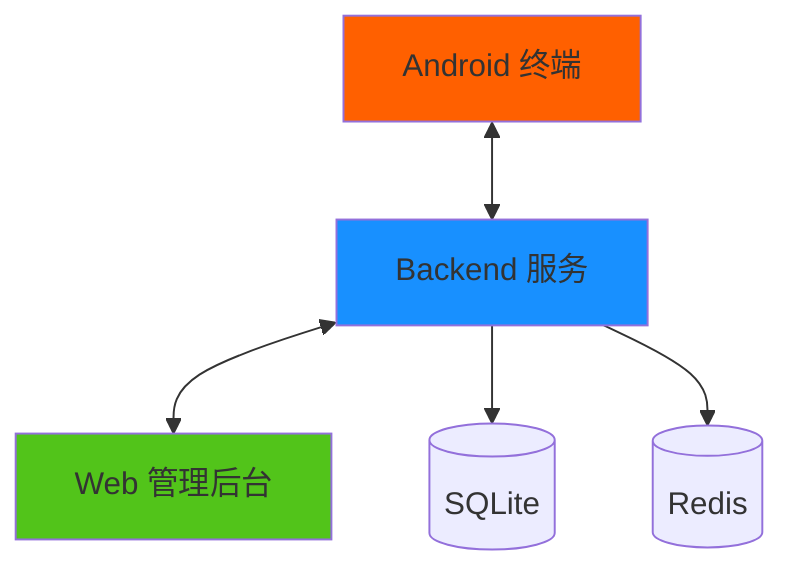
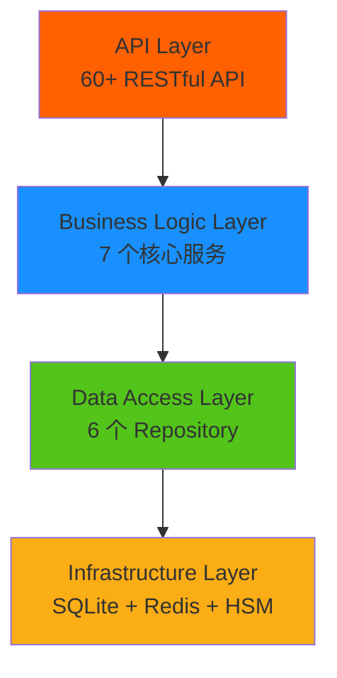
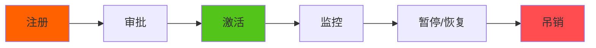
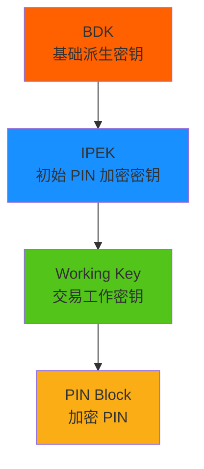
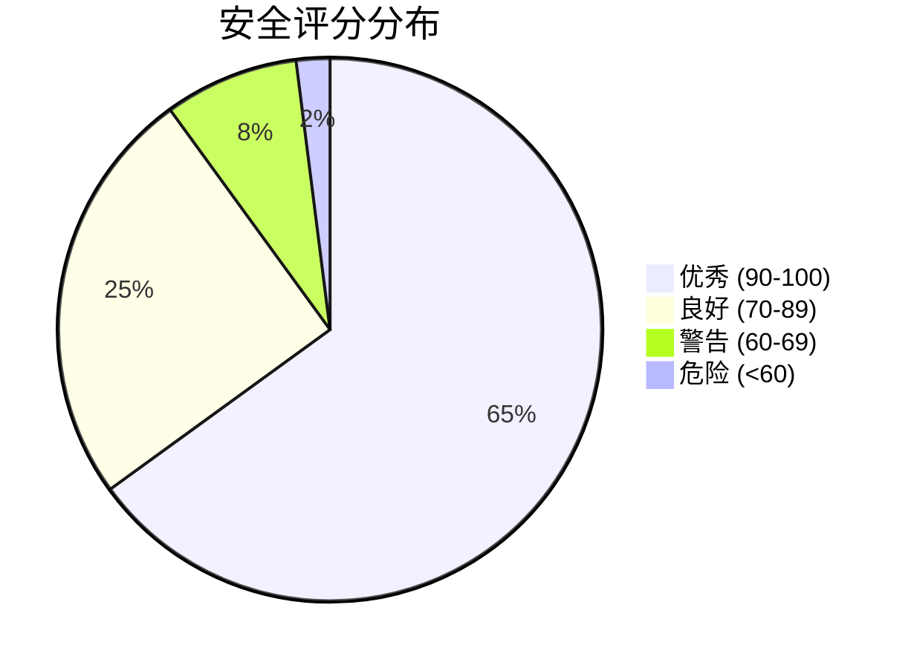
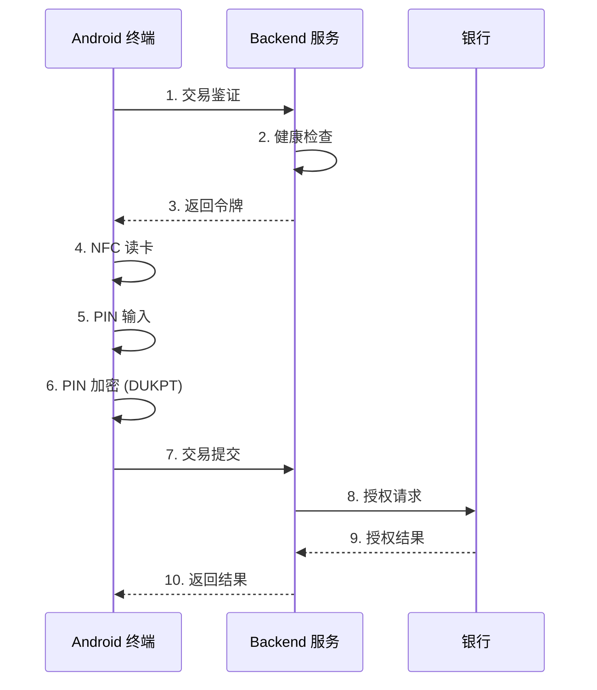

# SUNBAY SoftPOS

企业级移动支付终端管理平台

  
    开始演示 <carbon:arrow-right class="inline"/>
  

  <button @click="$slidev.nav.openInEditor()" title="Open in Editor" class="text-xl slidev-icon-btn opacity-50 !border-none !hover:text-white">
    <carbon:edit />
  </button>
  <a href="https://github.com/sunbay" target="_blank" alt="GitHub" title="Open in GitHub"
    class="text-xl slidev-icon-btn opacity-50 !border-none !hover:text-white">
    <carbon:logo-github />
  </a>

---
transition: fade-out
layout: default
---

# 目录

<Toc minDepth="1" maxDepth="2"></Toc>

---
layout: image-right
image: https://images.unsplash.com/photo-1563986768609-322da13575f3?w=800
---

# 方案概述

<v-clicks>

## 什么是 SUNBAY SoftPOS？

一套完整的**移动支付终端管理解决方案**

- 🔒 **金融级安全** - TEE + DUKPT + 实时监控
- 📱 **完整设备管理** - 全生命周期管理
- 🛡️ **智能安全监控** - 实时威胁检测
- 🚀 **现代化技术** - Rust + React + Kotlin

</v-clicks>

---
layout: center
class: text-center
---

# 核心数字

  
3

  
个平台

  
Android + Backend + Frontend

  
190+

  
个文件

  
高质量源代码

  
18.5K+

  
行代码

  
企业级实现

  
91%

  
完成度

  
生产就绪

---
layout: two-cols
---

# 三端架构

::right::

<v-clicks>

### Android 终端
- NFC 读卡
- EMV 处理
- TEE 安全
- 交易处理

### Backend 服务
- 60+ API
- 设备管理
- 密钥管理
- 威胁检测

### Web 管理后台
- 设备监控
- 威胁管理
- 交易查询
- 版本管理

</v-clicks>

---
layout: default
---

# 系统架构

## Backend 分层架构

## 核心服务

<v-clicks>

- 🔐 **设备服务** - 注册、审批、生命周期
- 🔑 **密钥管理** - DUKPT 派生、注入、更新
- 💚 **健康检查** - 安全评分、趋势分析
- ⚠️ **威胁检测** - 自动检测、严重性评估
- 💳 **交易服务** - 鉴证、处理、令牌管理
- 📦 **版本管理** - 创建、分发、推送
- 📝 **审计日志** - 操作记录、查询导出

</v-clicks>

---
layout: image-right
image: https://images.unsplash.com/photo-1563013544-824ae1b704d3?w=800
---

# 设备管理

## 完整的生命周期

<v-clicks>

### 功能亮点

- ✅ 设备注册和信息采集
- ✅ 审批流程和安全评估
- ✅ 实时状态监控
- ✅ 设备统计和分析
- ✅ 批量操作支持

</v-clicks>

---
layout: default
---

# 密钥管理 - DUKPT 体系

## 密钥派生流程

## 安全特性

<v-clicks>

- 🔒 **私钥永不导出** TEE
- 🔐 **RSA-2048** 公钥加密传输
- 📜 **符合标准** ANSI X9.24
- 🔄 **自动更新** 剩余次数预警
- ⚡ **无缝切换** 密钥更新

### 功能亮点

- 远程密钥注入
- 自动密钥派生
- 密钥状态监控
- 剩余次数预警

</v-clicks>

---
layout: two-cols
---

# 健康检查

## 7 大检查项目

<v-clicks>

| 检查项 | 权重 |
|--------|------|
| 🔓 Root 检测 | -30 分 |
| 🪝 Hook 检测 | -25 分 |
| 🐛 调试检测 | -20 分 |
| 💻 模拟器检测 | -15 分 |
| 🔐 TEE 完整性 | -30 分 |
| 🖥️ 系统完整性 | -20 分 |
| 📱 应用完整性 | -25 分 |

**基础分**: 100 分

</v-clicks>

::right::

## 安全评分

<v-clicks>

### 检查时机

- ⏰ 定期心跳（每小时）
- 💳 交易前强制检查
- 🔄 状态变更时检查
- 👆 手动触发检查

</v-clicks>

---
layout: center
class: text-center
---

# 威胁检测

  
🟢

  
LOW

  
记录日志

  
🟡

  
MEDIUM

  
发出警告

  
🟠

  
HIGH

  
暂停设备

  
🔴

  
CRITICAL

  
吊销设备

### 威胁类型

ROOT_DETECTED • HOOK_DETECTED • DEBUG_DETECTED • EMULATOR_DETECTED • TEE_COMPROMISED • INTEGRITY_FAILED

---
layout: default
---

# 交易处理流程

---
layout: two-cols
---

# 技术栈

## Backend - Rust

<v-clicks>

- ⚡ **高性能** - 接近 C/C++ 性能
- 🔒 **内存安全** - 编译时保证
- 🔄 **并发安全** - 无数据竞争
- 📦 **生态丰富** - Axum、SQLx、Tokio

</v-clicks>

## Frontend - React

- 🎨 **组件化** - 可复用 UI
- 📘 **类型安全** - TypeScript
- ⚡ **现代化** - React 18 + Vite 5
- 🎭 **UI 丰富** - Ant Design + ECharts

::right::

## Android - Kotlin

<v-clicks>

- 🎯 **现代语言** - 简洁、安全
- ✅ **官方推荐** - Google 支持
- 🎨 **Jetpack Compose** - 声明式 UI
- 🏗️ **MVVM 架构** - 清晰架构

</v-clicks>

### 为什么选择这些技术？

- 高性能 + 类型安全
- 现代化 + 易维护
- 生态丰富 + 社区活跃
- 企业级 + 生产就绪

---
layout: center
class: text-center
---

# 项目成果

  
100%

  
Backend

  
50+ 文件 • 7,500 行代码

  
✅ 完成

  
72%

  
Frontend

  
80+ 文件 • 5,000 行代码

  
🟢 接近完成

  
100%

  
Android

  
60+ 文件 • 6,000 行代码

  
✅ 完成

## 总体完成度: **91%** 🎉

---
layout: default
---

# 功能统计

## API 端点

<v-clicks>

| 模块 | 数量 | 状态 |
|------|------|------|
| 认证授权 | 5 | ✅ |
| 设备管理 | 9 | ✅ |
| 密钥管理 | 6 | ✅ |
| 健康检查 | 6 | ✅ |
| 威胁管理 | 5 | ✅ |
| 交易管理 | 6 | ✅ |
| 版本管理 | 12 | ✅ |
| 审计日志 | 6 | ✅ |

**总计**: 55+ API

</v-clicks>

## 前端页面

<v-clicks>

| 模块 | 页面数 | 状态 |
|------|--------|------|
| 仪表板 | 1 | ✅ |
| 设备管理 | 4 | ✅ |
| 威胁管理 | 2 | ✅ |
| 交易查询 | 2 | ✅ |
| 版本管理 | 2 | 🟡 |
| 系统日志 | 1 | 🟡 |
| 其他 | 3 | ✅ |

**总计**: 15+ 页面

</v-clicks>

---
layout: image-right
image: https://images.unsplash.com/photo-1551288049-bebda4e38f71?w=800
---

# 应用场景

<v-clicks>

## 🏦 金融机构
- 银行移动支付应用
- 信用卡收单业务
- 移动 POS 终端

## 💳 支付服务商
- 第三方支付平台
- 聚合支付服务
- POS 设备管理平台

## 🏪 零售连锁
- 连锁门店收款
- 移动收银系统
- 外卖配送收款

## 💼 ISV 服务商
- SaaS 收款服务
- 行业解决方案
- 多商户管理平台

</v-clicks>

---
layout: two-cols
---

# 安全保障

## 多层防护

<v-clicks>

### 应用层
- JWT 认证授权
- 角色权限控制
- API 速率限制

### 传输层
- TLS 1.3 加密
- Certificate Pinning
- 请求签名验证

### 数据层
- DUKPT 密钥派生
- RSA 公钥加密
- PIN Block 加密

### 设备层
- TEE 可信执行环境
- Hardware Attestation
- 运行时安全检测

</v-clicks>

::right::

## 合规性

<v-clicks>

### 国际标准

- ✅ **PCI MPoC**
  - 移动支付终端安全标准

- ✅ **ISO 9564**
  - PIN 加密标准

- ✅ **ANSI X9.24**
  - DUKPT 密钥管理标准

- ✅ **数据保护**
  - 符合数据保护法规要求

</v-clicks>

---
layout: center
class: text-center
---

# 竞争优势

  
🚀

  
技术优势

  

    现代化技术栈 
    企业级架构 
    高性能可扩展
  

  
⭐

  
功能优势

  

    完整生命周期 
    实时监控检测 
    灵活密钥管理
  

  
💎

  
体验优势

  

    直观管理界面 
    实时数据更新 
    丰富数据可视化
  

---
layout: default
---

# 商业价值

## 💰 降低成本

- **硬件成本** ↓
  - 无需专用 POS 设备
- **运维成本** ↓
  - 自动化管理和监控
- **开发成本** ↓
  - 完整的 SDK 和 API
- **培训成本** ↓
  - 直观的用户界面

## ⚡ 提升效率

- **部署效率** ↑
  - 快速部署和上线
- **管理效率** ↑
  - 集中化设备管理
- **响应效率** ↑
  - 实时监控和告警
- **开发效率** ↑
  - 完整的文档和示例

## 🔒 增强安全

- **设备安全** ✓
  - 持续健康检查
- **交易安全** ✓
  - 金融级加密
- **数据安全** ✓
  - 完整审计追踪
- **合规安全** ✓
  - 符合国际标准

---
layout: default
---

# 下一步计划

## 📅 短期（1-2周）

- Frontend 完善
  - 健康检查详情
  - 系统日志完善
  - 版本管理扩展

- 测试和优化
  - 单元测试
  - 性能优化
  - 部署文档

## 📆 中期（1-2月）

- 功能增强
  - 监控告警能力
  - 数据库优化
  - 数据可视化
  - 多语言支持

- 生态建设
  - API 文档
  - SDK 示例
  - 开发者社区

## 📅 长期（3-6月）

- 功能扩展
  - 更多卡组织
  - 离线交易
  - 生物识别
  - AI 威胁检测

- 市场拓展
  - 行业解决方案
  - 合作伙伴生态
  - 国际化支持

---
layout: center
class: text-center
---

# 总结

## ✅ 核心优势

- 🔒 金融级安全保障
- 📱 完整设备管理
- 🛡️ 实时威胁检测
- 🚀 现代化技术栈
- 🏗️ 企业级架构

## 📊 项目状态

- Backend: **100%** ✅
- Android: **100%** ✅
- Frontend: **72%** 🟢
- 整体: **91%** 🎉
- 状态: **生产就绪** 🚀

## SUNBAY SoftPOS

### 让移动支付更安全、更简单、更高效

---
layout: end
class: text-center
---

# 感谢观看！

## 联系方式

📧 技术支持: [待定]  
💼 商务合作: [待定]  
📚 文档地址: docs/solution/

<a href="https://github.com/sunbay" target="_blank" class="text-xl slidev-icon-btn opacity-50 !border-none !hover:text-white">
  <carbon:logo-github /> GitHub
</a>

